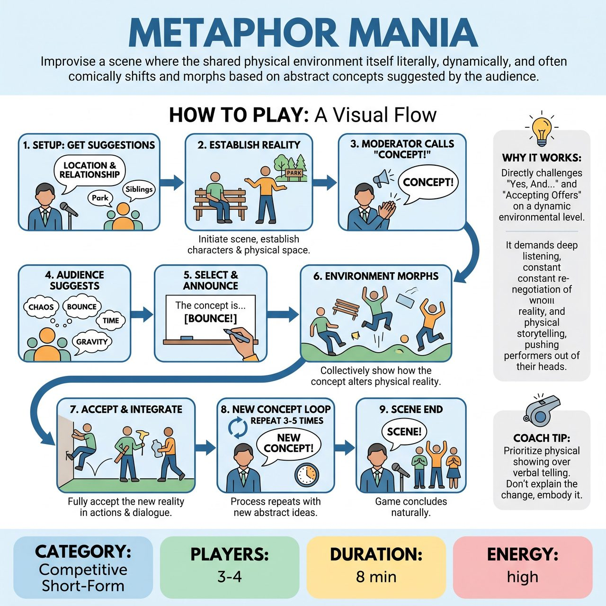

# Metaphor Mania

{ .game-hero }

> Improvise a scene where the shared physical environment itself literally, dynamically, and often comically shifts and morphs based on abstract concepts suggested by the audience.

## Overview
Metaphor Mania is an improv game where performers establish a scene in a specific location and relationship. The core mechanic involves a moderator calling out 'CONCEPT!', after which the audience suggests abstract ideas. Players must then collectively improvise how the physical environment itself literally changes and morphs to embody that concept, forcing them to adapt to a dynamically shifting reality.

## Setup
Requires 3-4 improvisers and a Moderator/Referee to facilitate audience suggestions, select concepts, and award points. A bare stage is ideal, with minimal set pieces like a chair or neutral box. A whiteboard or large pad for the moderator to write down the chosen concept is helpful.

## How to Play
1. The Moderator solicits a specific location and a relationship between two starting characters from the audience.
2. Two improvisers step forward and initiate the scene, establishing their characters and the initial physical reality of the suggested location.
3. After approximately 60-90 seconds, when the scene has found its footing, the Moderator claps loudly and shouts, 'CONCEPT!'
4. The audience immediately shouts out abstract nouns or concepts (ideas that can manifest physically, not emotions felt by characters).
5. The Moderator quickly selects one strong concept, writes it clearly, and loudly announces, 'The concept is... [Chosen Concept]!'
6. The improvisers must immediately and collectively agree on how this abstract concept physically alters their shared environment, showing it through actions rather than explaining it.
7. Players must fully accept this new physical reality and integrate it into their character's objectives, dialogue, and physical actions. An additional improviser may join the scene at this point.
8. After another minute or two, the Moderator calls 'NEW CONCEPT!' and the process repeats with a different abstract concept. Former concepts might linger or be overwritten.
9. The game continues for 3-5 concepts or until the Moderator feels the narrative has reached a natural conclusion, calling 'Scene!'

## Coaching Notes
- Focus on physical changes, not emotions. It is not about playing the emotion of the concept, but how it literally changes the physical properties or laws of the scene.
- All players must commit to the same physical interpretation. Conflicting interpretations lead to confusion and may result in point deductions.
- Do not explain the concept; show it through actions and reactions.
- For example, 'Bureaucracy' might make the ground sticky or objects heavy; 'Weightlessness' makes objects float; 'Fragility' makes everything delicate; 'Pressure' makes the air thick; 'Nostalgia' makes elements visibly age.
- In a competitive short-form match, the Referee awards points for Clarity of Physical Manifestation (5 points), Seamless Integration (5 points), Commitment & Presence (3 points), and Humor & Creativity (2 points).
- Points may be deducted for breaking the reality of the game, acknowledging the concept as an external prompt, or ignoring the concept's physical effects.

## Variations
- Competitive Match Play: Played by alternating players or designated teams where a Referee awards points based on clarity, integration, commitment, and humor, and deducts points for breaking reality or conflicting interpretations.

## Why It Works
It directly challenges the core tenets of 'Yes, And...' and 'Accepting Offers' on a dynamic environmental level. It demands deep listening, constant re-negotiation of reality, and physical storytelling, pushing performers out of their heads and into their bodies to turn abstract thought into shared, spontaneous physical creation.

## Safety & Inclusion
Ensure the physical environment is safe for sudden shifts in movement or mime (e.g., falling, floating, or straining). Players should respect physical boundaries and avoid dangerous acrobatics when manifesting concepts.

