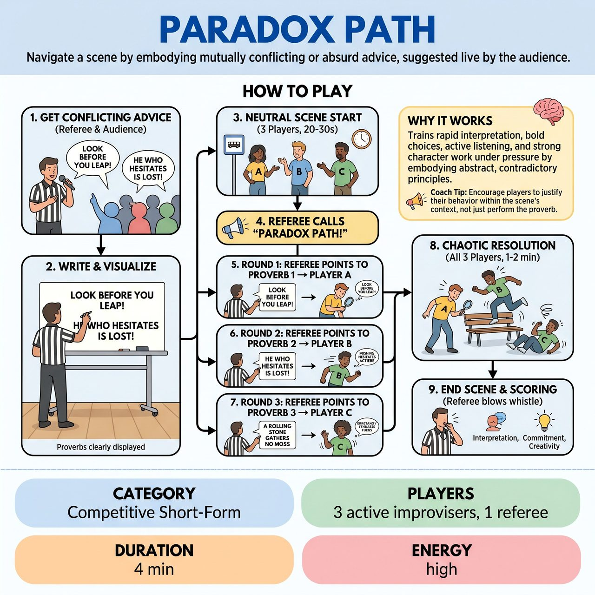

# Paradox Path

{ .game-hero }

> Navigate a scene by embodying mutually conflicting or absurd advice, suggested live by the audience.

## Overview
Paradox Path is an improvisational game where three players navigate a scene by embodying mutually conflicting or absurd advice, such as proverbs or truisms, suggested live by the audience. After establishing a scene premise, a facilitator individually assigns each player one of the contradictory directives, which they must immediately integrate into their character's actions and dialogue without explicitly stating it. The comedy arises from the improvisers' committed attempts to rationalize and 'yes, and' these irreconcilable internal motivations, creating a chaotic yet engaging scene that challenges their adaptability and commitment.

## Setup
Requires 3 active improvisers and 1 facilitator/referee. Props needed: a whiteboard or large pad of paper with a marker, and a referee whistle or buzzer. Ensure the stage has good visibility for the audience to see the written suggestions.

## How to Play
1. The Referee asks the audience for two or three completely distinct and ideally contradictory pieces of advice, common proverbs, idioms, or truisms (e.g., 'Look before you leap' vs. 'He who hesitates is lost').
2. The Referee writes these suggestions clearly visible for both players and audience, then asks for a simple, neutral scene premise.
3. The three active improvisers begin the scene based on the premise for 20-30 seconds, establishing characters, relationships, and the initial context.
4. The Referee loudly calls out, 'Paradox Path!' to begin the integration rounds.
5. Round 1: The Referee points to one written proverb, then points directly at Player A. Player A must immediately begin to justify and embody the spirit of that advice within their character's actions and dialogue without stating it directly.
6. Round 2: After 10-15 seconds, the Referee points to another written proverb and points at Player B, who must immediately embody the spirit of their assigned advice without stating it.
7. Round 3: After another 10-15 seconds, the Referee points to the final written proverb and points at Player C, who integrates their conflicting advice into the scene.
8. Chaotic Resolution: For 1-2 minutes, all three players operate under potentially contradictory internal directives, justifying their behavior, reacting to others, and maintaining scene momentum.
9. The Referee blows the whistle/buzzer to end the scene. Points can be awarded based on Interpretation & Embodiment, Conflict & Cohesion, Commitment, and Creativity & Comedy.

## Coaching Notes
- Players must not explicitly state their assigned proverb directly; they must embody its spirit.
- 'Yes, and...' is paramount. Players must accept their absurd new motivation and add to it, while also accepting the absurdity their scene partners bring.
- The comedy often comes from the characters trying to make sense of, or rationalize, the illogical conflict created by their individual 'Paradox Paths.'
- Encourage players to maintain the scene's momentum, even as its logic unravels or takes absurd turns.
- Players should find an organic (or comically inorganic) way to incorporate their new internal directive into the ongoing scene.

## Why It Works
The game combines the pressure of simultaneous directives with a deeper, character-driven challenge of embodying abstract, contradictory principles. It forces rapid interpretation, bold choices, active listening, and strong character work under duress. The inherent clash of contradictory advice generates comedic tension, absurd rationalizations, and physical reactions while maintaining a focus on narrative progression.

## Safety & Inclusion
Ensure physical safety during chaotic or absurd physical reactions. Players should respect physical boundaries and consent, even when characters are in conflict or acting illogically.

