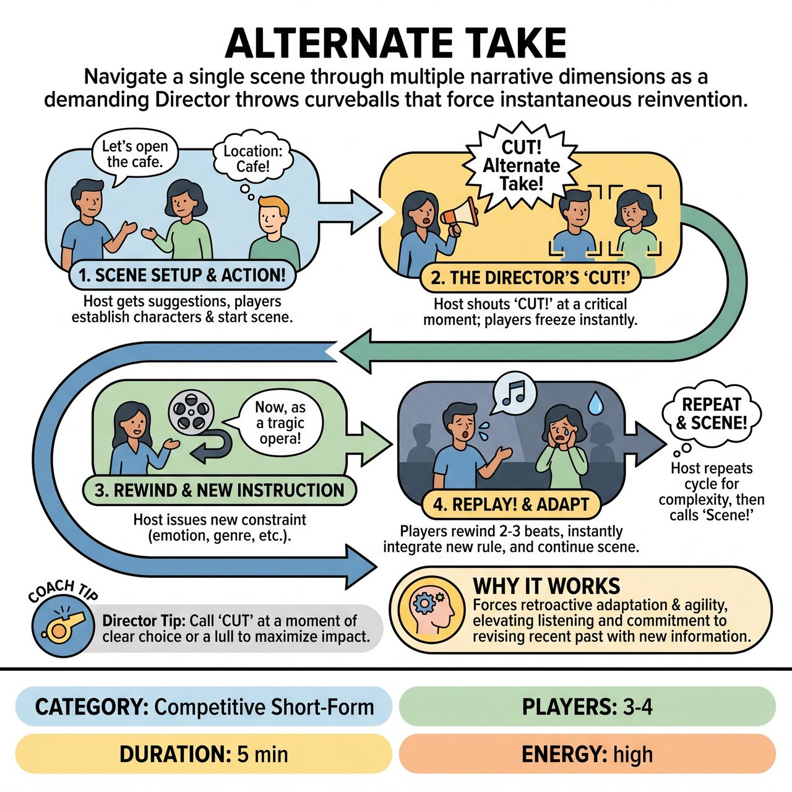

# Alternate Take

{ .game-hero }

> Navigate a single scene through multiple narrative dimensions as a demanding Director throws curveballs that force instantaneous reinvention.

## Overview
Alternate Take is a dynamic improv game where players begin a scene based on audience suggestions. At critical moments, a Host, acting as a 'Director,' yells 'CUT! Alternate Take!' and imposes a dramatic new constraint—like an award-winning emotional shift, character motivation, or genre change. Players must then rewind a few beats and instantly replay that segment, integrating the new rule before continuing the scene.

## Setup
Requires 3-4 improvisers for the scene, plus 1 Host/Referee (the 'Director'). No specific props are needed beyond standard stage furniture; mime everything else. Ensure clear sightlines between the Host and players. A visible scoreboard is recommended for point tracking. Begin by getting an audience suggestion for a location, relationship, or opening line.

## How to Play
1. Scene Setup (The Audition): The Host asks the audience for a core suggestion (location, relationship, or opening line). Players briefly agree on basic character dynamics.
2. Action! (The First Take): Players begin the scene, establishing characters, situation, and initial objectives.
3. The Host watches closely for a moment of high potential, a critical decision point, a predictable rut, or a clear character choice that could be flipped.
4. CUT! Alternate Take!: The Host yells 'CUT! Alternate Take!' and all players immediately freeze in their positions.
5. The Director's Intervention: The Host issues a specific instruction for how to replay a preceding moment. Categories include Emotional Shifts, Character Adjustments, Narrative Twists, Genre Blends, Physical Constraints, or Information Revelations.
6. REPLAY! And Action!: The Host instructs players to rewind their action/dialogue back 2-3 beats before the 'CUT!' call.
7. Players replay that short segment, immediately incorporating the new instruction, and let the new reality ripple forward as the scene continues.
8. Multiple Takes and Conclusion: The Host calls for several 'Alternate Takes' throughout the scene to build layers of complexity, ending the game by calling 'Scene!' when a satisfying conclusion is reached.

## Coaching Notes
- Host/Director: Time your interventions for maximum impact. Look for moments where a twist will completely upend the current dynamic.
- Encourage players to deeply listen and commit instantly to the new reality, rather than just playing the twist for a single laugh.
- Scoring - Award 3 points for Seamless Integration (weaving the take without breaking flow), 2 points for Creative Interpretation, and 1 point for Bold Commitment.
- Scoring - Award Bonus Points based on audience applause for particularly successful takes.
- Penalties - Deduct 2 points for 'Ignoring the Director', 'Breaking Frame' (acknowledging the game/Host directly within the scene), or 'Lack of Commitment'.

## Why It Works
The requirement to rewind and replay forces players to retroactively adapt and demonstrate agility not just in continuing a scene, but in revising its very recent past with new information. This elevates listening, agreement, and commitment to new heights, taking 'Yes, And...' to an extreme.

## Safety & Inclusion
Ensure any physical constraints given by the Director are safe for the players to perform. Maintain respect for personal boundaries during emotional shifts and character adjustments.

