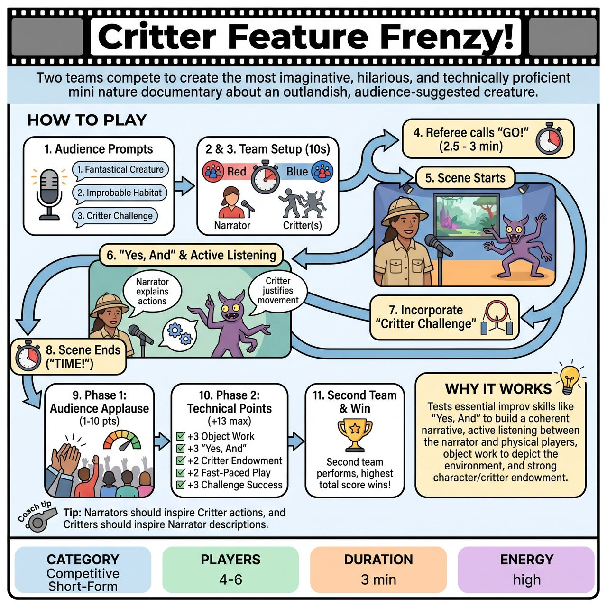

# Critter Feature Frenzy!

{ .game-hero }

> Two teams compete to create the most imaginative, hilarious, and technically proficient mini nature documentary about an outlandish, audience-suggested creature.

## Overview
Critter Feature Frenzy! is an improv game where two teams (Red vs. Blue) compete to create a mini "nature documentary." One player narrates, introducing an audience-suggested, outlandish creature living in an improbable habitat, while the other team member(s) physically embody the critter. Scoring is a hybrid system combining audience applause with a referee's assessment of improv skills and foul deductions.

## Setup
Form two teams (Red and Blue) with 2-3 players per team. Clear an open playing area for dynamic physicalization and object work. Assign a Referee to observe, score, call fouls, and manage an 'Audience Applause Gauge' (or visual indicator) to interpret audience applause levels.

## How to Play
1. The Referee prompts the audience for three suggestions: a fantastical, never-before-seen Creature Name, an utterly improbable Habitat, and ONE 'Critter Challenge' (a specific, brief action the creature must attempt).
2. The Referee announces the creature, habitat, and challenge for the first team.
3. The team has 10 seconds to quickly decide roles: one Narrator/Documentarian and the rest as Critter(s).
4. The Referee calls 'GO!' to begin a 2.5 to 3-minute scene.
5. The Narrator sets the scene, introducing the creature and its bizarre habitat, while the Critter(s) bring the creature to life through physical embodiment, reactions, and sound effects.
6. The Narrator must 'Yes, And' the Critter's actions, explaining their significance, while the Critter(s) must actively listen to the Narrator and justify their movements.
7. The team must incorporate the 'Critter Challenge' at some point during their feature.
8. The scene ends when the Referee calls 'TIME!' or the team naturally concludes.
9. The Referee facilitates Phase 1 scoring by asking the audience to applaud based on how much they believed in and loved the creature (awarding 1-10 points based on volume).
10. The Referee facilitates Phase 2 scoring by adding technical points (+3 Object Work, +3 'Yes, And', +2 Critter Endowment, +2 Fast-Paced Play, +3 Challenge Success) and deducting points for any fouls called during the scene.
11. The second team performs their round with new suggestions, and the team with the highest combined score wins.

## Coaching Notes
- Actively watch for standard competitive short-form fouls: Content Foul (blue humor/swearing), Groaner Foul (bad puns), Wimping Out (failing to commit to character/environment), and Talkie/Gabber (critters speaking unnecessarily or narrators waffling). Deduct 3-5 points per foul.
- Narrators must clearly 'endow' the stage environment and interact with the critter(s) using a documentary-style tone (e.g., a classic nature documentarian style).
- Critters should focus heavily on strong physicalization, vocalizations, and consistent behavioral choices rather than speaking.
- Ensure the pacing remains lively, engaging, and fast-paced throughout the brief scene.
- When judging audience applause, the Referee must guide the scoring to ensure cheers for any 'blue' or inappropriate content are ignored.

## Why It Works
It tests essential improv skills like 'Yes, And' to build a coherent narrative, active listening between the narrator and physical players, object work to depict the environment, and strong character/critter endowment.

## Safety & Inclusion
This game is inherently designed for family-friendly humor. The 'Content Foul' serves as a strong, non-negotiable deterrent against any inappropriate humor, swearing, or innuendo. The referee must vet all audience suggestions to guarantee a safe and enjoyable experience for all ages.

