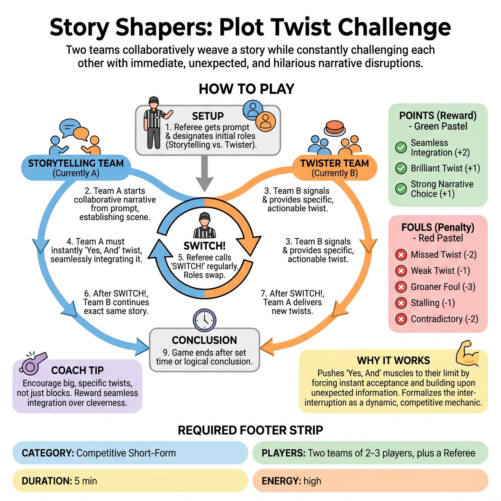

# Story Shapers: Plot Twist Challenge

{ .game-hero }

> Two teams collaboratively weave a story while constantly challenging each other with immediate, unexpected, and hilarious narrative disruptions.

## Overview
Two teams collaboratively weave a story, taking turns as the active storytellers and the 'Plot Twisters.' The twisting team introduces immediate, unexpected narrative disruptions that the storytelling team must instantly 'Yes, And' and seamlessly integrate. The ultimate goal is to create a uniquely dynamic, constantly evolving, and uproarious family-friendly narrative while scoring points for brilliant twists and masterful integration.

## Setup
Standard competitive short-form performance area. No special props are needed (all objects created through object work). Each team needs a designated 'Twist Button' (a buzzer, a bell, or yelling 'PLOT TWIST!'). A Referee is required to moderate, call fouls, and award points.

## How to Play
1. The referee obtains a single, simple story prompt (e.g., a location, an unusual object, a character type) from the audience.
2. The referee designates one team as the initial 'Storytelling Team' and the other as the 'Plot Twister Team.'
3. The Storytelling Team begins to collaboratively tell a narrative based on the prompt, establishing characters, setting, and conflict.
4. When the Plot Twister Team deems a moment impactful or comedic, they hit their Twist Signal and immediately provide a specific, actionable, and family-friendly narrative element that dramatically changes the story's direction.
5. The Storytelling Team must instantly 'Yes, And' the twist, incorporating it into their story as if it was their idea all along, without questioning, ignoring, or rejecting it.
6. The referee intermittently (e.g., every 30-60 seconds, or after 2-3 twists) calls 'SWITCH!', at which point the teams swap roles.
7. The new Storytelling Team continues the exact same ongoing story from where the other team left off, while the new Plot Twister Team listens to deliver twists.
8. The referee awards points: Seamless Integration (2 points), Brilliant Twist (1 point), and Strong Narrative Choice (1 point).
9. The referee deducts points for fouls: Missed Twist (-2 points), Weak Twist (-1 point), Groaner Foul (-3 points), Stalling Foul (-1 point), and Contradictory Twist Foul (-1 point).
10. The game concludes after a set time (e.g., 4-5 minutes) or when the referee deems the narrative has reached a suitably hilarious or logical conclusion.

## Coaching Notes
- Pacing: Twists should be delivered at a quick, unpredictable rhythm. The referee can interject if a twist is not delivered or integrated quickly enough.
- Active Listening: Storytellers must actively listen to integrate twists, and Twisters must listen to find the most opportune and challenging moments for disruption.
- Object Work & Endowments: Players must quickly manifest sudden new elements physically and adopt new physicality and vocal choices on the fly when twists demand character changes.
- Contradictory Twists: Twists should build, not dismantle fundamentals. Do not negate a core, established fact of the story that has already been accepted.
- Audience Interaction: The referee may occasionally gauge audience reaction to a twist or an integration (e.g., 'Audience, was that a brilliant twist or merely adequate?') to help determine points.

## Why It Works
It pushes improvisers' 'Yes, And' muscles to their limit by forcing them to instantly accept any new information and immediately build upon it. It formalizes the interruption into a direct, competitive mechanic, creating a dynamic push-and-pull 'chess match' where quick wits and creative pivots are key.

## Safety & Inclusion
Strictly enforced clean-content foul: Any blue humor, swearing, or inappropriate innuendo from any player, whether storytelling or twisting, results in a 5-point deduction and immediate player disqualification. The game must remain a family-friendly comedic experience.

