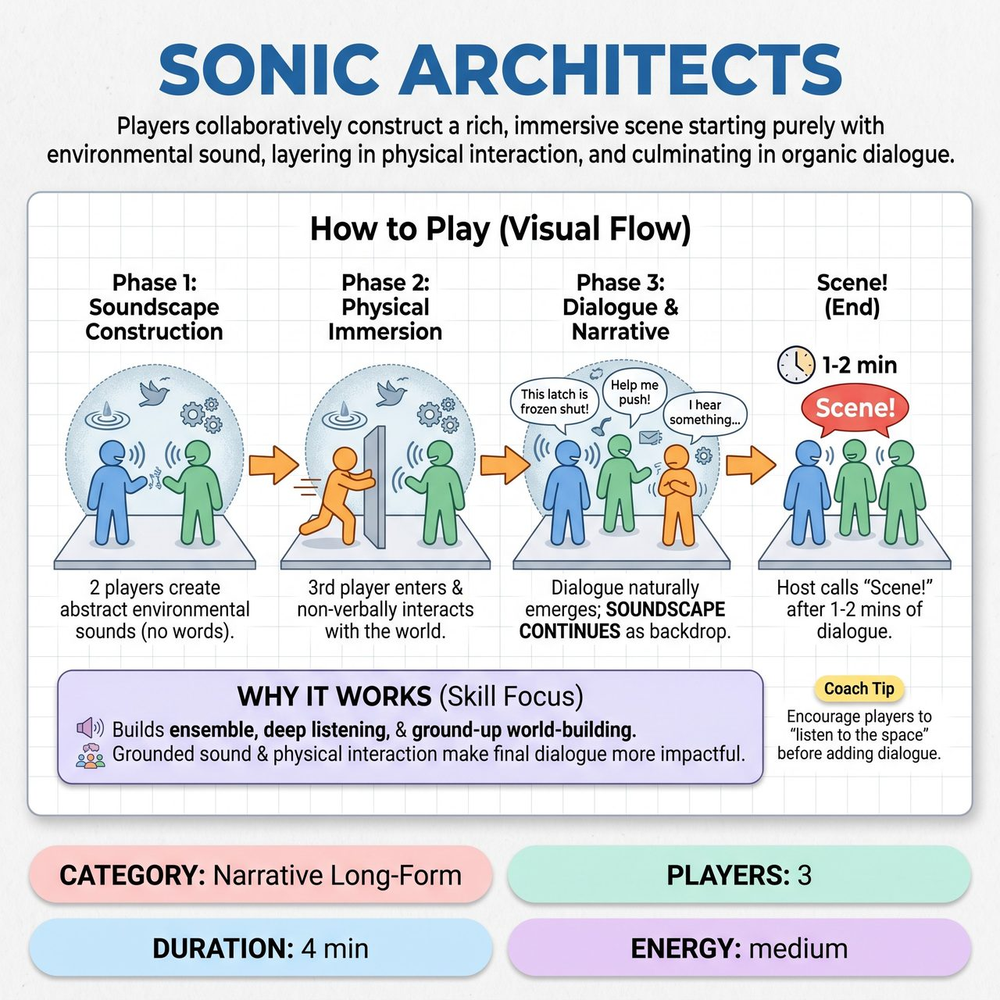

# Sonic Architects

{ .game-hero }

> Players collaboratively construct a rich, immersive scene starting purely with environmental sound, layering in physical interaction, and culminating in organic dialogue.

## Overview
Sonic Architects is an improv game challenging players to collaboratively construct a rich, immersive scene. It begins with two improvisers establishing a vivid environmental soundscape using only voices and body percussion. A third player then enters to physically interact with this non-verbal world before dialogue organically emerges to advance a narrative.

## Setup
Requires 3 improvisers on stage and a host or referee to manage transitions. Use a clear, open performance space with no props. Get a single, specific, and evocative location from the audience, such as a bustling futuristic marketplace or a deep-sea trench.

## How to Play
1. Phase 1 (Soundscape Construction): Two players step forward. On the host's cue, they create the soundscape of the audience-provided location using only abstract vocal sounds and body percussion for 30 to 60 seconds.
2. Phase 2 (Physical Immersion): The host cues the third player to enter. This player immediately and physically interacts with the implied environment non-verbally, justifying the sounds through movement for 30 to 60 seconds, while the soundscape players adapt to their actions.
3. Phase 3 (Dialogue & Narrative): The host gives a final cue for dialogue. All three players embody characters and introduce intelligible dialogue that naturally emerges from the non-verbal elements.
4. The soundscape must continue as an active, evolving backdrop throughout Phase 3. The host allows the scene to develop for 1 to 2 minutes before calling Scene!

## Coaching Notes
- Ensure players listen intensely to each other in Phase 1, building harmoniously rather than competing.
- Watch for fouls: introducing intelligible dialogue too early, soundscapes not matching the location, or physical actions ignoring the established sounds.
- Prevent one player from dominating the soundscape or physical space without integrating others' offers.
- Crucial: Do not allow the soundscape to diminish or disappear significantly in Phase 3; it must remain an active, continuous backdrop.

## Variations
- Scored Version: A host, panel of judges, or audience can provide evaluative feedback or assign metaphorical points based on the richness of the soundscape, physical justification, and seamless dialogue integration, while deducting points for fouls.

## Why It Works
It prioritizes ensemble building, deep listening, and progressive skill development. By emphasizing world-building from the ground up through multi-sensory engagement, the eventual dialogue becomes more grounded and impactful.

## Safety & Inclusion
Ensure players are mindful of physical space and boundaries during the physical immersion phase. Vocalizations should be kept at safe volumes to avoid straining voices or overwhelming scene partners.

