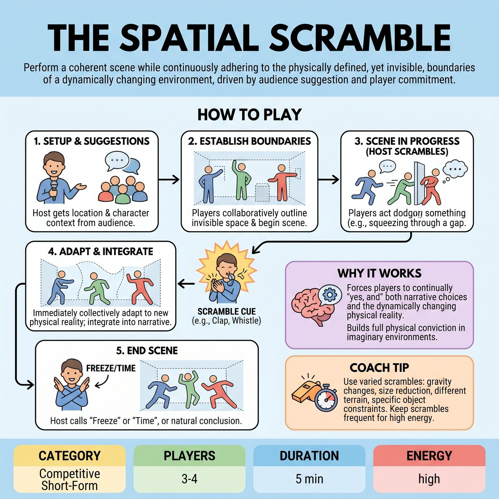

# The Spatial Scramble

{ .game-hero }

> Perform a coherent scene while continuously adhering to the physically defined, yet invisible, boundaries of a dynamically changing environment, driven by audience suggestion and player commitment.

## Overview
The Spatial Scramble is an improv game for 3-4 players where they perform a scene within a dynamically changing, invisible environment. Initiated by audience suggestions for location and character context, players must collaboratively establish and continuously adhere to these physically defined, yet imaginary, boundaries. Throughout the scene, a host announces sudden scramble alterations, forcing improvisers to immediately and collectively adapt their physical performance to the new spatial reality, integrating these challenges into the narrative to generate comedy and maintain scene coherence.

## Setup
A clear, open stage area is essential. No physical props or set pieces are needed, as the environment is entirely improvised. A dedicated host or MC is crucial to solicit initial suggestions and to announce the dynamic scramble alterations during play.

## How to Play
1. The host greets the audience and explains the game: players will create a scene within an invisible space that will constantly change.
2. The host asks the audience for two suggestions: a specific, often confined, location and a relationship or context for the characters.
3. Players enter the stage, immediately establishing their characters and initiating a scene based on these suggestions.
4. As the scene begins, the players must collaboratively and physically define the initial invisible boundaries of their environment by outlining walls, bumping into an invisible ceiling, showing the scale of the room, and consistently reacting to these self-imposed borders.
5. At various points during the scene (typically every 30-60 seconds, or after a significant beat), the host signals a new physical alteration by clapping, whistling, or yelling 'SCRAMBLE!' followed by a specific constraint.
6. Upon hearing the cue, players must immediately and collectively adapt their physical performance to the new environmental reality, demonstrating the new boundaries and reacting truthfully.
7. The scene's narrative must continue, with players integrating their struggles with the evolving environment into their characters' dialogue and actions.
8. The scene ends when the host calls 'Freeze' or 'Time,' or when the narrative reaches a natural comedic conclusion. The final state of the invisible chamber can be highlighted for one last laugh.

## Coaching Notes
- Use a variety of 'Scramble' alterations, such as: 'The Walls Are Closing In!', 'The Ceiling Is Dropping!', 'The Floor Is Tilting!', 'The Space Is Stretching!', 'A New Wall Appears!', 'Zero Gravity!', or 'Invisible Obstacle!'.
- If playing with competitive short-form match style scoring, award 3 points for Physical Agreement & Consistency, 2 points for Comedic Effect, and 1 point for Scene Coherence.
- Call a 'Breaking the Wall' foul if a player consistently ignores an established invisible boundary or performs an action that clearly contradicts the shared physical reality.
- Remind players that the physical constraint should drive new character beats and comedic opportunities, rather than just being a mime exercise.
- Success relies entirely on the players' ability to collectively agree on and maintain a shared, evolving physical reality.

## Why It Works
The game forces players to continually 'yes, and' not only each other's narrative choices but also the dynamically changing physical reality. It directly challenges players' ability to embody an imaginary environment with full physical conviction and demands constant spatial awareness.

## Safety & Inclusion
Because players may be physically pressed against each other or required to crouch, crawl, and lean, ensure all improvisers are comfortable with close physical proximity and the physical demands of the scene. Establish clear consent boundaries beforehand.

