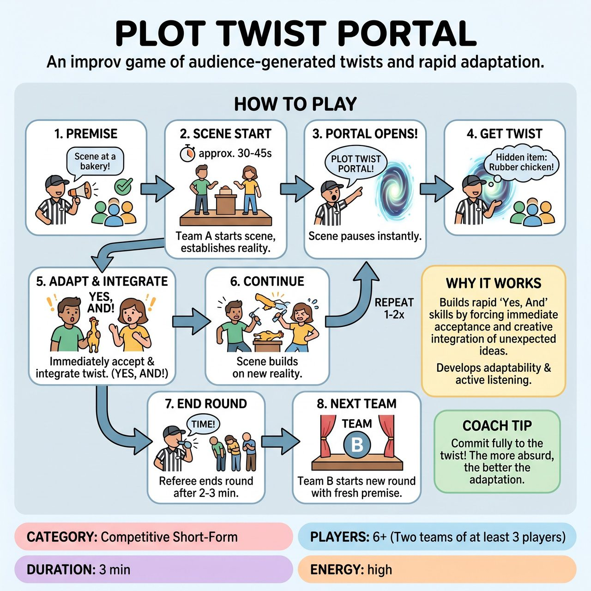

# Plot Twist Portal

{ .game-hero }

> An improv game of audience-generated twists and rapid adaptation.

## Overview
Plot Twist Portal is a competitive improv game where two teams create dynamically evolving, humorous scenes. A Referee orchestrates the action by prompting the audience for spontaneous, family-friendly 'plot twists' (like a character's hidden talent or a new absurd rule). Teams must immediately integrate these twists using 'Yes, And' principles, demonstrating rapid adaptability and creative problem-solving.

## Setup
Two teams (Red and Blue), each with at least three players. A Referee equipped with a whistle, scoring mechanism, and a designated 'Portal Zone' on stage. A lively audience ready to provide suggestions.

## How to Play
1. The Referee begins by asking the audience for a broad, family-friendly scene premise and selects the most promising suggestion.
2. Two or three players from Team A enter the stage and immediately begin improvising a scene based on the chosen premise, establishing characters, setting, and initial conflict/objective.
3. After approximately 30-45 seconds of scene development, the Referee dramatically shouts, 'PLOT TWIST PORTAL!' The scene pauses instantly, and the Referee steps into their designated 'Portal Zone.'
4. From the Portal Zone, the Referee rapidly asks the audience for a specific type of surprising, family-friendly twist (e.g., a secret item, unexpected animal sound, bizarre new rule) and selects one suitable suggestion.
5. The scene immediately resumes, and the players must without hesitation accept and physically/verbally integrate the new plot twist for a burst of creative, adaptive improv for 20-30 seconds.
6. The scene continues from this new, twist-influenced point, building on the altered reality.
7. The Referee may open the 'Plot Twist Portal' one or two more times during a team's round, introducing further layers of absurdity or compelling challenges.
8. After 2-3 minutes total, or once a final twist has been fully integrated, the Referee blows the whistle to end Team A's round.
9. Team B takes the stage with a brand new scene premise and their own unique set of twists.

## Coaching Notes
- The Referee is the 'Oracle of Twists' and must actively choose the best family-friendly twist suggestions from the audience, timing them crucially for the game's flow and humor.
- Players should show, not just tell, how the twist affects their characters, their relationship, and the scene's progression.
- Award points for Creative Scene Setup (up to 5), Seamless Twist Integration (up to 5 per twist), Energy and Pacing (up to 3), 'Yes, And' in Action (up to 3), Character Commitment (up to 2), and Overall Humor and Entertainment (up to 5).
- Call a clean-content foul if players introduce anything crude, inappropriate, or non-family-friendly.
- Call a bad pun penalty for exceptionally obvious, low-effort puns during the integration of a twist or as the primary reaction to it.
- Call a 'Denial Portal' penalty if a player overtly ignores, denies, or fails to meaningfully integrate a chosen plot twist.
- Call a 'Lost in the Portal' penalty if players completely freeze, get stuck, or fail to progress the scene in any way after a twist is introduced.

## Why It Works
It tests and develops 'Yes, And' skills as players must accept and build on unexpected twists without hesitation. It builds active listening, adaptability, and flexibility, forcing players to rapidly adjust character motivations, scene goals, and narrative direction on the fly while maintaining pacing, energy, and character embodiment.

## Safety & Inclusion
The Referee must ensure all content remains family-friendly. Only family-friendly initial scene premises and plot twist suggestions are solicited and accepted. Players are explicitly subject to the clean-content foul for any inappropriate humor during their integration of twists or general scene work. The audience providing inappropriate suggestions might also be gently corrected by the referee, or the suggestion ignored entirely.

