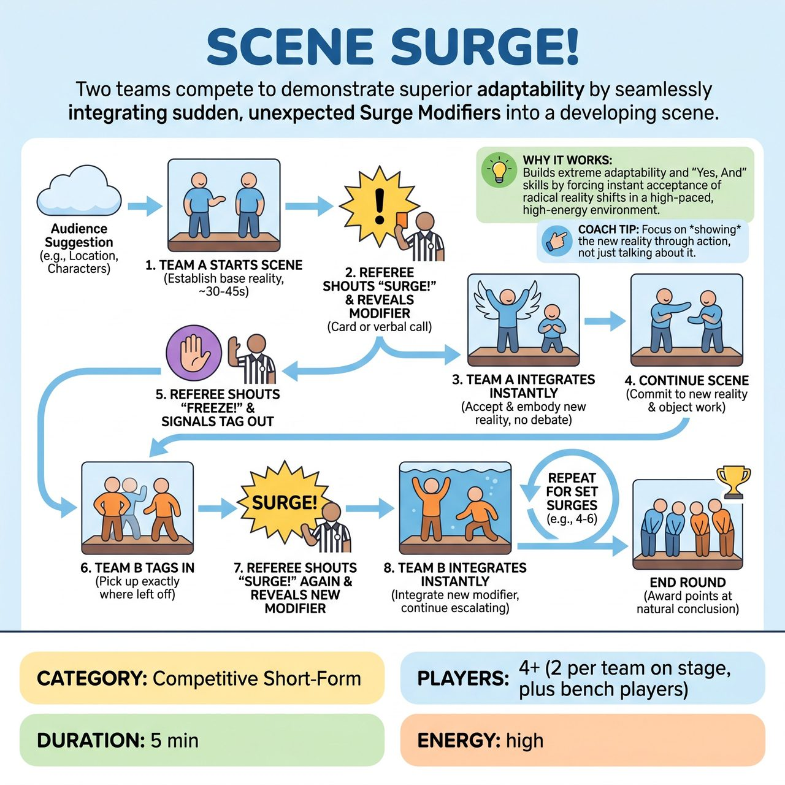

# Scene Surge!

{ .game-hero }

> Two teams compete to demonstrate superior adaptability by seamlessly integrating sudden, unexpected Surge Modifiers into a developing scene.

## Overview
Scene Surge! is a dynamic improvisational comedy game where two teams compete to demonstrate superior adaptability and 'Yes, And' skills. Players build an audience-suggested scene, which is constantly interrupted by a referee introducing sudden, diverse Surge Modifiers. Teams must instantly integrate these changes into the ongoing scene, taking turns to build on its escalating complexity.

## Setup
A stage with the referee centrally located. Two players from each team (e.g., Team Red and Team Blue) start on stage for the opening round, with others on the bench. The referee has a set of Surge Cards (or a digital display/randomizer) with various types of modifiers like Location, Character Emotion, Relationship, or Action Constraint.

## How to Play
1. The referee calls for an initial suggestion from the audience (e.g., a mundane location and two characters with a secret). Two players from the first team take the stage and begin building a scene based on this suggestion.
2. After approximately 30-45 seconds, the referee shouts 'SURGE!' and reveals a Surge Card or declares a specific modifier, clarifying any ambiguity.
3. Upon hearing the SURGE!, the players must immediately accept, acknowledge, and integrate the new modifier into their ongoing scene with no debate or resistance.
4. The players continue the scene, now fully embodying the new reality, while the referee watches for successful integration, clear object work, and continued energy.
5. After another 30-45 seconds, or once a clear comedic beat is hit, the referee shouts 'FREEZE!' and signals the opposing team to tag in.
6. Two players from the opposing team enter the stage, immediately picking up the scene exactly where the first team left off, incorporating all existing scene elements and the last Surge Modifier.
7. After the new team has established themselves for 30-45 seconds, the referee calls 'SURGE!' again, introducing a new modifier which they must integrate.
8. The referee ends the round after a set number of Surges (e.g., 4-6 surges) or when a scene reaches a natural comedic conclusion or chaotic crescendo, awarding points to determine the winner.

## Coaching Notes
- Point Assignment: Award 2-3 points for smooth, quick, and creative integration of a Surge Modifier; 1 point for strong 'Yes, And' building on the previous team's work; 1 point for high energy and commitment to characters; 1 point for excellent object work; and 1 point for big audience laughs.
- Fouls: Call a 'Clean-Content Foul' for blue humor or swearing. Call a 'Groaner Foul' for excessively bad or uninspired puns. Call a 'Hesitation Foul' if a player visibly hesitates or resists integrating the SURGE! for more than 2-3 seconds. Call a 'No Surge Foul' if a player actively ignores a declared Surge Modifier. Deduct points for all fouls.
- Referee Role: The referee is the sole source of Surge Modifiers, using pre-written Surge Cards to ensure variety, challenge, and strict adherence to family-friendly content.
- Pacing and Endowment: Keep the scene moving briskly through the rapid changes, and quickly establish new endowments for locations, objects, or relationships based on the Surge.

## Variations
- Advanced Gameplay: The referee might occasionally solicit an audience suggestion for the content of a modifier (e.g., 'Audience, give me an emotion!') and then declare the SURGE! using that suggestion. The referee acts as a filter to ensure family-friendliness.

## Why It Works
It challenges players to immediately accept radical changes to their scene's reality, demonstrating their 'Yes, And' skills in a fast-paced, high-energy environment. It heavily tests active listening, adaptability, spontaneity, object work, and maintaining character integrity despite external chaos.

## Safety & Inclusion
Scene Surge! is inherently designed for family-friendly audiences. The referee's sole control over the Surge Cards ensures that all modifiers are appropriate and inspire imaginative, clean fun. The Clean-Content Foul remains a strong deterrent, reinforcing the competitive short-form match commitment to humor that is intelligent, quick-witted, and accessible to all ages without resorting to vulgarity or innuendo.

