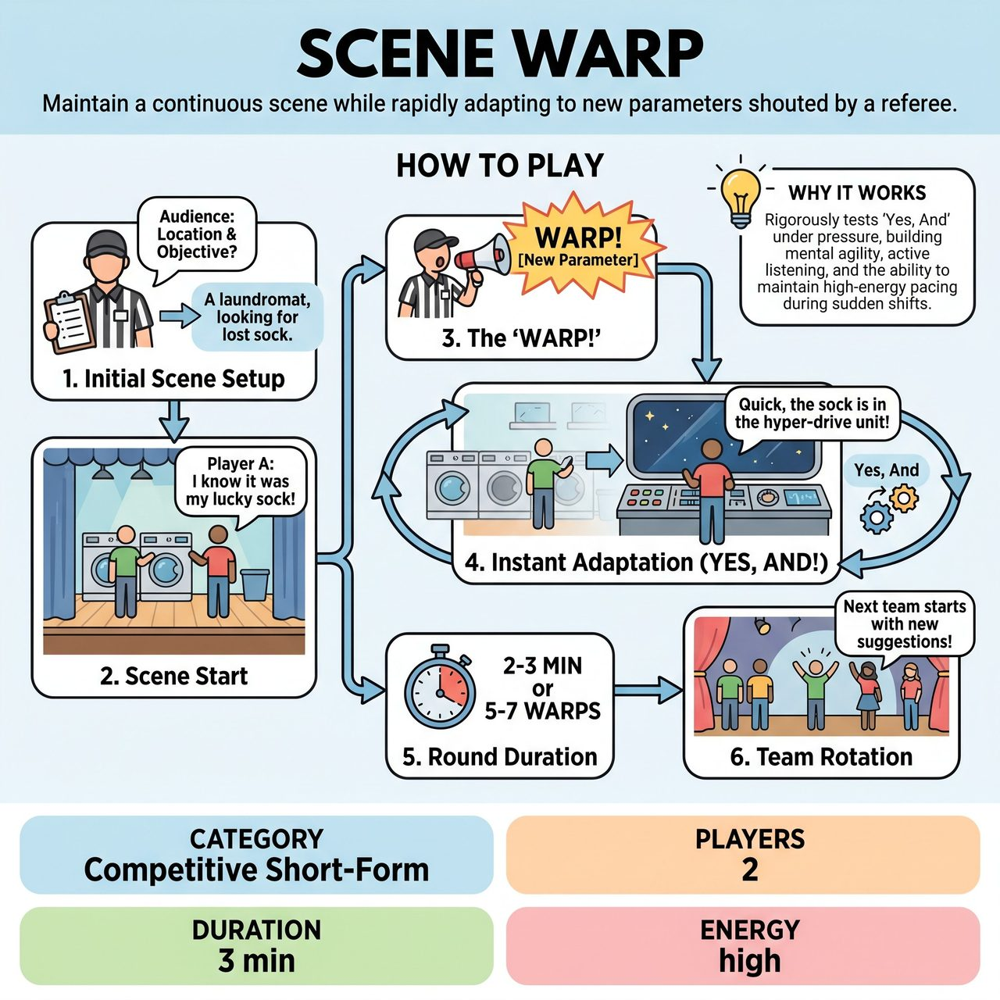

# Scene Warp

{ .game-hero }

> Maintain a continuous scene while rapidly adapting to new parameters shouted by a referee.

## Overview
Two players maintain a continuous, engaging scene while a referee constantly challenges them by shouting 'WARP!' followed by a new scene parameter. Players must immediately and seamlessly 'Yes, And' the new location, relationship, genre, or objective into the ongoing narrative.

## Setup
Two improvisers from one team, a referee, a scorekeeper, and an active audience. No special props or costumes are needed.

## How to Play
1. Initial Scene Setup: The referee solicits an initial Location (e.g., 'A laundromat') and a simple Scenario/Objective from the audience.
2. Scene Start: Two players enter the scene, establishing characters and immediately embarking on the initial scenario.
3. The 'Warp': At unpredictable intervals (typically every 15-30 seconds), the referee shouts 'WARP!' followed by a new, distinct parameter (e.g., new location, relationship, objective, genre, endowment, or emotional shift).
4. Instant Adaptation: Upon hearing the 'WARP!', players must immediately 'Yes, And' the new parameter into the ongoing scene. The scene doesn't stop; it morphs, with the new parameter taking immediate precedence.
5. Round Duration: The round continues for a set time (2-3 minutes) or a set number of 'Warps' (5-7 changes).
6. Team Rotation: After one team's round, the next team takes their turn with new initial suggestions and their own set of 'Warps'.
7. Scoring: The referee awards points for rapid adaptation (1-5 points per warp), humor and entertainment (1-5 points per round), and teamwork/support (1-3 points per round).

## Coaching Notes
- The referee controls the rhythm of the game and should aim for a rapid, energetic flow, delivering parameters clearly and loudly.
- Call a 'Hesitation Foul' (minus 1-3 points) if players visibly hesitate or pause for more than 2-3 seconds after a 'WARP!' call.
- Call an 'Ignoring Foul' if players completely disregard or fail to meaningfully incorporate a Warp parameter.
- Call a 'Groaner Foul' for excessively bad puns that detract from the scene's flow or cheapen the comedy.
- Players must rapidly re-establish and re-contextualize physical actions and imaginary props in dramatically different environments.
- Encourage players to maintain or swiftly switch character attitudes and physicality to suit new relationships or emotional states.

## Variations
- Audience Warps: Instead of the referee providing all parameters, solicit some 'Warp' parameters from quick audience shouts (e.g., 'Give me a ridiculous object!').

## Why It Works
It rigorously tests 'Yes, And' by forcing players to accept new realities without hesitation, while developing active listening, mental agility, and the ability to maintain high-energy pacing despite sudden, jarring shifts in context.

## Safety & Inclusion
The game is explicitly designed to be family-friendly. The referee should actively call a content foul for any blue humor, swearing, or inappropriate innuendo, deducting points to ensure clean comedic territory.

