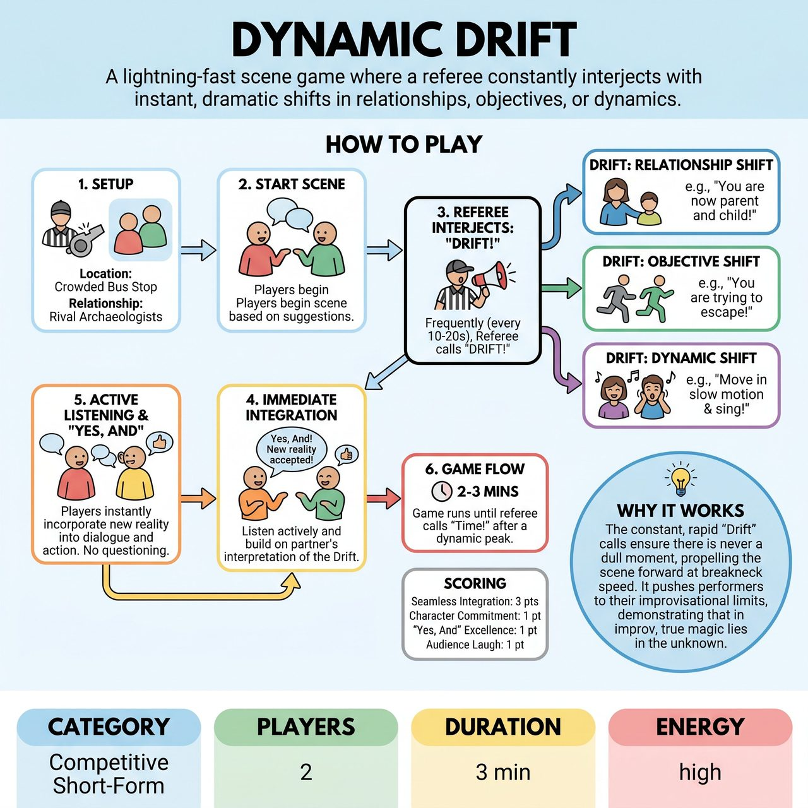

# Dynamic Drift

{ .game-hero }

> A lightning-fast scene game where a referee constantly interjects with instant, dramatic shifts in relationships, objectives, or dynamics.

## Overview
"Dynamic Drift" is a lightning-fast, two-player scene game where the referee constantly shouts out instant, dramatic shifts in character relationships, scene objectives, or the overall scene dynamic. Players must immediately and seamlessly integrate these "Drifts" into their ongoing dialogue and physical choices. It creates a hilarious and challenging improv workout that tests adaptability, "Yes, And" skills, and quick thinking under pressure.

## Setup
Two players from opposite teams on a standard competitive short-form stage. No props are used (all mimed object work). The audience provides the initial suggestion for the scene's location and an initial relationship between the two players.

## How to Play
1. The referee takes an audience suggestion for a location (e.g., 'a crowded bus stop') and an initial relationship between the two players (e.g., 'rival archaeologists').
2. The players begin the scene based on these suggestions.
3. At irregular but frequent intervals (typically every 10-20 seconds), the referee loudly interjects with 'Drift!' followed immediately by a new directive.
4. The directive changes one of three things: Relationship (e.g., 'You are now parent and child!'), Objective (e.g., 'You are trying to escape!'), or Dynamic (e.g., 'The scene is now a frantic race!').
5. Upon hearing the 'Drift!' call, players must immediately incorporate the new reality into their dialogue and physical choices. There is no time to question or logically explain the change; it simply becomes the new truth.
6. Players actively listen and 'Yes, And' their partner's interpretation of the new Drift, reinforcing the new dynamic or objective.
7. The game runs for 2-3 minutes or until the referee calls 'Time!' after a particularly dynamic Drift.
8. Scoring: Points are awarded for Seamless Drift Integration (3 points), Character Commitment (1 point), 'Yes, And' Excellence (1 point), Audience Laugh (1 point), and Strong Physicality (1 point). Points are deducted for Confusion Fouls (-2 points), 'No, But' Fouls (-1 point), Stalling Fouls (-1 point), Groaner Fouls (-1 point), and clean-content fouls (Referee's Discretion).

## Coaching Notes
- Players must accept the new reality of each Drift and build upon their partner's immediate reaction.
- Active listening is essential for understanding the Drift call and tracking the partner's response.
- Players must instantly adapt their character's motivations, physicality, and emotional state to fit the new relationship or dynamic.
- Mimed objects should take on new significance and uses with each Drift.
- The core challenge is to invent logical or hilarious justifications for illogical changes on the fly.
- Avoid stalling, questioning the drift, or obvious cheap puns that halt scene momentum.

## Why It Works
The constant, rapid 'Drift' calls ensure there is never a dull moment, propelling the scene forward at breakneck speed. It pushes performers to their improvisational limits, demonstrating the core principle that in improv, true magic lies in the instantaneous embrace of change. It promotes key skills like 'Yes, And', active listening, character re-endowment, and dynamic pacing.

## Safety & Inclusion
The game explicitly prohibits offensive content through a clean-content foul (blue humor, swearing, or innuendo). Standard physical safety applies during frantic shifts (e.g., mimicking a car chase).

