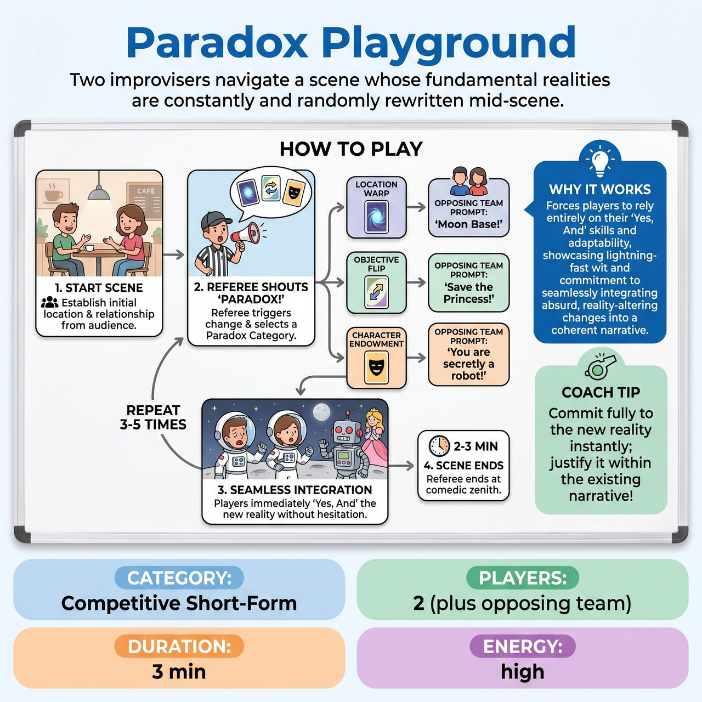

# Paradox Playground

{ .game-hero }

> Two improvisers navigate a scene whose fundamental realities are constantly and randomly rewritten mid-scene.

## Overview
Paradox Playground is a dynamic and fiercely challenging competitive short-form game where two improvisers attempt to navigate a scene whose fundamental realities (location, objectives, and character endowments) are constantly and randomly rewritten mid-scene. Triggered by the Referee and often dictated by the opposing team, these 'Paradox Prompts' force players into a hilarious struggle to accept and justify the absurd new realities with lightning-fast wit and physical commitment.

## Setup
Two improvisers from one team are in the scene, while the opposing team observes and contributes prompts. No props are used; all object work is mimed. The Referee stands off to the side with a small whiteboard or pre-labeled cards ('Location Warp', 'Objective Flip', 'Character Shift') to clarify the paradox category. The audience provides the initial scene premise.

## How to Play
1. The Referee obtains an initial starting location and a simple relationship or activity from the audience.
2. The two players begin the scene, establishing their characters and the initial situation.
3. After 30-45 seconds, or when the scene is ready for a shake-up, the Referee dramatically shouts 'PARADOX!'
4. The Referee uses a whiteboard or cards to indicate one of three Paradox Categories: Location Warp (physical environment shifts), Objective Flip (primary goal changes), or Character Shift (new endowment, trait, or limitation).
5. The Referee turns to the opposing team and asks them to provide a specific, single-word or short-phrase detail for the chosen category (e.g., 'Moon Base!' for Location Warp).
6. The playing improvisers must immediately and seamlessly integrate this new reality into their scene without questioning, ignoring, or visibly hesitating.
7. Players must 'Yes, And' the change as if it was always true, justifying it creatively and humorously within the existing narrative.
8. The scene continues, with the Referee calling 'PARADOX!' multiple times to introduce new layers of reality distortion.
9. The game ends after 2-3 minutes, 3-5 Paradox Prompts, or when the Referee determines a clear comedic zenith.

## Coaching Notes
- Award 3 points for seamless, hilarious integration; 2 points for creative justification that is slightly clunky but clear; and 1 point for enthusiastic acceptance without much cleverness.
- Call a Paradox Neglect/Fight foul (-5 points) if players visibly ignore, resist, argue with, or overtly delay integrating a prompt.
- Call a Lag Foul (-3 points) if a player takes more than 3 seconds to begin physically or verbally reacting to a new Paradox Prompt.
- Call a Groaner Foul for particularly obvious, unfunny puns or desperate, non-comedic attempts to integrate a paradox.
- Ensure players maintain physical commitment to the new realities, instantly altering their mimed environment or physical endowments.

## Why It Works
It forces players to rely entirely on their 'Yes, And' skills and adaptability, showcasing their lightning-fast wit and commitment to seamlessly integrating absurd, reality-altering changes into a coherent narrative.

## Safety & Inclusion
Enforce the clean-content foul strictly: with rapidly shifting realities, players and the opposing team must be extra vigilant to keep all suggestions and scene content strictly family-friendly.

