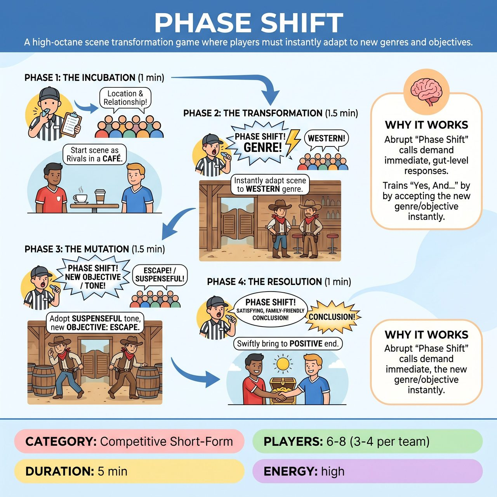

# Phase Shift

{ .game-hero }

> A high-octane scene transformation game where players must instantly adapt to new genres and objectives.

## Overview
Phase Shift is a high-octane competitive short-form game where two teams build a single, continuous scene that is radically transformed multiple times by the referee, based on audience suggestions. Players must instantly adapt the scene's genre, emotional tone, or objective, forcing a rapid evolution of their characters and the narrative within the existing setting. The game is a test of immediate adaptability, seamless integration, and comedic ingenuity across a dynamic, multi-phase story arc.

## Setup
Standard open stage with no props (all object work is mimed). Typically 3-4 players per team (Red vs. Blue). Designate two primary players to initiate the scene, one from each team. The audience provides initial scene suggestions (location, relationship) and mid-game 'Phase Shift' suggestions (new genre, new objective/mood).

## How to Play
1. 1. Phase 1: The Incubation (Approx. 1 minute). The Referee asks the audience for a Location and a Relationship between two primary players, one from each team. The designated primary players begin the scene, establishing their characters, situation, and initial objective. Other team members can join organically.
2. 2. Phase 2: The Transformation (Approx. 1.5 minutes). The Referee suddenly calls out, 'PHASE SHIFT! Give me a GENRE!' The audience shouts out suggestions. Players must immediately transform the existing scene to fit the new genre, adapting physical choices, vocal tones, and dialogue while maintaining the original location and characters.
3. 3. Phase 3: The Mutation (Approx. 1.5 minutes). The Referee calls, 'PHASE SHIFT! Give me a NEW OBJECTIVE / EMOTIONAL TONE!' The audience provides suggestions. Players must integrate this new objective or dominant emotional tone into the scene, layering it on top of the established location and the current genre.
4. 4. Phase 4: The Resolution (Approx. 1 minute). The Referee calls 'PHASE SHIFT! Bring it to a SATISFYING, FAMILY-FRIENDLY CONCLUSION!' Players must swiftly bring the multi-layered scene to a clear, humorous, and appropriate ending that respects the current genre and objective.

## Coaching Notes
- Instant Acceptance: Aim for immediate, smooth, and confident transitions between phases. The less hesitation, the more points awarded.
- Creative Integration: Cleverly weave the new phase elements into the existing scene, making disparate ideas work together.
- Character Evolution: Adapt endowments, physicality, and emotional responses believably across the shifts, without losing the core identity.
- Watch for Phase Lag Fouls: Penalize hesitation, confusion, or explicitly acknowledging/questioning the 'Phase Shift' (e.g., 'Wait, it's a musical now?').
- Watch for Narrative Break Fouls: Penalize abandoning previously established scene elements (location, character relationships, or the core of a previous genre) that should still be present.
- Watch for Groaner Fouls: Penalize cheap puns, obvious jokes, or breaking the flow of the scene with uninspired humor.

## Why It Works
The abrupt 'Phase Shift' calls demand immediate, gut-level responses, keeping the pacing incredibly dynamic and preventing any scene from stagnating. It forces players to practice 'Yes, And...' by accepting the referee's call and building upon the existing scene, while also developing active listening, fluid object work, and strong physical choices as characters evolve.

## Safety & Inclusion
The game inherently promotes creative problem-solving over crude humor. The final resolution phase explicitly mandates a family-appropriate ending. Standard competitive short-form rules apply: any blue humor, swearing, or inappropriate innuendo results in a clean-content foul and an automatic loss of points.

