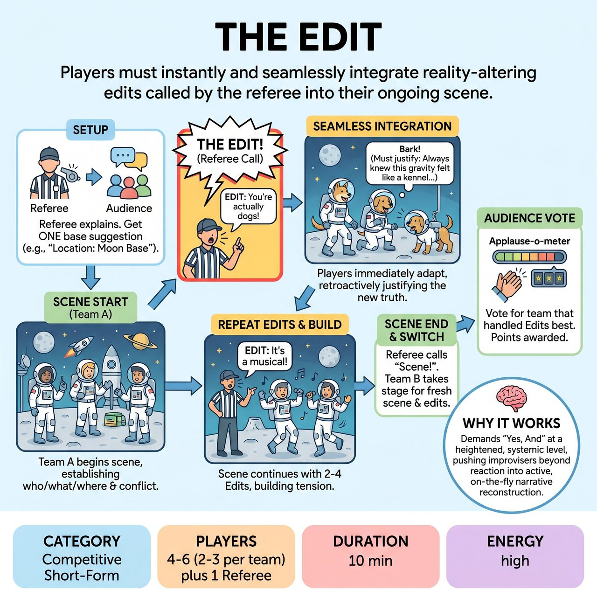

# The Edit

{ .game-hero }

> Players must instantly and seamlessly integrate reality-altering edits called by the referee into their ongoing scene.

## Overview
The Edit is a competitive improv game where two teams perform scenes based on audience suggestions. The core mechanic involves a referee interjecting 'EDIT!' to introduce a new, reality-altering piece of information at any point. Players must instantly and seamlessly integrate this new truth, retroactively justifying or reinterpreting their scene as if it had always been real.

## Setup
Form two competing teams (e.g., Red Team and Blue Team) of 2-3 improvisers each, plus a Referee for adjudication and initiating edits. Use a standard improv stage with minimal, generic set pieces like 1-2 chairs and a small table. Active audience participation is required for initial suggestions and final scoring.

## How to Play
1. The Referee introduces the game and explains the core mechanic: players will establish a scene, but at any moment, the Referee or audience may call 'EDIT!' to introduce a new fact that changes everything.
2. The Referee solicits a single Base Suggestion from the audience, such as an environment, characters, or a clear relationship.
3. Team A sends 2-3 players to the stage to begin a scene based on the Base Suggestion, establishing the 'who, what, where' and initiating conflict within the first 30-60 seconds.
4. At any point, the Referee loudly interjects by calling 'EDIT!' followed immediately by a specific, new piece of information (e.g., a genre shift, hidden truth, or physical constraint).
5. Players must instantly and seamlessly incorporate this new information into their ongoing scene, retroactively justifying or reinterpreting previous actions and dialogue.
6. The scene continues, with the Referee typically making 2-4 Edits per scene to build comedic tension.
7. The Referee calls 'Scene!' to end the round for Team A.
8. Team B takes the stage and performs a new scene, starting with a fresh Base Suggestion and enduring their own series of Edits.
9. After both teams perform, the Referee asks the audience to vote via applause-o-meter for the team that handled their Edits best, awarding points to the winner.

## Coaching Notes
- Players must not just acknowledge the new truth, but retroactively justify previous actions, dialogue, and character motivations in light of the edit.
- Characters must internalize and react as if this new information has always been true or is now their absolute reality.
- Referees should enforce standard competitive short-form match fouls, such as a concentration foul for players who struggle to integrate an edit, miss its implications, or break character.
- Call a groaner foul for excessively cheap, obvious, or uninspired jokes resulting from an edit.
- Penalties can include point deductions, points to the opposing team, or comedic penance like wearing a silly prop over the head.

## Variations
- Audience Power Edit: The Referee points to an audience member and solicits a short, impactful edit suggestion (e.g., 'You are all secretly aliens'), repeating it clearly for the players to integrate.

## Why It Works
It demands the 'Yes, And' principle at a heightened, systemic level, pushing improvisers beyond reacting to new information and into active, on-the-fly narrative reconstruction.

## Safety & Inclusion
Enforce a clean-content call or buzzer if any inappropriate, offensive, or non-family-friendly content is introduced, ensuring the game maintains a clean, family-friendly ethos.

