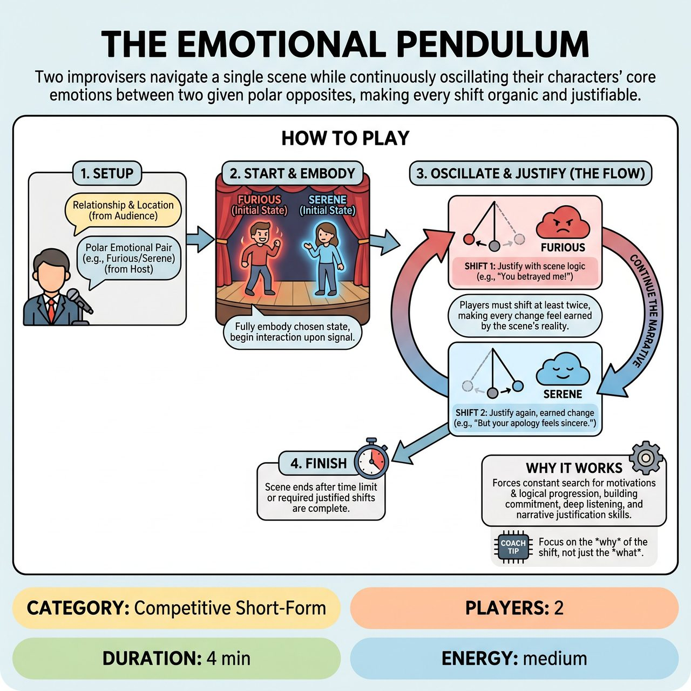

# The Emotional Pendulum

{ .game-hero }

> Two improvisers navigate a single scene while continuously oscillating their characters' core emotions between two given polar opposites, making every shift organic and justifiable.

## Overview
The Emotional Pendulum is an improv game where two players navigate a single scene by continuously oscillating their characters' core emotions between a host-provided pair of polar opposites (e.g., 'Furious/Serene'). The central challenge lies in making every emotional shift organic and entirely justifiable within the scene's developing narrative, testing improvisers' commitment, listening, and justification skills. Designed for competitive short-form matches, the game utilizes audience suggestions for scene setup and the emotional constraints, rewarding believable transitions and dynamic character work.

## Setup
2 improvisers on stage. No props required. An open playing space is sufficient. A host (or referee) is crucial to explain the rules, gather suggestions, present the emotional challenge, keep time, and award points. A visible scoreboard or the referee's hand signals can be used to award points for successful execution.

## How to Play
1. The host comes to center stage and asks the audience for a Relationship between two characters and a Specific Location for the scene.
2. The host presents the two improvisers with a polar opposite emotional pair (e.g., Ecstatic/Despondent, Furious/Serene, Deeply In Love/Bitterly Hateful).
3. The host instructs the players that they must embody one of these emotions as their dominant state when the scene begins, clearly establishing it.
4. Upon the host's signal ('Scene!'), the two improvisers begin their interaction, fully embodying their chosen initial emotional state within the suggested context.
5. During the 3-5 minute scene, each player's individual character must, at least twice, convincingly shift their dominant emotion from one extreme of the given pair to the other, and then back again (a 'return swing').
6. Players must justify every emotional shift so it feels earned and logical within the context of the scene's reality and the developing interaction.
7. Players continue the scene, developing the narrative, relationship, and characters while consistently navigating and justifying these radical emotional swings.
8. If played competitively (in a competitive match), the host/referee awards points for clear emotional embodiment, believable justification, impact on partner, comedic/dramatic resonance, and strong listening and building.
9. The host/referee deducts points (penalties/fouls) for unearned shifts, ignoring the constraint, or breaking character/reality.
10. The host signals the end of the scene after a set time limit (e.g., 3-5 minutes), once both players have completed their required pendulum swings, or upon a particularly strong final beat.

## Coaching Notes
- Justification is Key: The emotional shift cannot be an arbitrary or forced switch. Players must find dialogue, reactions, or physical choices that believably motivate their change.
- Players can influence each other's emotional state, trying to cause their partner's shift or reacting to something their partner says or does to justify their own.
- Active listening and 'Yes, And...' apply not just to plot, but to emotional offers.
- Maintain coherence and believability amidst the constant internal flux.
- Watch out for unearned shifts (an emotional switch that comes out of nowhere) or ignoring the constraint (failing to make a clear emotional swing, or sticking to one emotion for too long).

## Variations
- Activity Suggestion: The host may also ask the audience for a simple Activity the characters might be doing at the beginning for added specificity.
- General Games (Non-Competitive): Play without the competitive scoring, referee penalties, or scoreboard, focusing entirely on the scene work and emotional justification.

## Why It Works
Instead of simply being 'one emotion' or 'two emotions that switch once,' the requirement for continuous, justified oscillation is a fresh and demanding constraint. It forces improvisers to constantly search for motivations and logical progression within radical emotional shifts. This game directly hones a critical improv skill: making improbable things true within the scene. It's not enough to show an emotion; players must actively cause and explain its transformation.

## Safety & Inclusion
When playing with intense emotional pairs (e.g., Furious, Bitterly Hateful), ensure that the emotional intensity is directed at the circumstances or the characters' dynamic, rather than bleeding into genuine aggression toward the scene partner. Players should maintain physical safety and respect boundaries during heightened emotional swings.

