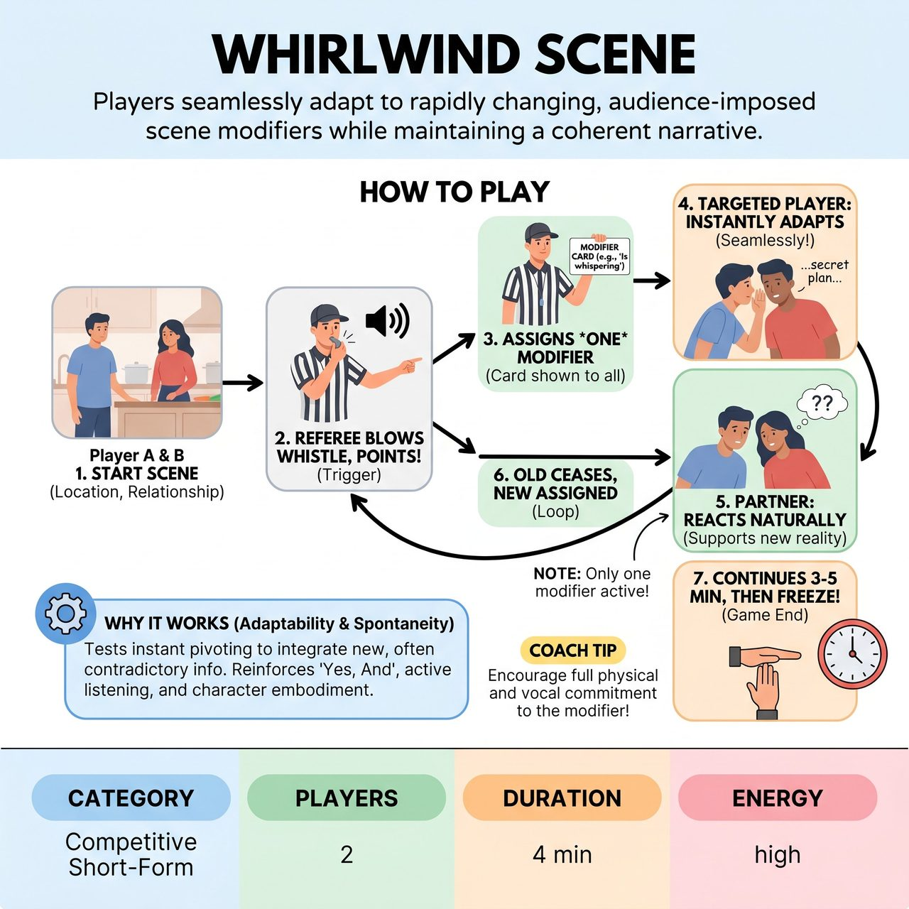

# Whirlwind Scene

{ .game-hero }

> Players seamlessly adapt to rapidly changing, audience-imposed scene modifiers while maintaining a coherent narrative.

## Overview
Whirlwind Scene is a dynamic improv game where two players must seamlessly adapt to rapidly changing, audience-imposed 'scene modifiers' while maintaining a coherent, family-friendly narrative. A referee randomly assigns a specific, vetted modifier to one player at a time, who must instantly integrate it into their character's actions or dialogue without breaking the narrative. The non-modified player then reacts naturally to the evolving absurdity, creating dynamic and often comedic interactions.

## Setup
Two players from the performing team take the stage. The Referee prepares a stack of pre-written 'Modifier Cards' generated from audience suggestions (e.g., 'Must only speak in questions', 'Can only move backwards'). The Referee vets all suggestions for family-friendliness, setting aside any inappropriate ones. Get an audience suggestion for a scene location and relationship to begin.

## How to Play
1. Two players begin the scene based on the suggested location and relationship.
2. At random intervals, the Referee blows a whistle or bell, shouts 'MODIFIER!', and points directly at one specific player.
3. The Referee holds up a pre-approved Modifier Card for that targeted player and the entire audience to see.
4. The targeted player must immediately and seamlessly adopt this new modifier into their character's actions, dialogue, or internal monologue without acknowledging the 'game' aspect.
5. The non-targeted partner continues the scene normally, reacting naturally and supportively to the new reality created by the modifier without being told what it is.
6. When the Referee signals for the next modifier, the previous modifier instantly ceases, and a new modifier is assigned to either player (only one modifier is active at a time).
7. The game continues for 3-5 minutes or until the Referee calls 'Freeze!' or 'Time!'.

## Coaching Notes
- Award points for seamless integration, effective reactions, maintaining pacing, and audience laughter.
- Call a 'Broken Code Foul' (5-point penalty) if a player fails to implement their modifier, ignores it, or takes too long to adapt.
- Call a 'Rule Explainer Foul' (3-point penalty) if a player describes their modifier instead of showing it through action and dialogue. The comedy comes from justification, not explanation.
- Call a 'Groaner Foul' or 'Content Foul' for excessively bad puns or inappropriate humor.
- Encourage strong object work and environment interaction if a modifier requires physical action.
- Remind players to maintain their underlying character goals and relationships while layering on the external behavioral constraint.

## Why It Works
It heavily tests adaptability and spontaneity, forcing players to pivot instantly to integrate new, often contradictory information. It reinforces fundamental 'Yes, And' skills, active listening, and character embodiment by requiring players to justify absurd constraints while maintaining scene momentum.

## Safety & Inclusion
All audience-suggested modifiers must be rigorously vetted by the Referee for family-friendliness and appropriate scope before the game begins. Any inappropriate suggestions or those that are too complex or derogatory must be politely set aside.

