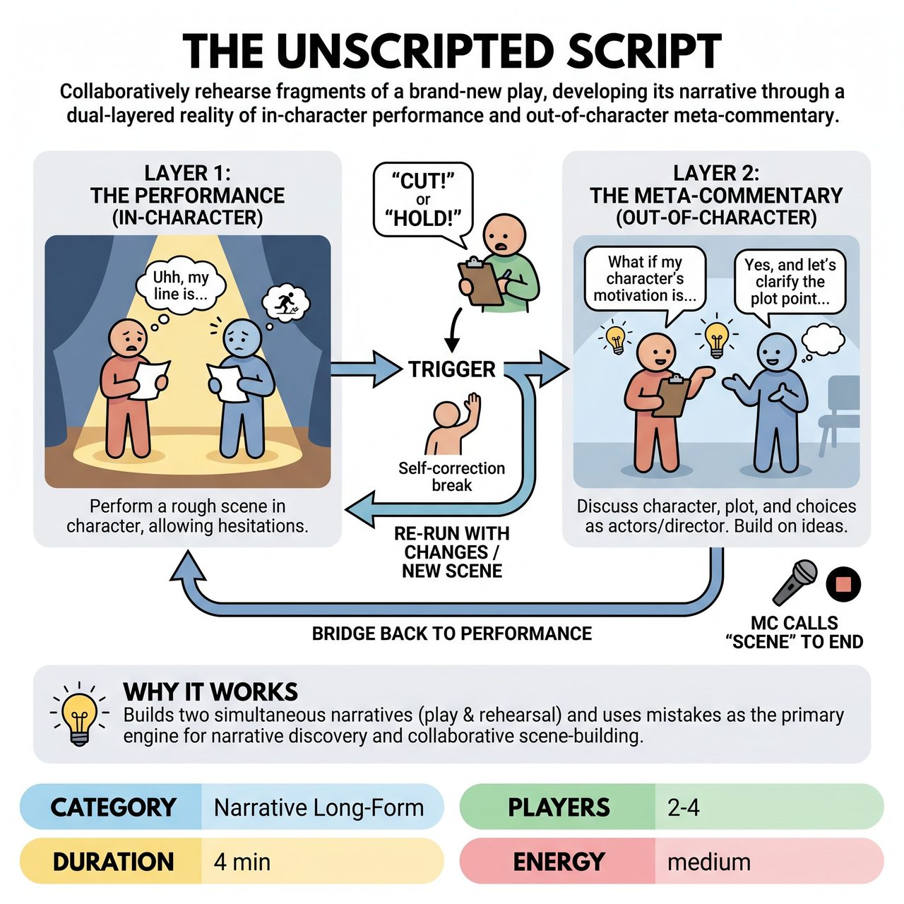

# The Unscripted Script

{ .game-hero }

> Collaboratively rehearse fragments of a brand-new play, developing its narrative through a dual-layered reality of in-character performance and out-of-character meta-commentary.

## Overview
Players perform intentionally rough, in-character scenes of a never-before-seen play, then transition into meta-commentary as actors or a director to discuss character motivations, plot points, and artistic choices. This dynamic interplay between performance and behind-the-scenes discussion challenges improvisers to demonstrate compelling storytelling and robust collaborative skills. The rehearsal process itself is used to build and deepen the play's evolving story.

## Setup
The MC obtains an audience suggestion for the Genre of the play being rehearsed and/or a Vague Premise/Opening Line. The improvisers take the stage ready to 'begin rehearsal' with no props or costumes beyond basic performance blacks (chairs may be used for set pieces if justified). For competitive play, 3 players is ideal: two primary actors and one Director/Stage Manager.

## How to Play
1. Begin Layer 1 (The Performance): Players start performing a scene from the 'play' in character, intentionally allowing for rough delivery, hesitations, fumbled lines, and physical uncertainty.
2. Transition to Layer 2 (The Meta-Commentary): At specific triggers, players 'break character' and step into the roles of actors, the director, or the stage manager to discuss the play, characters, script, blocking, or narrative choices.
3. Trigger a transition by having a designated Director/Stage Manager call 'Cut!' or 'Hold!', or by having any performer deliberately break character to self-correct or offer a meta-note (e.g., 'Wait, can we run that again?').
4. During meta-commentary, actively build on each other's ideas, offering suggestions and accepting directorial notes to clarify, deepen, or advance the narrative of the play.
5. Bridge back to the performance by re-running the scene with the discussed changes or moving to a new scene within the play.
6. Continue alternating between the performance and meta-commentary layers until the MC calls 'Scene' to end the game.

## Coaching Notes
- Ensure all meta-commentary serves to improve both the character and the collective play; notes should never be blocking or destructive.
- Embrace mistakes: flubbed lines, forgotten motivations, and awkward blocking are the primary triggers for creative problem-solving and narrative discovery.
- Play with status shifts: actors are typically submissive to the director during meta-commentary, but character status dictates the in-scene power dynamics.
- Highlight the contrast in physicality and voice between tentative rehearsal movements/lines and more committed performance moments.
- Performers must readily incorporate directorial notes and script suggestions into their subsequent performances to show they are being changed.

## Variations
- External Signal: A judge or MC periodically uses a bell or specific sound to force a transition to meta-commentary, ensuring both layers are explored if performers get stuck in one.

## Why It Works
It explicitly demands the development of two narratives simultaneously (the play and the rehearsal process) and turns 'failure' into opportunity by using mistakes as the primary engine for narrative discovery and collaborative scene-building.

## Safety & Inclusion
Ensure physical and emotional boundaries are respected during directorial notes and scene work. Meta-commentary should remain focused on the fictional narrative and never be used to genuinely criticize, demean, or bulldoze fellow players.

