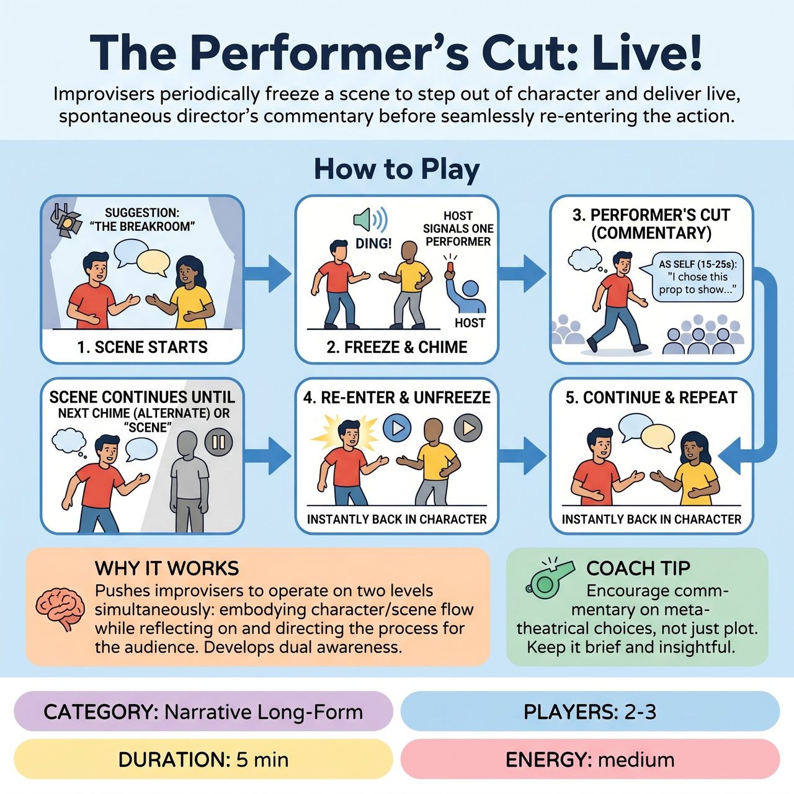

# The Performer's Cut: Live!

{ .game-hero }

> Improvisers periodically freeze a scene to step out of character and deliver live, spontaneous director's commentary before seamlessly re-entering the action.

## Overview
The Performer's Cut: Live! is a game where improvisers periodically freeze a scene to step out of character and deliver live, spontaneous director's commentary. As themselves, they offer insights into their character's choices, narrative progression, or collaborative improvisational process, before seamlessly re-entering the scene. This unique format deepens the unfolding story by encouraging conscious choices and provides the audience with an engaging window into the analytical mind of the improviser.

## Setup
Two performers take the stage. The Host solicits a standard improv suggestion (e.g., location, relationship, emotional states, first line). A distinct chime or buzzer is needed for the Host to trigger the freezes.

## How to Play
1. The two performers initiate a scene based on the suggestion.
2. At predetermined intervals (e.g., every 60-90 seconds), the Host sounds a distinct chime or buzzer, and the scene freezes.
3. The Host indicates which performer will offer the Performer's Cut (performers alternate each time the chime sounds).
4. The designated performer steps out of the scene's immediate spatial context (e.g., takes a step forward or turns directly to the audience), while the other performer remains frozen exactly as they were, holding their last physical pose and emotional state.
5. The commenting performer addresses the audience as themselves (the improviser, not the character) for a brief period (15-25 seconds), offering commentary on character insight, narrative progression, collaborative reads, addressing a mistake, or a conscious improv choice.
6. After the commentary, the performer steps back into the scene's physical space, instantly re-adopts their character's voice, physicality, and emotional state, and continues the scene seamlessly from the frozen moment, ideally informed by their commentary.
7. The other performer unfreezes and continues the scene from their original frozen position.
8. The scene continues until the next chime, when the other performer takes their turn, or until the Host calls Scene.

## Coaching Notes
- Narrative Development: Encourage performers to think about the 'why' and 'where next' of their story, making deliberate choices that they then articulate to shape and deepen the narrative.
- Embracing Mistakes/Unexpected Turns: Use the Performer's Cut to address perceived mistakes or unexpected turns, explaining how to incorporate them as a gift to transform stumbles into conscious narrative choices.
- Collaborative Scene-Building: Commenting on a partner's choices requires closely observing and articulating appreciation for their contributions, then flawlessly picking up the thread to implicitly affirm them.
- Being Changed: Performers must instantaneously shift from their character persona to their analytical improviser-self, and then instantly and convincingly snap back into character, often embodying a character who is now subtly or explicitly changed.
- Yes, And: The act of commenting on a partner's move and planning how to integrate it is a verbalized Yes, And, while the frozen partner implicitly asks the commentator to Yes, And the scene in their absence.

## Variations
- Designated Commentator: A third performer serves as a designated commentator who rotates in, though two ensures tighter collaboration and alternating turns.

## Why It Works
It pushes improvisers to operate on two levels simultaneously: embodying a character and maintaining scene flow, while also reflecting on and directing that process for the audience. This provides a unique, direct window into the improviser's mind, making the audience privy to the creative choices, challenges, and collaborative dynamics unfolding live.

## Safety & Inclusion
Ensure physical safety when freezing in dynamic poses. Maintain respect for scene partners during commentary; use the director's cut to uplift and build upon your partner's choices rather than criticizing them.

