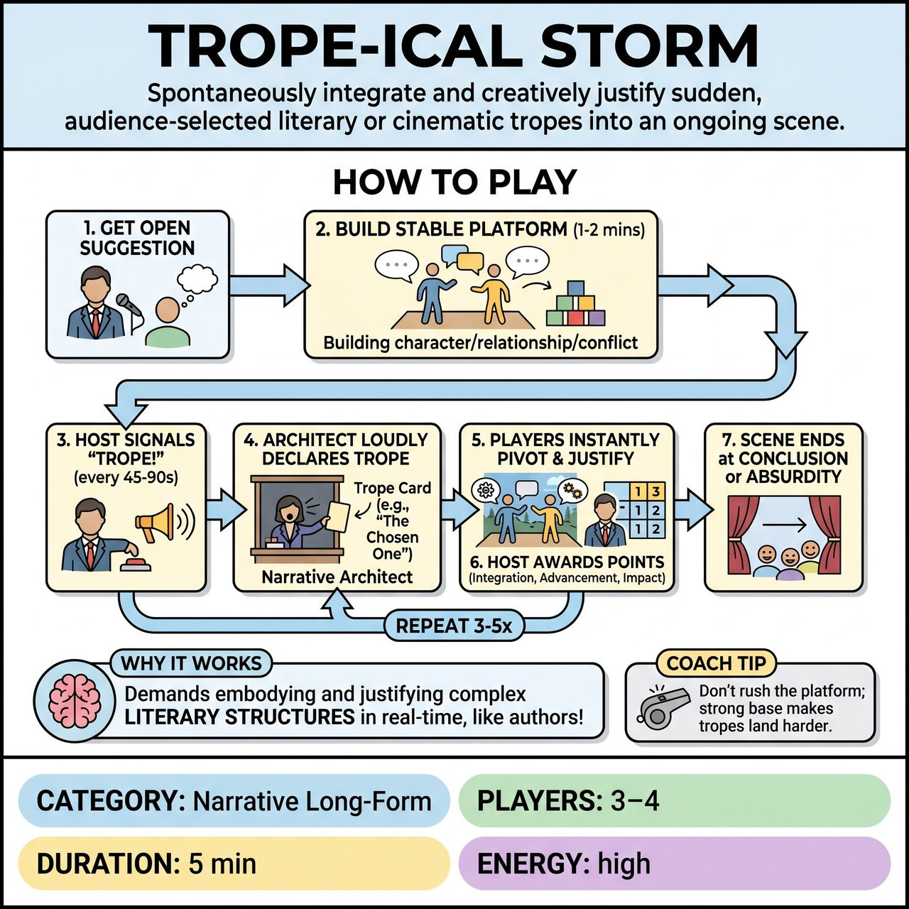

# Trope-ical Storm

{ .game-hero }

> Spontaneously integrate and creatively justify sudden, audience-selected literary or cinematic tropes into an ongoing scene.

## Overview
A high-level, competitive short-form game where an audience 'Narrative Architect' injects specific literary or cinematic tropes into an ongoing scene upon an audible signal. Players must instantly integrate and creatively justify these narrative structures, showcasing rapid adaptability and meta-narrative storytelling.

## Setup
Requires 3-4 improvisers, a Host/Referee, and one audience member designated as the 'Narrative Architect'. Prepare a 'Trope Deck' of 5-7 cards, each bearing a specific trope (e.g., 'Deus Ex Machina', 'Flashback', 'Unreliable Narrator', 'Planted Object', 'Breaking the Fourth Wall', 'Plot Twist', 'Prophecy Fulfilled'). You also need a clear signal device like a bell, buzzer, or cymbal crash.

## How to Play
1. The Host solicits a single, open-ended suggestion from the audience to initiate the scene.
2. Players initiate an open scene, spending 1-2 minutes building a stable 'platform' of clear characters, relationships, and foundational conflict.
3. At the Host's discretion (typically every 45-90 seconds), the Host declares 'Trope!' and activates the signal device.
4. Upon hearing the signal, the Narrative Architect immediately selects one trope card from their hand and loudly declares it.
5. Players must instantly pivot their characters' actions, dialogue, and the scene's framework to integrate and justify the trope's sudden appearance.
6. The Host awards points in a competitive short-form style based on Trope Integration (1-3 points), Scene Advancement (1-2 points), and Audience Impact (1-2 points), with bonuses (+1) for ingenuity and deductions (-1) for failing to integrate or breaking character.
7. The scene continues through 3-5 distinct trope injections until the Host calls the scene's end when it reaches a satisfying conclusion or delightful absurdity.

## Coaching Notes
- Unconditional 'Yes, And' to Narrative Structure: Players must accept the declared trope as a new, undeniable truth within the scene's evolving reality.
- Real-time Narrative Pivot: Instantly pivot actions, dialogue, and even the scene's temporal or conceptual framework.
- Flashback: One player can freeze, shift body language, and initiate a past event. Others must adapt by joining or observing.
- Deus Ex Machina: Have a character 'notice' an absurdly convenient, previously unestablished escape route or object, making the miracle amusingly improbable yet integrated.
- Unreliable Narrator: A character can break eye contact, address the audience, and amend a previous statement or exaggeration.
- Planted Object: A previously mentioned but seemingly irrelevant object must suddenly become critically important to the conflict or resolution.
- Creative Outcome: Do not merely acknowledge the trope; actively leverage it to drive new comedic or dramatic developments.

## Why It Works
It moves beyond simple content-based constraints to structural and meta-narrative constraints, demanding that improvisers embody and justify complex literary devices in real-time. This requires players to think like authors and directors concurrently with acting, placing a substantial but rewarding cognitive load on the performers.

## Safety & Inclusion
Ensure physical safety during rapid scene pivots. The Host should monitor the scene to ensure injected tropes do not force players into uncomfortable subject matter or cross personal boundaries.

