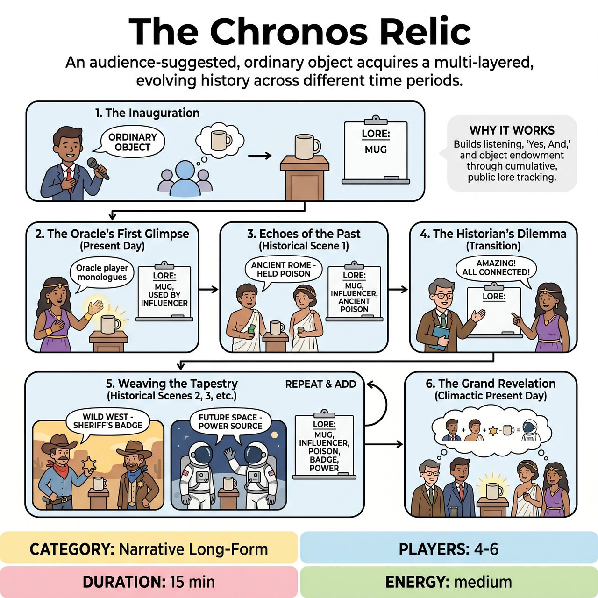

# The Chronos Relic

{ .game-hero }

> An audience-suggested, ordinary object acquires a multi-layered, evolving history across different time periods.

## Overview
The Chronos Relic is an improvised game where an audience-suggested, ordinary object acquires a multi-layered, evolving history across different time periods. Players create scenes that establish and build upon the object's lore, which is publicly tracked on a whiteboard, ensuring each subsequent scene must integrate all previously established details. This cumulative and often hilariously contradictory history culminates in a final present-day scene where the relic's entire bizarre timeline shapes its profound significance and ultimate fate.

## Setup
Requires 4-6 improvisers (two teams if competitive), a clear performance area, a small elevated pedestal or stand prominently placed center stage, a large whiteboard or flip chart visible to all, and a marker. Obtain one actual, ordinary, audience-suggested object (e.g., a single shoe, a chipped coffee mug). A Host/Referee is essential for moderating suggestions, tracking the object's 'lore,' and awarding points.

## How to Play
1. 1. The Inauguration: The Host/Referee solicits a suggestion for an ordinary, everyday object. The Host places the actual object onto the pedestal. This object is now 'The Chronos Relic.'
2. 2. The Oracle's First Glimpse (Present Day - Scene 1): One player ('The Oracle') steps forward to the relic in the present day. They deliver a brief monologue or scene establishing its profound present-day significance and one ambiguous, intriguing historical hint about its unknown past. The Host writes the 'Present-Day Significance' on the whiteboard.
3. 3. Echoes of the Past (Historical Scene 1): The Oracle calls out a specific historical era. 2-3 other players perform a scene in that era. The relic must be physically present and played as historically appropriate. The scene must incorporate the Oracle's historical hint and a proto-version of the relic's present-day significance. The scene ends with a significant event where the relic gains a new piece of lore. The Host writes this 'New Historical Truth' on the whiteboard under that era.
4. 4. The Historian's Dilemma (Transition): Another player (the 'Historian') joins the Oracle at the pedestal, marveling at the relic and acknowledging all written 'Historical Truths.' The Historian then announces a different historical era (or speculative future) for the next scene.
5. 5. Weaving the Tapestry (Historical Scenes 2, 3, etc.): 2-3 players perform the new scene, integrating the entire cumulative lore from the whiteboard and adding a new piece of lore. The Host adds this to the whiteboard. Repeat Steps 4 and 5 for a predetermined number of rounds (e.g., 3-4 historical scenes total).
6. 6. The Grand Revelation (Climactic Present Day - Final Scene): All players return to the present day around the relic. The relic's full, cumulative history is now active and influences the characters' actions. Characters must acknowledge all established lore and bring the narrative to a satisfying, comedic, or dramatically resonant conclusion.

## Coaching Notes
- Creative Integration: Encourage players to skillfully weave all existing lore into their scenes, especially when connecting seemingly disparate facts.
- Narrative Leap: Ensure the 'New Historical Truth' added by a scene is compelling or surprising, and builds upon the relic's evolving story.
- Object Resonance: Remind players to stay physically and emotionally connected to the object, demonstrating its evolving significance through object work.
- Consistency: Reward players for making sense of the relic's sometimes contradictory history, or for playing the contradiction for maximal comedic effect.
- Emotional Arc: Guide players to convey the growing emotional stakes associated with the relic throughout its various timelines.

## Variations
- Competitive Play (competitive short-form match): The Referee awards 1-5 points for Creative Integration, Narrative Leap, Object Resonance, Consistency, and Emotional Arc. At the end, the audience votes for the team that best developed the 'true spirit' of the Chronos Relic's bizarre history, contributing to the final score.

## Why It Works
It leverages classic improv skills such as listening, 'Yes, And,' object endowment, and strong character choices within genre. The cumulative, persistent, and evolving 'lore' of a single mundane object, tracked publicly and demanded in every subsequent scene, pushes beyond typical object endowment games. It creates a dynamic, multi-layered narrative across time, making the object not just a prop, but a living, breathing historical character whose past directly shapes its present and future.

## Safety & Inclusion
Ensure physical safety when interacting with the object and pedestal. Respect physical boundaries during scenes, especially when heightening emotional stakes or physical comedy.

