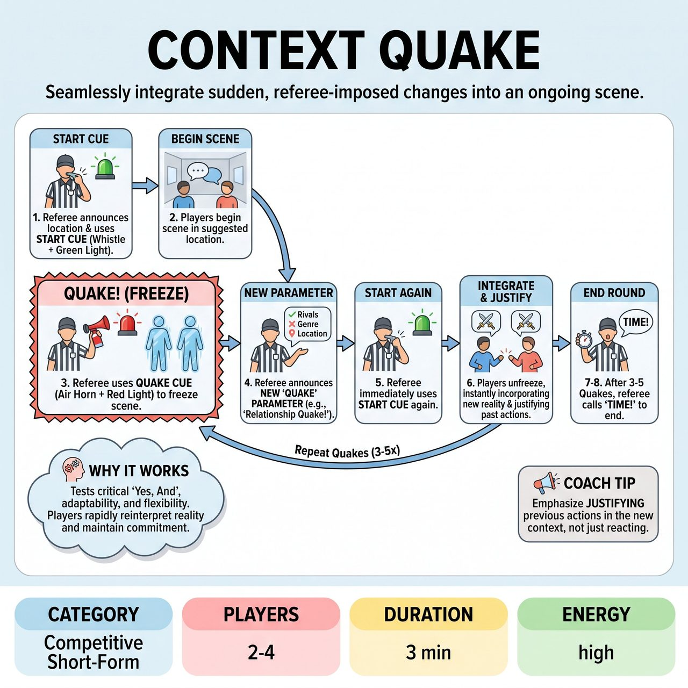

# Context Quake

{ .game-hero }

> Players must seamlessly integrate sudden, referee-imposed changes into an ongoing scene.

## Overview
Context Quake is a rapid-fire improvisational game where teams of players must demonstrate extreme adaptability and collaborative humor. A referee regularly imposes sudden, audibly and visually cued 'Quakes' that instantly change a core element of an ongoing scene, such as its location, the characters' relationships, or the genre. Players earn points by seamlessly, humorously, and coherently integrating these new parameters as if they were always part of the scene's reality.

## Setup
Form two teams (Red vs. Blue), with two players from one team on stage at a time. The referee solicits a single audience suggestion for a Location to start the scene. The referee needs a pre-determined list of 'Quake' categories (Location, Relationship, Emotion, Objective, Genre) and distinct visual/auditory cues (e.g., whistle and green light for start, air horn and red light for freeze/quake).

## How to Play
1. The referee announces the starting location and uses the Start Cue (Short Whistle + Green Light Flash).
2. Two players from the designated team immediately begin a scene in the suggested location.
3. At unpredictable intervals (typically 15-30 seconds), the referee uses the Quake Cue (Air Horn/Buzzer + Red Light Flash) to instantly freeze the scene.
4. The referee announces a new 'Quake' parameter (e.g., 'Relationship Quake! You are now bitter rivals!').
5. The referee immediately uses the Start Cue again.
6. Players unfreeze and continue the scene, instantly incorporating the new parameter as if it had always been the case, justifying previous actions and dialogue within the new context.
7. The game continues with multiple Quakes layering new challenges onto the scene.
8. The referee calls 'Freeze!' or 'Time!' (or uses a Game End Cue) to end the round after 3-5 Quakes, and the next team takes the stage.

## Coaching Notes
- Players must 'Yes, And' everything, especially the abrupt changes thrown by the referee.
- Maintain character consistency (unless the Quake specifically alters character) and strong object work throughout the rapid shifts.
- Call a 'Context Contradiction Foul' if a player overtly contradicts or ignores the new Quake parameter for more than a brief beat of processing.
- Call a 'Lag Foul' if a player visibly hesitates, freezes up, or takes too long to adapt to the new Quake after the Start Cue.
- Call a 'Groaner Foul' for excessively bad puns or predictable jokes.
- The referee controls the pace of the game by determining the intervals between Quakes, keeping the energy high and challenging the players' agility.

## Variations
- Audience Choice: The referee occasionally asks the audience to suggest which 'Quake' category they want next (e.g., 'Audience, should I hit them with a Relationship Quake or an Objective Quake?').

## Why It Works
It tests absolutely critical 'Yes, And' skills, active listening, adaptability, and flexibility. Players must rapidly change their reality, reinterpret objects, and maintain character endowment and emotional commitment even as their circumstances are thrown into chaos.

## Safety & Inclusion
Strictly enforce a clean-content foul: any blue humor, swearing, or innuendo results in an immediate point deduction and removal of the offending player, reinforcing the family-friendly nature of the game.

