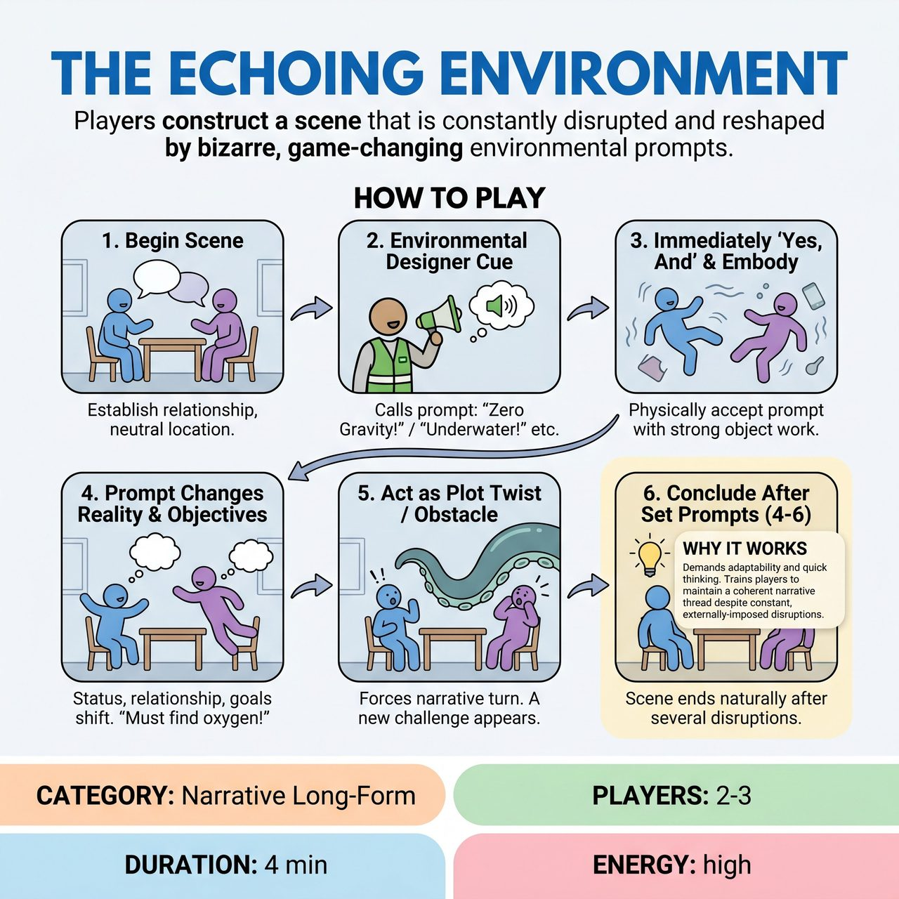

# The Echoing Environment

{ .game-hero }

> Players construct a scene that is constantly disrupted and reshaped by bizarre, game-changing environmental prompts.

## Overview
The Echoing Environment is an improvisational game where players collaboratively construct a narrative dynamically reshaped by external environmental prompts. A designated 'Environmental Designer' introduces new physical realities at regular intervals that improvisers must immediately accept and physically embody. This dynamic interaction highlights how circumstances intrinsically shape character and narrative progression.

## Setup
A bare stage. A non-performing 'Environmental Designer' (ED) – typically the host, a judge, or a designated player – needs a small bell, buzzer, or a specific light cue to signal new prompts.

## How to Play
1. The improvisers begin a scene, establishing their characters, their relationship, and an initial neutral location or situation.
2. At regular, predetermined intervals (e.g., every 30-45 seconds), the Environmental Designer signals a cue and calls out a single word or short phrase describing a new, significant characteristic of the shared environment (e.g., 'The floor is lava,' 'Zero gravity').
3. Performers must immediately 'Yes, And' this new environmental characteristic into the scene, physically demonstrating its impact using strong object work.
4. Players must allow the prompt to change their physical reality, their objectives, their status, or their relationship within the scene.
5. Each environmental change should act as a plot twist or a significant obstacle/opportunity, forcing the narrative to twist and turn in unexpected directions.
6. The game concludes after a set number of environmental prompts (e.g., 4-6 prompts), allowing for a natural, albeit often abrupt, conclusion to the rapidly evolving narrative.

## Coaching Notes
- Narrative Development: Ensure each environmental prompt serves as an active plot device, forcing characters to adapt their goals and propelling the story forward.
- Embracing Mistakes/Taking Risks: Encourage performers to fully commit to bizarre, contradictory, or seemingly impossible prompts, treating any initial awkwardness as a springboard for new narrative.
- Collaborative Scene-Building: Players must instantly agree on the new environmental reality and its implications for both their characters. If one player ignores a prompt, the scene falters.
- Being Changed: Players cannot simply ignore the new reality; they must be changed by it, adapting their objectives, status, and physical approach.
- Physicality & Object Work: Demand strong physical reactions, believable imaginary object work, and a constant re-evaluation of how characters interact with their evolving space.
- Spatial Awareness: Remind performers to constantly redefine and react to their physical relationship to the stage, to each other, and to the newly introduced environmental elements.

## Why It Works
The environment actively changes the characters' circumstances, demanding they adapt their objectives and physical approach. It tests the ability to maintain a coherent narrative thread through constant disruption while reinforcing fundamental 'Yes, And' and object work skills.

## Safety & Inclusion
Players should maintain physical control and spatial awareness when reacting to extreme environmental prompts (like 'zero gravity' or 'ice') to prevent accidental collisions, falls, or injuries.

