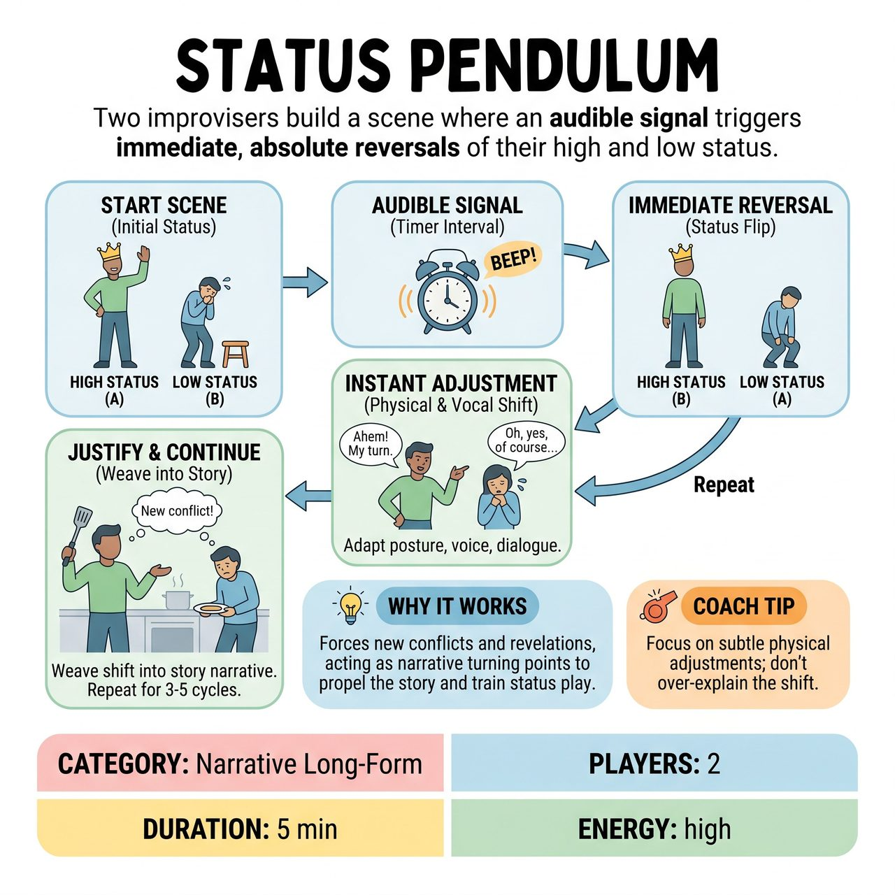

# Status Pendulum

{ .game-hero }

> Two improvisers build a scene where an audible signal triggers immediate, absolute reversals of their high and low status.

## Overview
Status Pendulum is a short-form game that challenges improvisers to collaboratively build a coherent scene by incorporating regular, oscillating shifts in character status. At set intervals, an audible signal triggers an immediate and absolute reversal of high and low status between the characters. This forces performers to instantly adapt their physicality, vocal tone, and dialogue while seamlessly integrating these fluctuating power dynamics into the evolving narrative.

## Setup
The MC obtains a single, simple suggestion from the audience to establish a scene premise (e.g., 'A doctor's office'). A designated 'Timer' (the MC or a stagehand) stands off-stage with a clear audible signal (bell, chime, or buzzer) and a stopwatch. Performers are assigned an initial status designation: Performer A is High Status, Performer B is Low Status. The MC determines the interval for the signal (e.g., every 60-90 seconds).

## How to Play
1. Begin the scene with Performer A playing High Status and Performer B playing Low Status.
2. At the set interval (e.g., 75 seconds), the Timer emits the audible signal.
3. Immediately upon the signal, the status dynamic reverses: the High Status character becomes Low Status, and the Low Status character becomes High Status.
4. Performers instantaneously adjust their character's physicality, vocal tone, demeanor, and dialogue to reflect their new status.
5. Performers must weave the shifts into the scene's evolving narrative, justifying the sudden alteration in their reality or perceived power without explicitly stating their status changed.
6. The pendulum continues to swing with each successive signal until the MC or Timer concludes the scene after 3-5 minutes, allowing for 3-5 status shifts.

## Coaching Notes
- Instant Adaptation ('Being Changed'): Performers must react immediately to the status shift, showing the change in their entire being. A moment of high status followed by an abrupt low status must be visibly and audibly clear.
- Justification: The characters' external power dynamic changes, but their internal objective might not. Embody how the character responds to this sudden alteration in their reality rather than just stating it.
- Partner Support: Performers must accept their partner's new status and support it. If one player suddenly adopts high status, the other must acknowledge it by taking on low status. Do not battle for status; collaborate to embody the forced shift.
- Embrace Mistakes: A clumsy status change isn't a mistake but an opportunity. Lean into the awkwardness or challenge of the new status.
- Physicality & Vocal Expression: Use posture, eye contact, vocal projection, and personal space as fundamental tools for expressing the immediate and dramatic shift in status.

## Why It Works
The external shifts act as narrative turning points, forcing new conflicts, revelations, and character reactions that propel the story. It provides an intense workout for understanding status play, collaborative scene-building, and the fundamental skill of 'being changed' by external circumstances.

## Safety & Inclusion
Ensure physical choices related to high and low status (such as towering over someone, crouching, or altering personal space) remain respectful of performers' physical boundaries and consent.

