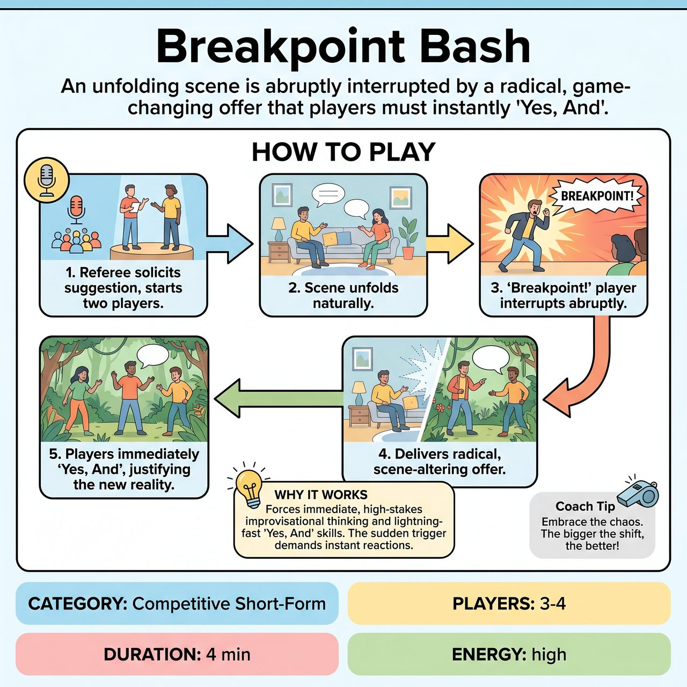

# Breakpoint Bash

{ .game-hero }

> An unfolding scene is abruptly interrupted by a radical, game-changing offer that players must instantly 'Yes, And'.

## Overview
'Breakpoint Bash' is a dynamic competitive short-form game where a developing scene is suddenly, and often radically, interrupted by a 'Breakpoint!' - a game-changing offer that entirely redefines the scene's reality. The challenge for the other players is to immediately 'Yes, And' this new reality, integrating it seamlessly with humor and ingenuity.

## Setup
Requires 3-4 players (2 starting, 1-2 waiting off-stage), a standard performance area, and a Referee. All props must be mimed. Get an initial scene suggestion from the audience (e.g., location, relationship, or first line).

## How to Play
1. The Referee solicits a suggestion from the audience and chooses two players to start the scene.
2. At any moment, a designated 'Breakpoint!' player (waiting off-stage or signaled by the Referee) yells 'BREAKPOINT!' and leaps into action.
3. The 'Breakpoint!' player delivers a new, radical, and distinct improvisational offer that fundamentally alters the existing scene (e.g., changing the environment, genre, or physics of the world) using strong physical presence and clear mime.
4. The players already in the scene must immediately 'Yes, And' the offer, instantly justifying the new circumstances and adapting their characters without questioning or ignoring it.
5. The scene continues in its altered state until the Referee observes enough creative integration or calls 'TIME!'.
6. The Referee awards points: 3 points for a surprising Breakpoint Bonus, 2 points per player for Integration Ingenuity, and 1 Audience Acclaim bonus point for exceptional wit or physical comedy.

## Coaching Notes
- Watch out for the Freeze-Out Foul (1 point deduction): penalize players who visibly hesitate, question the offer, or fail to actively 'Yes, And' the new reality.
- Watch out for the Mini-Moment Foul (1 point deduction): penalize 'Breakpoint!' offers that are too subtle or merely add a minor detail without genuinely changing the scene's core premise.
- Call a Groaner Foul (1 point deduction) for any offer or integration that falls flat, relies on an obvious cliché, or fails to generate humor.
- Encourage players to use strong object work and physical choices, as 'Breakpoints!' often necessitate immediate physical transformations.
- Players must instantly adapt existing characters or invent entirely new traits and motivations to fit the drastically altered scene.

## Variations
- REMIX!: The Referee can yell 'REMIX!' mid-scene, signaling that a player already in the scene can now call 'Breakpoint!' instead of an off-stage player.

## Why It Works
It forces immediate, high-stakes improvisational thinking and lightning-fast 'Yes, And' skills. The sudden trigger demands instant reactions and active listening, ensuring the game moves at a relentless pace while developing character endowments and dynamic pacing.

## Safety & Inclusion
Strict adherence to the clean-content foul: Any inappropriate, offensive, or blue humor, language, or gesture results in an immediate 3-point deduction and potential player removal from the game, ensuring the scene remains family-friendly.

