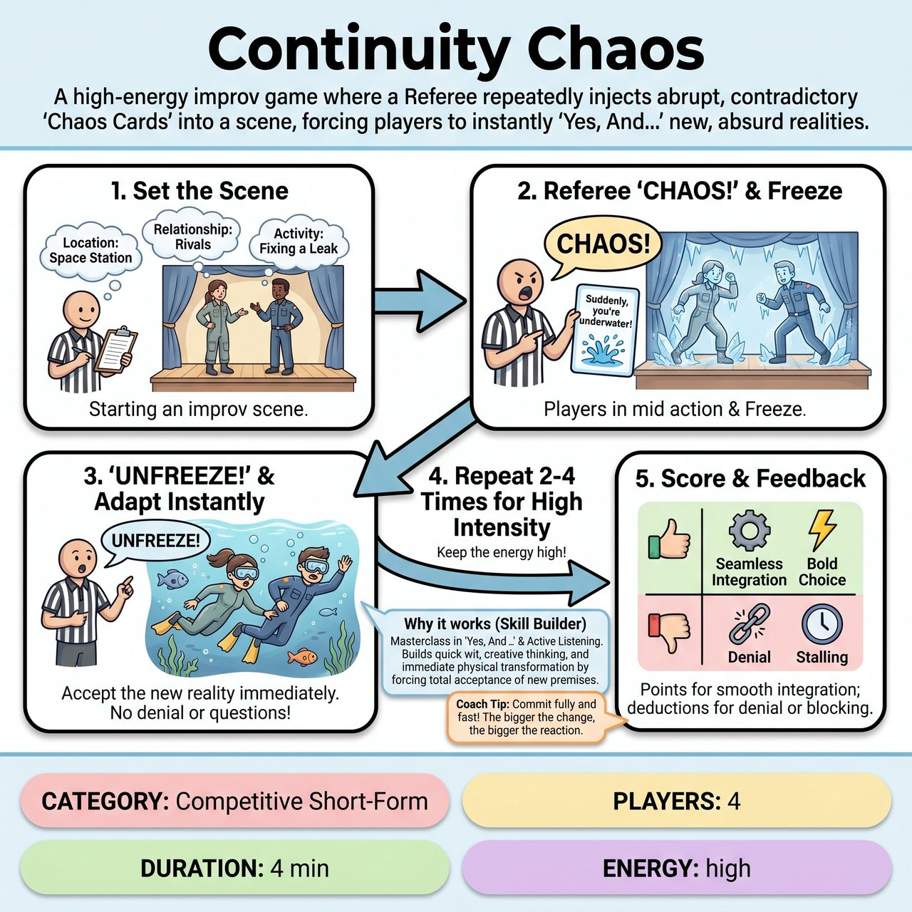

# Continuity Chaos

{ .game-hero }

> A high-energy improv game where a Referee repeatedly injects abrupt, contradictory 'Chaos Cards' into a scene, forcing players to instantly 'Yes, And...' new, absurd realities.

## Overview
Continuity Chaos challenges improvisers to build a compelling scene only to have its established reality, character endowments, or narrative arc abruptly and unpredictably recalibrated by the Referee or audience. Players must immediately and unequivocally 'Yes, And...' these often contradictory new facts, integrating them seamlessly into the new continuity. It's a high-stakes improv tightrope walk where the ground shifts beneath your feet.

## Setup
Designed for 4 players (2 from each team on stage). Props are entirely mimed. Use a standard competitive short-form playing space with a central 'Chaos Control Podium' (or simple table) for the Referee to hold the 'Chaos Cards'. The audience provides the initial scene setting. The Referee acts as the 'Chaos Engine' to interrupt the scene, draw cards, manage rules, and assign points.

## How to Play
1. The Referee gathers initial suggestions from the audience for a Location, Core Relationship, and Current Activity/Problem.
2. Two players from each team take the stage to initiate a conventional improv scene based on these suggestions, establishing characters, stakes, and narrative details.
3. At a tactical moment (typically after 30-60 seconds of play), the Referee loudly declares, 'CHAOS!' and freezes the action on stage.
4. The Referee reveals and reads a 'Chaos Card' from a pre-made deck. The card contains a clear instruction that directly contradicts or drastically alters a previously established fact, relationship, or situation.
5. The Referee announces, 'UNFREEZE!' The players must immediately accept the new reality presented by the card without questioning, denying, or explaining the change, making it make sense within the new context.
6. The Referee injects Chaos Cards 2-4 times within the game, keeping intensity high while allowing players to briefly develop the new continuity.
7. The Referee awards points for seamless integration (+5 Continuity Conqueror), strong adaptability (+3 Agile Adaptor), bold physical choices (+2 Fierce Follies), and audience reactions.
8. The Referee deducts points for denying the reality (-5 Reality Rip), cheap puns (Groaner Foul), time stalling, or inappropriate humor (clean-content foul).

## Coaching Notes
- Encourage strong initial endowments and active listening at the top of the scene so there is a solid reality to disrupt.
- Ensure players do not question, deny, or explain the change; they must retroactively justify or completely shift characters.
- Pace the Chaos Cards to keep intensity high, but leave enough space (30-60 seconds) for players to briefly develop the new continuity before shattering it again.
- Watch out for the 'Reality Rip' foul: denying, arguing with, or explicitly questioning a Chaos Card instruction breaks the fundamental premise of the game.
- Watch out for 'Time Stall' fouls: long pauses, visible confusion without attempts to play through, or a general lack of forward momentum.
- Remind players that drastic shifts necessitate strong, immediate physical transformations and creative object work.

## Variations
- Audience Voting: For added audience integration, the Referee may occasionally hold up 2-3 pre-selected 'Chaos Cards' for the audience to loudly vote on, providing direct, game-altering input.

## Why It Works
The game is a dynamic masterclass in 'Yes, And...' and active listening. Every Chaos Card forces players to accept the new reality entirely and build upon its premise. It demands quick wit, creative thinking, and immediate physical transformations to integrate contradictory information, pushing improvisers to their creative limits in a fast, fierce, and competitive structure.

## Safety & Inclusion
All 'Chaos Cards' must be pre-written and rigorously screened to guarantee family-friendly, appropriate content. Enforce the clean-content foul for any humor deemed inappropriate for an all-ages audience, ensuring the game remains safe and fun for everyone.

