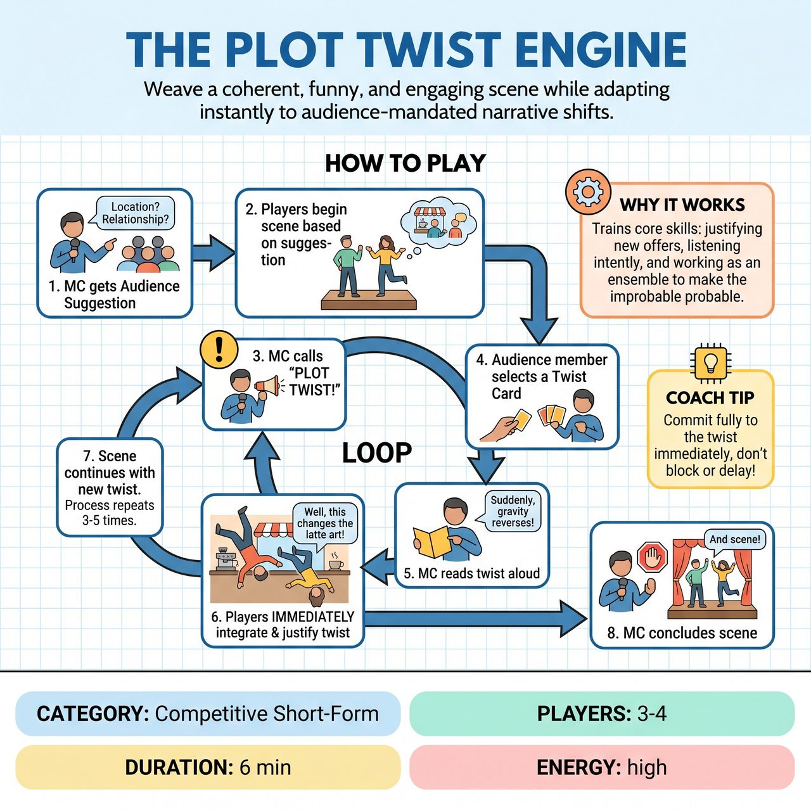

# The Plot Twist Engine

{ .game-hero }

> Weave a coherent, funny, and engaging scene while adapting instantly to audience-mandated narrative shifts.

## Overview
An improv game where a scene, initiated by an audience suggestion, is repeatedly and drastically altered by audience-selected 'Plot Twist' cards. Guided by an MC, improvisers must instantly and seamlessly integrate these often contradictory narrative shifts into the ongoing scene. Inspired by competitive short-form matches, it challenges players to maintain coherence, humor, and narrative flow amidst rapid creative adaptation.

## Setup
Requires 3-4 improvisers (3 for focused relationship work, 4 for broader scene dynamics) and an MC/Host. Use a standard improv performance space with minimal set dressing (e.g., a few chairs, a table). Prepare a deck of 20-30 pre-written 'Plot Twist' cards detailing unique narrative or genre shifts (e.g., 'The scene suddenly becomes a musical number,' 'One character is secretly an alien/robot/ghost,' 'Suddenly, it's a Western').

## How to Play
1. The MC gets an initial suggestion from the audience (e.g., a specific location, relationship, or object).
2. Two or three improvisers begin a scene based on this suggestion.
3. At any point during the scene (typically every 60-90 seconds, or when the MC feels a need for escalation), the MC loudly calls out, 'PLOT TWIST!'
4. The MC approaches the audience with a selection of 3-5 randomly drawn Plot Twist cards and invites an audience member to choose one.
5. The MC reads the selected Plot Twist aloud to both the improvisers and the entire audience.
6. The improvisers must immediately and seamlessly incorporate the chosen plot twist into the ongoing scene, showing its consequences and justifying its existence within the altered reality.
7. The scene continues with the newly integrated twist. The MC periodically calls 'PLOT TWIST!' again, repeating the process with new cards and audience selections.
8. The scene concludes after 3-5 twists, or when the MC feels a natural or hilariously chaotic stopping point has been reached. Optionally, the MC can use a special 'Ending' card for the final twist.

## Coaching Notes
- Improvisers must 'yes, and' the twist, using it to drive the narrative forward in a new, unexpected direction rather than merely stating it.
- The cumulative effect of multiple, often contradictory, twists is where much of the humor and challenge lies. Build on previous twists instead of dropping them.
- Maintain some semblance of narrative or emotional truth despite the radical changes.
- Accept the new reality quickly and seamlessly to demonstrate excellent 'Yes, And'.
- The MC can occasionally solicit an audience applause-o-meter for specific twist integrations to gauge popular appeal.

## Variations
- Competitive Match Style: Played between two improv teams. The MC acts as a referee, awarding points for Creativity & Justification (3-5 points), Cohesion & Narrative Flow (2-4 points), Speed & Acceptance (1-3 points), and Humor & Audience Reaction (1-5 points).

## Why It Works
It reinforces core improv principles: listening intently, accepting offers, making strong choices, justifying everything, and working as an ensemble to make the improbable probable. The game pushes performers to stretch their understanding of character and scene structure, fostering growth and creativity under the pressure of rapid adaptation.

## Safety & Inclusion
Ensure physical safety during rapid genre shifts (e.g., action or dance sequences) and establish boundaries so that narrative twists do not force players into non-consensual or uncomfortable subject matter.

