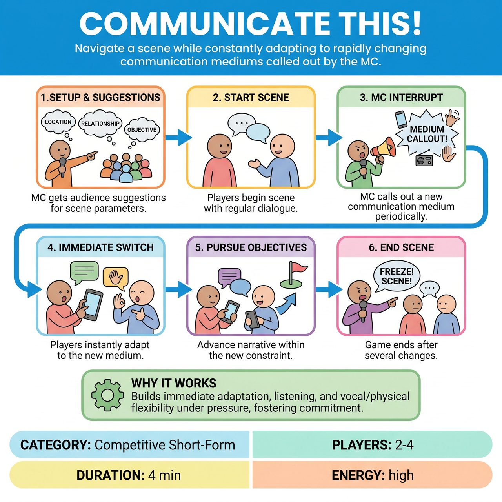

# Communicate This!

{ .game-hero }

> Navigate a scene while constantly adapting to rapidly changing communication mediums called out by the MC.

## Overview
Communicate This! is an improv game where players navigate a scene defined by audience suggestions for location and character relationships. The core mechanic involves an MC periodically calling out a new Communication Medium, to which players must immediately adapt their dialogue and interactions. The objective is to maintain character, advance the scene's narrative, and generate laughs by creatively performing within these rapidly changing constraints.

## Setup
You need 2-4 improvisers, one MC or Referee to call out the medium changes and manage scoring, and an audience for suggestions. No props are required. The MC should prepare a list of Communication Mediums (e.g., singing, mime, whispering, questions only, rhymes only, robot speak, sound effects only, emoji speak, haiku, bad puns).

## How to Play
1. The MC asks the audience for a location, a relationship between the two main characters, and optionally a simple objective.
2. Two improvisers begin the scene in the suggested location and relationship, using regular conversational dialogue to establish the context and goals.
3. At various intervals (typically every 15-30 seconds, or after 2-3 lines of dialogue), the MC shouts out a new Communication Medium.
4. The players must immediately switch to this new medium for their subsequent lines and interactions.
5. The scene continues, with players attempting to pursue their character's objective and advance the narrative within the new communication constraint.
6. The game typically runs for 3-5 minutes, with the MC calling Freeze! or Scene! after several medium changes.

## Coaching Notes
- Award points for seamless transitions, meaning players successfully and immediately switch to the new medium.
- Ensure players maintain character and narrative integrity despite the challenging communication method.
- Encourage creative interpretation, finding unique and humorous ways to embody a medium (e.g., an especially poignant song, a surprisingly clear mime).
- Call fouls for Missing the Switch (failing to adopt the new medium quickly), Breaking Character, or Blocking/Wimping Out (making excuses about a medium).
- Remind players not to ignore the scene; they must acknowledge their partner's contributions and keep the story moving.

## Variations
- Audience Call-Outs: Give the audience a small set of cards with different Communication Mediums written on them, and have a random audience member shout out the next medium when prompted by the MC.
- Translator: One player speaks, and another player translates for them, deliberately misinterpreting, exaggerating, or adding their own comedic spin. This requires three players if a third scene partner is present, or the translator can speak directly to the audience.

## Why It Works
It pushes improvisers out of their comfort zone, demanding immediate adaptation in both verbal and physical performance. It sharpens listening skills, vocal and physical dexterity, character commitment, and the ability to Yes, And under pressure.

## Safety & Inclusion
Standard improv safety applies. Ensure physical safety during mime or physical action mediums. Respect boundaries when adopting different vocal or physical choices, avoiding offensive tropes or stereotypes.

