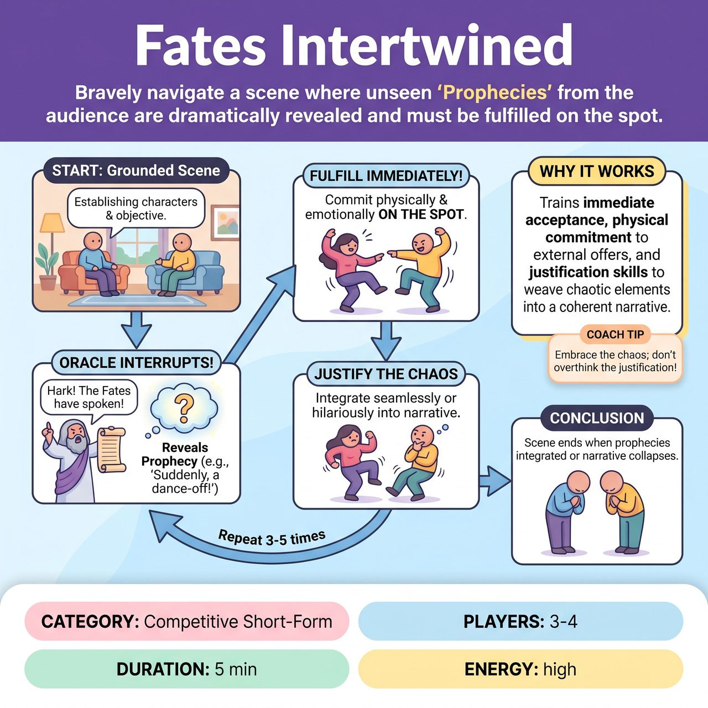

# Fates Intertwined

{ .game-hero }

> Bravely navigate a scene where unseen 'Prophecies' from the audience are dramatically revealed and must be fulfilled on the spot.

## Overview
"Fates Intertwined" is an improv game where players navigate a scene that is constantly twisted by hidden "Prophecies" collected from the audience by a host (the "Oracle"). The Oracle dramatically reveals these prophecies one by one, and the improvisers must immediately and physically fulfill each one on the spot. They then justify its sudden appearance or realization within their evolving narrative, leading to hilariously unpredictable and chaotic scene developments.

## Setup
Requires 3-4 improvisers on stage, minimal stage furniture (e.g., a chair, a small table), and one dedicated host/referee ('Oracle of the Fates') off-stage or at a podium with a microphone. Before the game begins, the host solicits 5-7 distinct, varied suggestions ('Prophecies') from the audience across categories like Objects, Physical Actions, Emotional States, Sound Effects, and Location Twists. The host writes these down privately on index cards or a notepad, keeping them hidden from the improvisers.

## How to Play
1. The host asks the audience for a simple initial scene suggestion, such as a location or relationship.
2. The improvisers begin a grounded, collaborative scene based on this suggestion, establishing characters, relationships, and an initial objective.
3. At various points during the scene (e.g., after 45-90 seconds), the host interrupts the action, dramatically declaring, 'Hark! The Fates have spoken! It is foretold that...' and reads one of the hidden audience prophecies aloud.
4. The improvisers must immediately acknowledge this prophecy and make it come true within the current scene through physical reality or an undeniable emotional state.
5. Once fulfilled, the improvisers must justify why this prophecy came true within their evolving narrative, integrating it seamlessly or hilariously awkwardly into the story and character motivations.
6. The host reveals 3-5 prophecies throughout the scene, each resetting the immediate challenge and forcing players to adapt on the fly.
7. The game concludes when all prophecies have been revealed and integrated, or when the host feels the narrative has reached a satisfying or hilariously collapsed conclusion.

## Coaching Notes
- Aim for variety in Prophecy Categories: Objects (e.g., a rubber chicken), Physical Actions (e.g., spontaneous interpretive dance), Emotional States (e.g., overwhelming jealousy), Sound Effects (e.g., a laser gun blast), and Location Twists (e.g., inside a giant hamster ball).
- Prophecies must not be merely referenced; they must become a physical reality or an undeniable emotional state for a character.
- The key is immediate and physical/emotional manifestation. There is no debate; the prophecy will come true.
- If played competitively (e.g., in a competitive short-form match), the referee can award points for successful, creative, and humorous integration of each prophecy.

## Why It Works
It forces improvisers to practice immediate acceptance and physical commitment to external offers, while heavily exercising their justification skills to weave chaotic, unrelated elements into a coherent narrative.

## Safety & Inclusion
Ensure physical actions and emotional shifts respect players' physical boundaries and emotional well-being. Players should avoid unsafe physical choices when fulfilling action prophecies.

