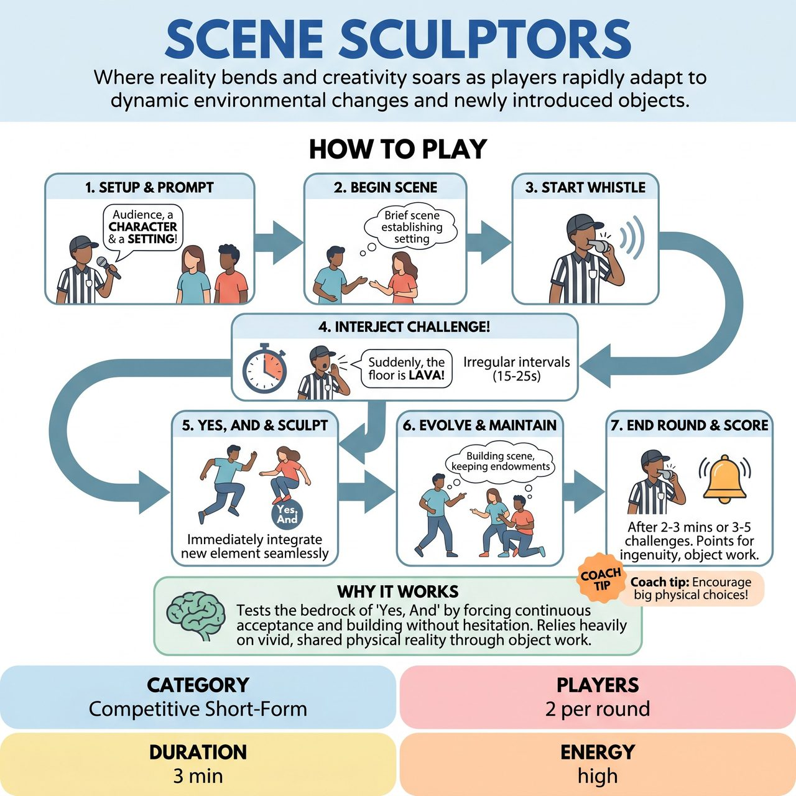

# Scene Sculptors

{ .game-hero }

> Where reality bends and creativity soars as players rapidly adapt to dynamic environmental changes and newly introduced objects.

## Overview
Scene Sculptors is a dynamic, family-friendly improv game where teams compete by creating engaging mini-scenes that rapidly evolve under the unpredictable direction of a Referee. Players, maintaining their initial character endowments, must immediately 'Yes, And' and physically integrate 'Sculpting Challenges' - sudden introductions of imaginary objects, environmental shifts, or physical constraints.

## Setup
Two players per round, one from each competing team, take center stage in the designated 'Sculpting Space.' The remaining team members stand ready at their respective benches. The Referee stands near the playing area, prepared to interject with challenges and scoring.

## How to Play
1. 1. The Referee asks the audience for a 'Character Endowment' for the first team's player and a 'Scene Setting' for where the action begins.
2. 2. The second team's player initiates a brief scene (approx. 20-30 seconds) establishing the setting and engaging the first team player's endowment, which the first team player immediately embodies.
3. 3. The Referee blows a whistle to start the scene.
4. 4. At irregular, short intervals (e.g., every 15-25 seconds), the Referee interjects with a 'Sculpting Challenge' - a clear verbal declaration followed by a precise physical demonstration of a new object, environmental effect, or physical constraint.
5. 5. The active players must immediately 'Yes, And' the Sculpting Challenge, integrating the new element seamlessly into the existing scene using strong object work, clear physical reactions, and justified dialogue.
6. 6. Players continue the evolving scene, building upon previous challenges and maintaining their character endowments.
7. 7. After 3-5 challenges or 2-3 minutes, the Referee blows a longer whistle or rings a bell to end the round.
8. 8. The Referee awards points during the round for ingenuity, object work, and seamless integration, and may award bonus points at the end for chemistry and character consistency.

## Coaching Notes
- The Referee must clearly show what they mean with physical demonstrations, not just describe the Sculpting Challenges.
- Players must show the change, not just explain it (e.g., if a pineapple appears, interact with it physically rather than just saying 'Oh, a pineapple!').
- Call a 'Clean-Content Foul' for blue humor, swearing, or inappropriate innuendo (offending player is penalized, points deducted).
- Call a 'Groaner Foul' for excessively weak puns or lazy justifications.
- Call a 'Stagnation Foul' if a player fails to adequately 'Yes, And' or physically integrate a challenge within a reasonable timeframe (prolonged hesitation or just explaining it).
- Award points immediately after each challenge is integrated to provide feedback and keep the score dynamic.

## Why It Works
It tests the absolute bedrock of 'Yes, And' by forcing players to continuously accept and build upon new elements without hesitation. It heavily relies on vivid, shared physical reality through object work and environment, while demanding rapid association to justify comically disparate ideas.

## Safety & Inclusion
The Referee curates the 'Sculpting Challenges' to always be benign, whimsical, and non-suggestive, acting as the ultimate filter for audience suggestions. The Clean-Content Foul is the ultimate safeguard, immediately penalizing and isolating any blue humor, swearing, or inappropriate innuendo to maintain a family-friendly environment.

