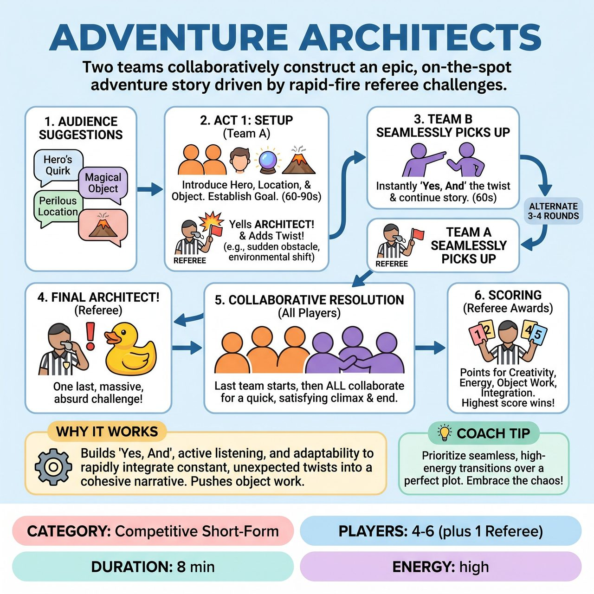

# Adventure Architects

{ .game-hero }

> Two teams collaboratively construct an epic, on-the-spot adventure story driven by rapid-fire referee challenges.

## Overview
Adventure Architects is a family-friendly improv game where two teams collaboratively construct an epic, on-the-spot adventure story. Kicking off with audience suggestions for a hero, magical object, and perilous location, teams take turns advancing a single narrative while integrating rapid-fire 'ARCHITECT!' challenges from a referee. Teams compete for points based on creativity, energy, and seamless integration, ultimately culminating in a thrilling, collaborative resolution.

## Setup
Form two teams (Red and Blue), each with 2-3 players. Assign one Referee. Ensure you have an engaged audience. All players act as 'Adventure Architects' collaboratively constructing a narrative.

## How to Play
1. The Referee begins by soliciting three key elements from the audience: a Hero's Unique Quirk, a Magical/Mysterious Object, and a Perilous Location.
2. Two players from the starting team initiate Act 1 (60-90 seconds), introducing the Hero, the Perilous Location, and the Magical Object to set up the initial goal or dilemma.
3. The Referee yells 'ARCHITECT!' and introduces a sudden, game-changing complication, obstacle, environmental shift, or new character endowment.
4. Two players from the opposing team seamlessly pick up the scene, instantly 'Yes, And'-ing the previous action and the new twist to advance the narrative for 60-90 seconds.
5. Teams continue to alternate in this manner for 3-4 rounds, with the Referee yelling 'ARCHITECT!' to introduce a new twist at the end of each segment.
6. The Referee yells 'FINAL ARCHITECT!' and provides one last, massive, often absurd challenge that the adventure must immediately resolve.
7. The last team to receive the prompt initiates the resolution, then all players from both teams rapidly collaborate on stage to bring the story to a quick, satisfying, and comedically triumphant end within 30-45 seconds.
8. The Referee awards 1-5 points per round based on integration, energy, creativity, object work, and character consistency. The team with the highest total score wins.

## Coaching Notes
- The Referee's 'ARCHITECT!' twists should be varied and surprising (e.g., environmental shifts, magical consequences, emotional shifts) to inspire immediate, high-energy responses.
- The 'FINAL ARCHITECT!' challenge should be big and demand immediate problem-solving to trigger the climax.
- Call a clean-content foul (immediate point deduction and on-the-spot replay/edit) if any humor strays from strictly family-friendly.
- Call a pun foul (immediate point deduction) for puns that are excessively obvious, forced, or cliched, especially if used as a lazy way to resolve a twist.
- Call a stalling foul (minor point deduction) for players who visibly stall, hesitate, or fail to immediately 'Yes, And' the previous action or prompt. The pace must be fierce.
- Call a teamwork foul (point deduction) for players who ignore or actively undermine teammates, or try to take over the narrative.
- Award bonus points for exceptionally clever callbacks, brilliant player-driven twists, or outstanding physical comedy.

## Why It Works
It heavily relies on 'Yes, And' and active listening to track a rapidly evolving narrative and integrate constant twists. It pushes players to vividly mime objects and environments, maintain character endowments, and sustain a fast, energetic pace while collaborating on a cohesive story arc.

## Safety & Inclusion
The game is designed to be inherently family-friendly. The clean-content foul serves as a constant guard against inappropriate content, ensuring the humor remains wholesome and steering the narrative away from mature themes.

