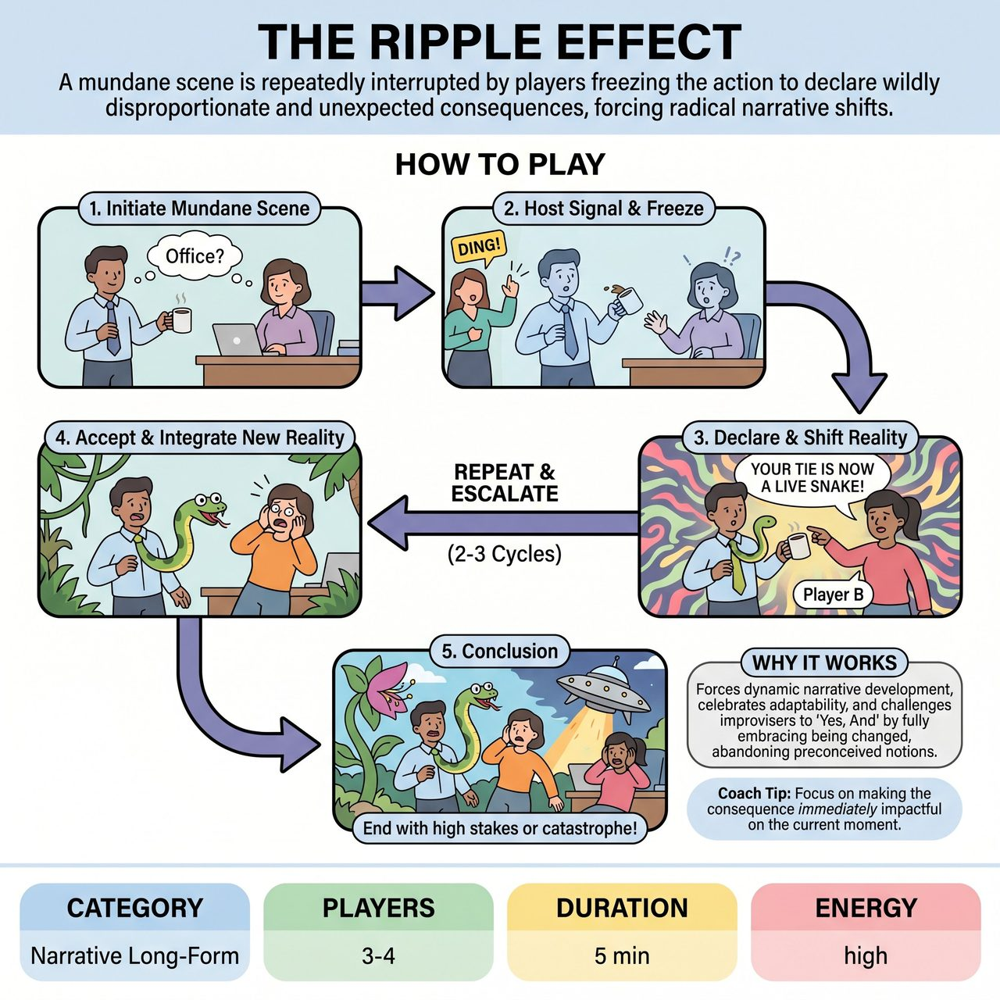

# The Ripple Effect

{ .game-hero }

> A mundane scene is repeatedly interrupted by players freezing the action to declare wildly disproportionate and unexpected consequences, forcing radical narrative shifts.

## Overview
The Ripple Effect is an improvisational game where 3-4 performers collaboratively build a scene based on a mundane audience suggestion. Periodically, a player freezes, and another player declares a wildly disproportionate and unexpected consequence directly tied to that frozen moment, drastically altering the scene's reality. All players must immediately accept and integrate this new reality, forcing them to adapt and escalate the narrative through a chain of increasingly bizarre yet accepted events.

## Setup
You need 3-4 performers. Get a single, simple suggestion from the audience: an everyday object (e.g., a dusty old book, a chipped coffee mug) or a mundane location (e.g., a bus stop, a waiting room).

## How to Play
1. Initiation: The scene begins with the players establishing a mundane scenario inspired by the audience suggestion, building characters, relationships, and an initial objective.
2. The Freeze & Ripple: At a random interval (e.g., after 30-60 seconds, signaled by a host's 'ding' or a judge's bell), one player (Player A) freezes mid-action or mid-expression. Their physical pose, facial expression, or the object they are interacting with becomes the focal point.
3. The Consequence Declaration: Another player on stage who is not frozen (Player B) steps forward, taps Player A, and declares a direct, significant, and wildly unexpected consequence of Player A's frozen action/expression. This must turn something mundane into something extraordinary.
4. Acceptance & Integration: Player A (the tapped player) must immediately, completely, and enthusiastically accept this new reality. Their frozen pose or expression now takes on the meaning of the declared consequence, and their performance shifts to embody this radical change.
5. Scene Continuation & Escalation: All other players on stage (including Player B) must seamlessly integrate this new reality into the ongoing scene. The narrative shifts abruptly, and the stakes should naturally escalate.
6. Repeated Ripples: This process repeats 2-3 more times with different players initiating the 'ripple effect' by tapping another frozen player. Each new consequence must build upon the altered reality, twisting the narrative further.
7. Ending: The game concludes after a set number of ripples (e.g., three or four) or upon the host's signal, ideally ending with some form of resolution or a catastrophic cliffhanger.

## Coaching Notes
- Consequences must be Game-Changing: Do not make minor tweaks; aim for significant alterations to character, plot, or reality.
- Direct Link: The declared consequence must stem directly from the frozen player's physical action, object interaction, or emotional expression at the moment of the freeze.
- Radical Acceptance: The tapped player must commit fully to the new reality, no matter how absurd.
- Shared Responsibility: All players are responsible for accepting and building upon all declared consequences. There is absolutely no negation allowed.
- Ensure each player taps at least once to initiate a ripple (if it is a 3+ person scene).
- Specificity and Endowment: The player declaring the consequence needs to be specific enough for it to be playable. The player receiving the consequence needs to endow it with emotion, physicality, and intention.

## Why It Works
This game inherently forces dynamic narrative development and celebrates adaptability and creative recovery. It challenges improvisers to practice 'Yes, And' by fully embracing being changed, abandoning preconceived notions of their character, and pivoting entire motivations and plot points in a split second.

## Safety & Inclusion
Ensure physical safety during freezes and sudden shifts in action. Players should respect physical boundaries when tapping or interacting with frozen players, and maintain emotional check-ins as stakes and realities escalate wildly.

