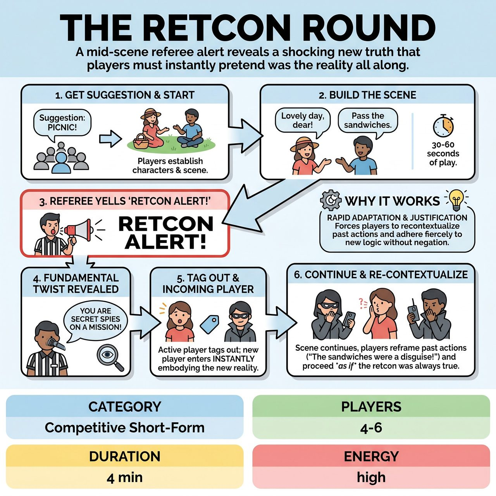

# The Retcon Round

{ .game-hero }

> A mid-scene referee alert reveals a shocking new truth that players must instantly pretend was the reality all along.

## Overview
Players establish a scene based on an audience suggestion. Mid-scene, a referee declares a 'Retcon Alert!' and reveals a fundamental, surprising truth that was secretly in play from the beginning. Players must immediately integrate this new reality, often tagging in fresh teammates, and continue the scene as if the retconned truth had always been the case.

## Setup
4-6 players total (typically 2-3 per team), with 2-3 players on stage at any given time. Standard improv stage with all props mimed. Get an initial suggestion from the audience (e.g., location, relationship, or situation).

## How to Play
1. The referee takes a suggestion from the audience to inspire the initial scene.
2. Two or three players begin the scene, establishing the characters, their relationship, the location, and their immediate objective for about 30-60 seconds.
3. At a point determined by the referee, they yell: 'RETCON ALERT!'
4. The referee announces a fundamental twist (e.g., relationship, location, or stakes) and states that this new reality has been true from the beginning.
5. The player who was just speaking must immediately tag out a teammate from their side waiting offstage.
6. The incoming player must immediately enter the scene, fully embodying the new, retconned reality as if it has always been the truth.
7. The scene continues with players re-contextualizing previous actions and dialogue without directly acknowledging the change, tagging in and out as needed.

## Coaching Notes
- Avoid the 'Temporal Paradox': Never directly acknowledge that the reality of the scene changed or reference the previous, un-retconned reality.
- Act as if the retconned truth always was the truth, and any previous actions were merely misunderstood or subtly reflecting it.
- The humor comes from reinterpreting established physical actions (e.g., kneading dough becomes fixing unstable robot wiring).
- Incoming players should make strong, immediate physical and verbal choices to establish the new reality without hesitation.
- Referees can award points for clever re-contextualization and deduct points for hesitation or breaking character.

## Why It Works
It forces improvisers to practice rapid adaptation and fierce adherence to new logic. By recontextualizing past actions instead of negating them, players develop strong justification skills and quick wit.

## Safety & Inclusion
The referee can use a content foul to stop any blue humor, profanity, or inappropriate content, ensuring the scene remains safe and respectful for all audiences.

