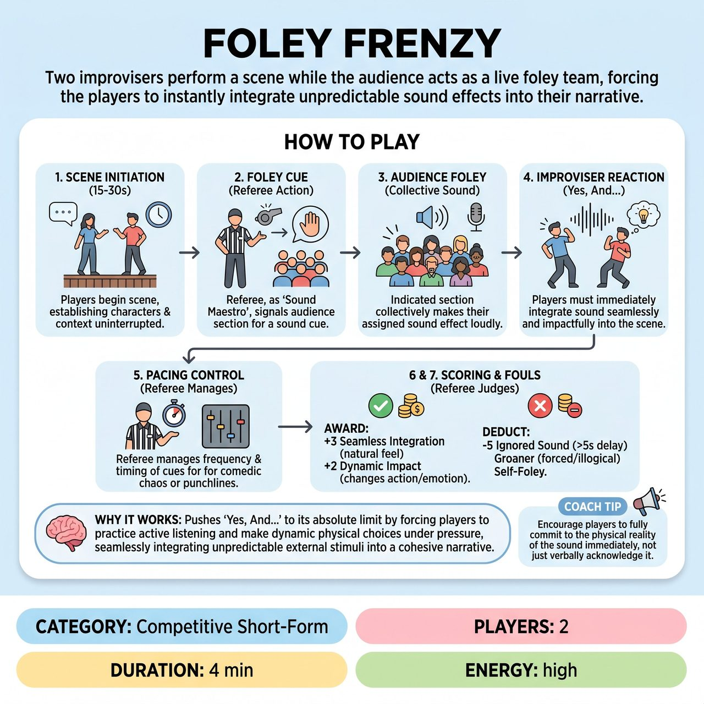

# Foley Frenzy

{ .game-hero }

> Two improvisers perform a scene while the audience acts as a live foley team, forcing the players to instantly integrate unpredictable sound effects into their narrative.

## Overview
"Foley Frenzy" is a competitive short-form game that transforms the audience into a collective foley artist team, providing unpredictable sonic challenges that improvisers must seamlessly integrate into their narrative. It pushes 'Yes, And...' to its absolute limit, demanding quick wit, active listening, and dynamic physical choices under pressure, all within a family-friendly, competitive framework.

## Setup
Two improvisers (Player A, Player B) are on stage representing their team. All props are strictly mimed. Divide the audience into 3-4 distinct sections. The referee pre-assigns a unique, generic sound category to each section (e.g., 'Impact/Crash', 'Movement/Glide', 'Animal/Vocal', 'Mechanical/Environment'). The referee conducts a quick, energetic 'sound check' practice run with each section, giving a clear gestural cue so they collectively make their assigned sound loudly. Get a broad scene premise from the audience.

## How to Play
1. 1. Scene Initiation (15-30 seconds): Players begin the scene, establishing characters, relationships, and context uninterrupted.
2. 2. Foley Integration: The referee, acting as the 'Sound Maestro', strategically points to an audience section and performs a clear, exaggerated gestural cue representing that sound category.
3. 3. Audience Cues: The indicated audience section collectively makes their assigned sound effect loudly and enthusiastically.
4. 4. Improviser Reaction: Players must immediately 'Yes, And...' the sound, integrating it seamlessly and impactfully into the ongoing scene by reacting physically, verbally, or emotionally.
5. 5. Pacing Control: The referee actively manages the frequency and timing of sound cues, adjusting pace for comedic chaos or holding back for punchlines.
6. 6. Scoring: The referee awards up to 3 points for 'Seamless Integration' (sound feels natural) and up to 2 points for 'Dynamic Impact' (sound changes action/emotion or advances plot).
7. 7. Fouls: The referee deducts 5 points for 'Ignored Sound' (failing to acknowledge within 5-7 seconds), 'Groaner Foul' (forced/illogical justification), 'Self-Foley Foul' (players making the sound themselves), or 'Content Foul' (inappropriate content).

## Coaching Notes
- The referee must be a highly active and visible 'Sound Maestro', using clear, energetic physical cues to trigger sounds.
- Referees control the comedic trajectory: start slower to ease players in, then increase the pace for chaos, or hold back sounds for pivotal moments.
- Players should ensure their integration feels natural and not forced to avoid the 'Groaner Foul'.
- Players must never make the assigned sounds themselves; this undermines the game's unique mechanic and triggers a 'Self-Foley Foul'.
- Award points when a sound directly changes a character's action, emotion, or advances the scene's plot in a way that demonstrably elevates the comedic stakes.

## Why It Works
It pushes 'Yes, And...' to its absolute limit by forcing players to practice active listening and make dynamic physical choices under pressure, seamlessly integrating unpredictable external stimuli into a cohesive narrative.

## Safety & Inclusion
Strictly enforce the 'Content Foul' for inappropriate content (no blue humor, swearing, innuendo), ensuring the open-ended nature of sound categories remains family-friendly.

