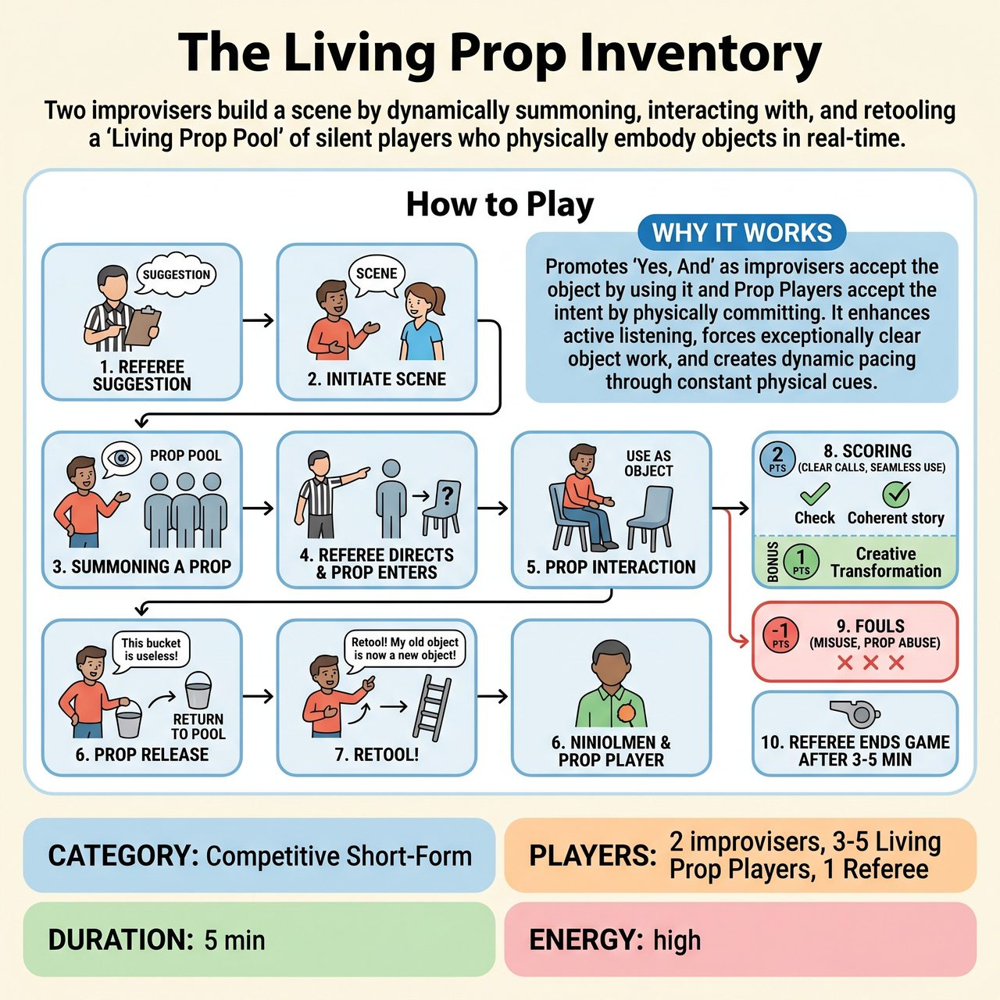

# The Living Prop Inventory

{ .game-hero }

> Two improvisers build a scene by dynamically summoning, interacting with, and retooling a 'Living Prop Pool' of silent players who physically embody objects in real-time.

## Overview
This innovative competitive short-form game transforms traditional object work into 'person work.' Two improvisers build a scene by dynamically summoning, interacting with, and retooling a 'Living Prop Pool'—a dedicated group of silent players who physically embody objects and environmental elements, reacting to the improvisers' needs and actions in real-time. It is a competitive test of clarity, physicality, and collaborative skill.

## Setup
Clear an open performance space with the 'Prop Pool' waiting discreetly in the wings. No actual props are used; all are mimed or embodied. The Referee introduces the two improvisers and each Living Prop Player (who may briefly demonstrate a 'signature prop pose'). The Referee explicitly outlines the 'Prop Player Code' (Silent Service, Physical Commitment, Dynamic Reaction, Family-Friendly Embodiment) and clearly states forbidden prop requests.

## How to Play
1. The Referee takes an audience suggestion to start the scene.
2. The two improvisers initiate a scene based on the suggestion.
3. Summoning a Prop: When an improviser needs an object, they make clear eye contact with the Living Prop Pool, gesture generally towards where the object is needed, and simply state the object's name (e.g., 'A sturdy rope here!').
4. The Referee silently directs the most suitable Prop Player from the pool to enter the scene and immediately adopt a physical form appropriate for the requested object.
5. Prop Interaction: Improvisers physically interact with the Living Prop Player as if it were the actual object. The Prop Player maintains their silent, physical embodiment but reacts believably to the improviser's actions.
6. Prop Release: To remove a prop, an improviser physically discards or repositions it with a clear verbal cue (e.g., 'This broken bucket is useless!'), prompting the Prop Player to discreetly exit. The Referee can also call 'Prop Release!'.
7. Retool: An improviser can request an existing prop be re-assigned to a new object by making a clear physical action and stating 'Retool! My [old object] is now my [new object]!', signaling the Prop Player to instantly shift their physical form.
8. Scoring: The Referee awards 2 points to improvisers for clear calls, seamless interaction, efficient management, and coherent narrative. 1 bonus point can be awarded for exceptional prop interpretation or resourceful retooling by Prop Players.
9. Fouls: The Referee deducts 1 point for Mismatched Use, Prop Abuse, Monologue, Broken Character, or Unresponsive Prop fouls.
10. The Referee blows the whistle to signal the immediate end of the game after 3-5 minutes.

## Coaching Notes
- The Referee's silent direction is critical for ensuring efficiency and balance when bringing Prop Players into the scene.
- Prop Players must strictly adhere to the 'Prop Player Code': no speaking or sound effects, full physical commitment, believable reactions, and G-rated embodiment.
- Improvisers must be exceptionally clear in their object definitions and usage, moving beyond mime to interactive 'person work'.
- Prop Players must actively listen to the improvisers' verbal cues and observe their physical actions to embody and react correctly.
- Prop Player fouls (Broken Character, Unresponsive Prop) indirectly penalize the improvisers for not managing the scene environment properly.

## Why It Works
It promotes 'Yes, And' as improvisers accept the object by using it and Prop Players accept the intent by physically committing. It enhances active listening, forces exceptionally clear object work, creates dynamic pacing through constant calling and retooling, and encourages strong, committed physical choices leading to rich visual comedy.

## Safety & Inclusion
Family-Friendly Enforcement is paramount. The 'Unacceptable Prop Foul' (Automatic clean-content call!) is the primary safeguard against sexually suggestive, undignified, physically dangerous, abstract, or offensive requests. The Referee immediately halts play and issues the foul. The 'Prop Abuse Foul' penalizes rough physical handling, demeaning treatment, or ignoring obvious physical limitations of the Prop Players.

