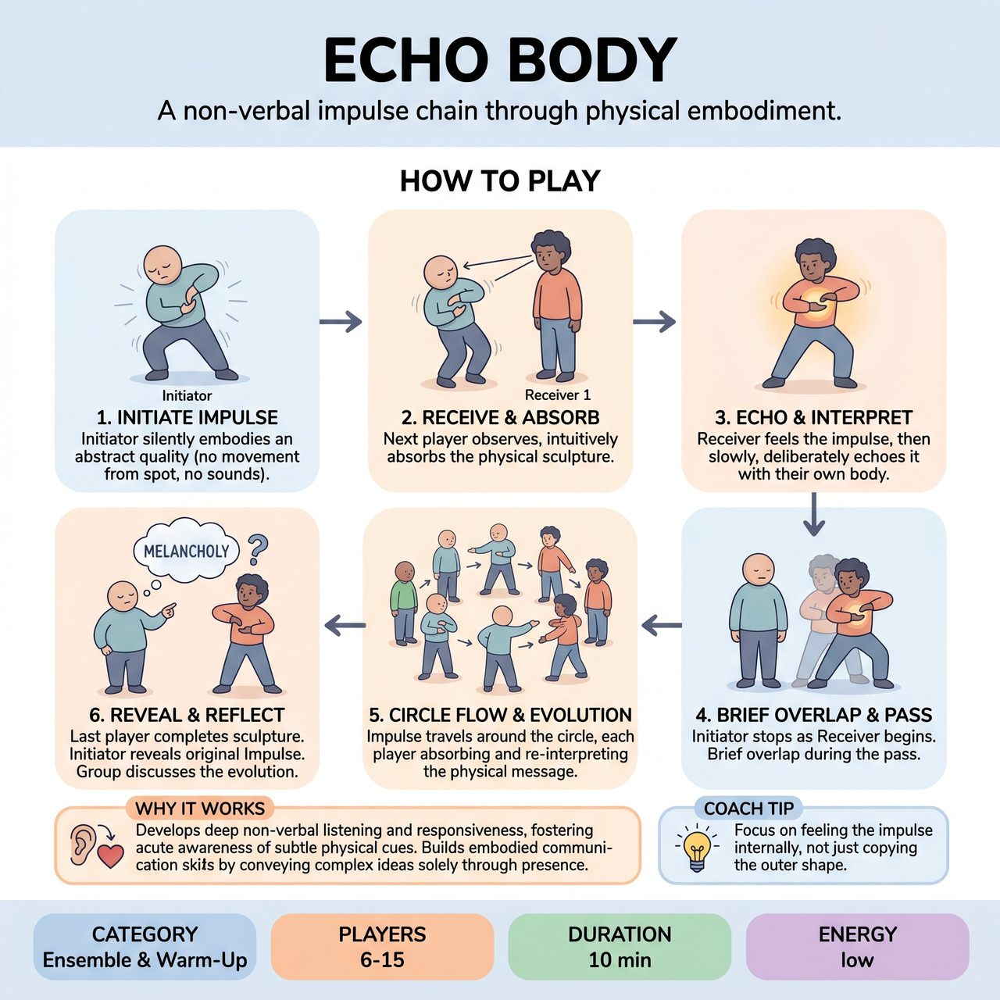

# Echo Body

{ .game-hero }

> A non-verbal impulse chain through physical embodiment.

## Overview
Echo Body is a novel theater game where a group stands in a circle to collectively embody and evolve a secret, non-verbal Impulse. An Initiator receives a private abstract quality and slowly, silently sculpts it within their personal space. This physical sculpture then travels around the circle, with each subsequent player observing, intuitively absorbing, and slightly re-interpreting it before passing their evolved version to the next.

## Setup
Players stand in a circle, facing inwards, close enough so they can clearly observe the physical actions of their neighbors but not touch. One player is designated as the Initiator. The facilitator privately gives the Initiator a single, non-verbal Impulse to convey, such as an abstract quality, a feeling, an intention, or a relationship to an unseen object (e.g., 'An unbearable weight' or 'A fragile discovery').

## How to Play
1. The Initiator begins to physically embody the Impulse without moving from their spot, making vocal sounds, or using props. They slowly and clearly create a sculpture of their body.
2. The player immediately to the right of the Initiator becomes the first Receiver. Their task is to observe and intuitively absorb the physical sculpture being offered.
3. Once the Receiver feels they have truly felt and understood the physical Impulse, they begin to slowly and deliberately echo it. This is an interpretation and slight evolution of the Impulse, not strict mimicry.
4. As the Receiver begins their physical embodiment, the Initiator stops and becomes a watcher. There should be a brief overlap as the receiver begins and the passer ends, creating a continuous current of physical energy.
5. This process continues around the circle. Each player in turn becomes the Receiver of the person to their left, absorbs the physical message, translates it through their own body, evolves it slightly, and becomes the Passer to the person on their right.
6. The Impulse travels around the entire circle, with the last player embodying their interpretation.
7. Once the final player has completed their sculpture, the facilitator asks the original Initiator to reveal the original Impulse. The group then briefly discusses what they perceived, what evolved, and how they felt.

## Coaching Notes
- Point of Concentration for the Receiver: What is the specific physical quality of the movement/stillness being expressed by the person to my left, and how does my body instinctively respond to and continue this physical narrative?
- Point of Concentration for the Passer: Am I embodying this physical Impulse clearly enough for my right-hand neighbor to truly feel it and pass it on?
- Remind players that this is not mimicry; it is an interpretation and slight evolution of the Impulse within their own body.
- Ensure the movement is continuous and fluid, but always deliberate and visually clear.
- Emphasize during the discussion that there is no right or wrong interpretation, only different shades of understanding.

## Why It Works
The game develops deep non-verbal listening and responsiveness, fostering an acute awareness of subtle physical cues. It builds embodied communication and storytelling skills by conveying complex ideas solely through physical presence, and cultivates ensemble trust as players rely on collective intuition to continue the Impulse.

## Safety & Inclusion
Players must remain in their personal space and not touch each other. Ensure movements are slow and deliberate to avoid physical strain. Cultivate a supportive environment where all interpretations are valid and there is no wrong way to embody the impulse.

