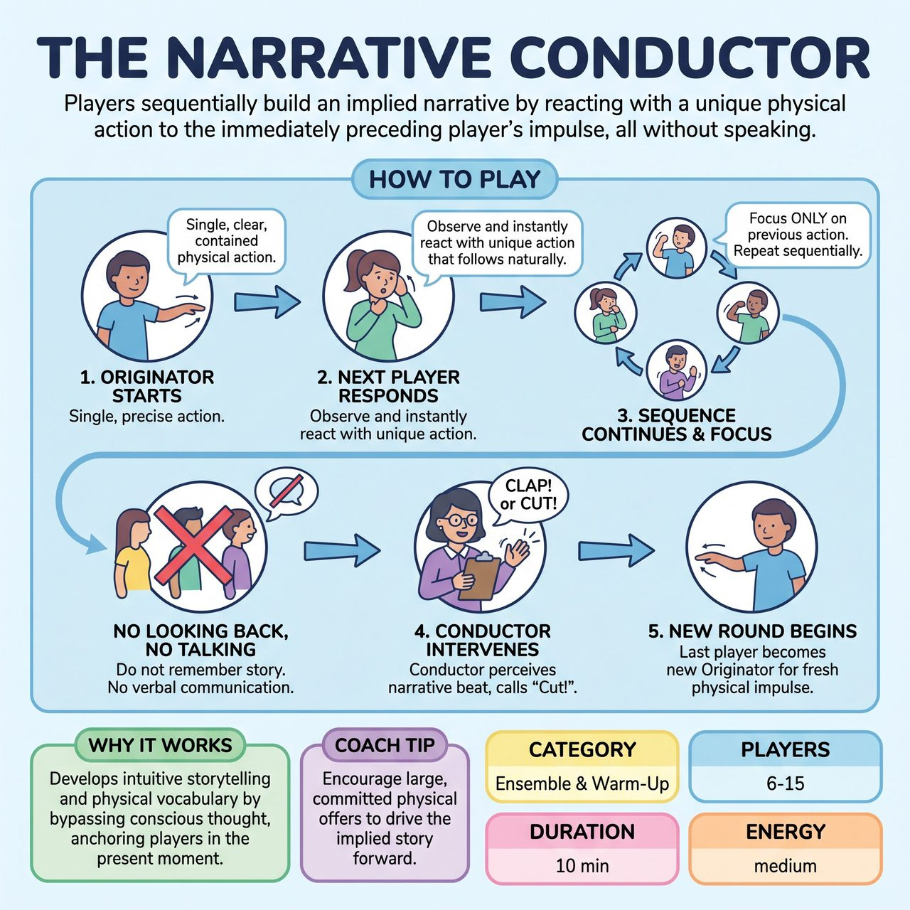

# The Narrative Conductor

{ .game-hero }

> Players sequentially build an implied narrative by reacting with a unique physical action to the immediately preceding player's impulse, all without speaking.

## Overview
The Narrative Conductor is an exercise designed to cultivate intuitive, non-verbal storytelling within an ensemble. Players in a circle sequentially build an implied narrative by each responding with a unique physical action that is an intuitive continuation of the preceding player's impulse. A designated Conductor observes and punctuates these emerging story beats, fostering hyper-responsiveness and ensemble sensitivity.

## Setup
Participants stand in a loose circle or horseshoe formation, ensuring everyone has a clear line of sight to the person immediately next to them. One player is designated the 'Originator' to begin the sequence. A 'Conductor' (initially the facilitator) stands where they can observe the entire sequence. No pre-set theme, character, or story is established.

## How to Play
1. The Originator initiates a single, clear, precise, and contained physical action or gesture (e.g., a subtle flinch, an exaggerated reach, a sharp turn of the head).
2. The adjacent player observes this action and immediately responds with their own unique physical action that implies a natural continuation or consequence of the Originator's action.
3. This process continues sequentially around the circle. Each player focuses only on the action performed by the person immediately before them and instantly responds with a new, unique physical action.
4. Players must not look back at earlier actions, try to remember the story, or use any verbal communication.
5. The Conductor observes the sequence. When they perceive a satisfying implied narrative beat or natural transition, they firmly clap their hands or call 'Cut!'.
6. When 'Cut!' is called, the sequence ends. The player who performed the last action becomes the new Originator for the next round, starting a fresh, unrelated physical impulse.

## Coaching Notes
- Point of Concentration (Players): Receive the preceding physical impulse, and without thought, express the instantaneous, unique physical consequence or continuation it demands from your body.
- Point of Concentration (Conductor): Identify and punctuate the precise moment when a chain of physical responses resolves into a complete, compelling, or thought-provoking implied narrative beat.
- Remind players not to copy the action or consciously create a story. The response should feel like the next logical physical beat.
- Ensure actions remain contained and precise, not sweeping.
- Encourage players to bypass conscious thought and intellectual planning; there is no right or wrong response.

## Variations
- Rotating Conductor: Once the ensemble understands the game, allow players to rotate into the Conductor role to practice identifying and punctuating narrative beats.

## Why It Works
It develops intuitive storytelling and an expansive physical vocabulary by forcing players to bypass conscious thought. The fast-paced, purely reactive nature of the game anchors players firmly in the present moment, eradicating opportunities for planning, worrying, or anticipation, while building profound ensemble trust.

## Safety & Inclusion
Maintain a play-based environment with no winners or losers and no judgment for a poor narrative. Ensure physical actions remain contained so players do not accidentally strike one another during spontaneous movements.

