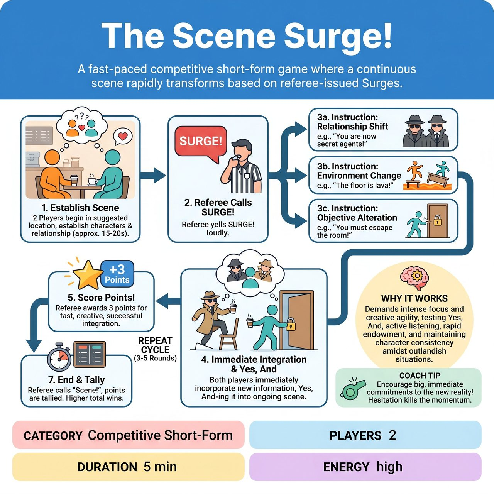

# The Scene Surge!

{ .game-hero }

> A fast-paced competitive short-form game where a continuous scene rapidly transforms based on referee-issued Surges.

## Overview
The Scene Surge! is a fast-paced improv game where two players collaboratively build a continuous scene that rapidly transforms based on referee-issued Surges. These Surges drastically alter core circumstances like setting, relationships, or objectives, forcing players to immediately and creatively Yes, And each new, often absurd, layer of information into the ongoing narrative. The game tests lightning-fast adaptability, energetic commitment, and creative justification, with referees scoring seamless integration and penalizing stagnation or inappropriate content, ensuring a hilariously evolving and family-friendly experience.

## Setup
Two players (one from each team) start on stage. The referee stands ready to introduce Surges throughout the scene. A designated scorekeeper is also ready. The referee calls for one audience suggestion, typically a location.

## How to Play
1. The two players begin a scene in the suggested location, establishing their characters and a basic relationship or objective based on the environment.
2. After approximately 15-20 seconds of gameplay, the referee calls out SURGE! loudly.
3. Immediately after the call, the referee issues a rapid-fire, concise new instruction or endowment that drastically alters a core aspect of the scene (e.g., relationship shift, objective change, setting shift, object introduction, genre shift, or hidden endowment).
4. Upon hearing the Surge!, both players must immediately incorporate the new information into the ongoing scene, Yes, And-ing it as if it has always been true or is a sudden, unarguable new reality.
5. The referee observes the integration and awards points directly after each successful integration is observed: 3 points for a successful, creative, and fast integration, or 5 points for an exceptionally brilliant or hilarious integration.
6. This SURGE! cycle continues for 3-5 rounds, with new instructions layering upon the previous ones. Players must track and incorporate all previous surges while integrating the new one.
7. The referee eventually calls Scene! to conclude the game, after which points are tallied. The team with the higher total points wins.

## Coaching Notes
- The referee's timing is crucial: allow enough time for initial scene establishment, but call Surges quickly enough to keep players on their toes and prevent stagnation.
- The clarity and distinctness of the referee's Surge instructions are paramount.
- Players are encouraged to create immediate, strong characters but remain flexible to dramatic shifts.
- Call a Static Scene Foul (loss of 2 points) if either player ignores a Surge or fails to integrate it meaningfully, leading to a break in the Yes, And contract.
- Call a Groaner Foul (no points for that round) for excessively bad puns or low-effort humor that stops the scene dead.
- Penalize the offending player's team by 1-2 points for general improv faults, such as completely contradicting each other without justification or overtly denying an established fact.
- The referee may occasionally solicit ideas from the audience for types of Surges before a call, but the referee has final say on the official instruction.

## Why It Works
The game demands intense focus and creative agility, testing core improv skills like Yes, And, active listening, object and environment work, rapid endowment, and maintaining character consistency amidst outlandish situations. The constant referee intervention ensures high energy, while the point system rewards clever integration.

## Safety & Inclusion
The game inherently fosters family-friendly humor by relying on situational comedy and absurd endowments rather than adult themes. The referee acts as a strict filter for suggestions and Surges. A clean-content foul must be called (resulting in no points for the offending team) for any blue humor, swearing, or innuendo.

