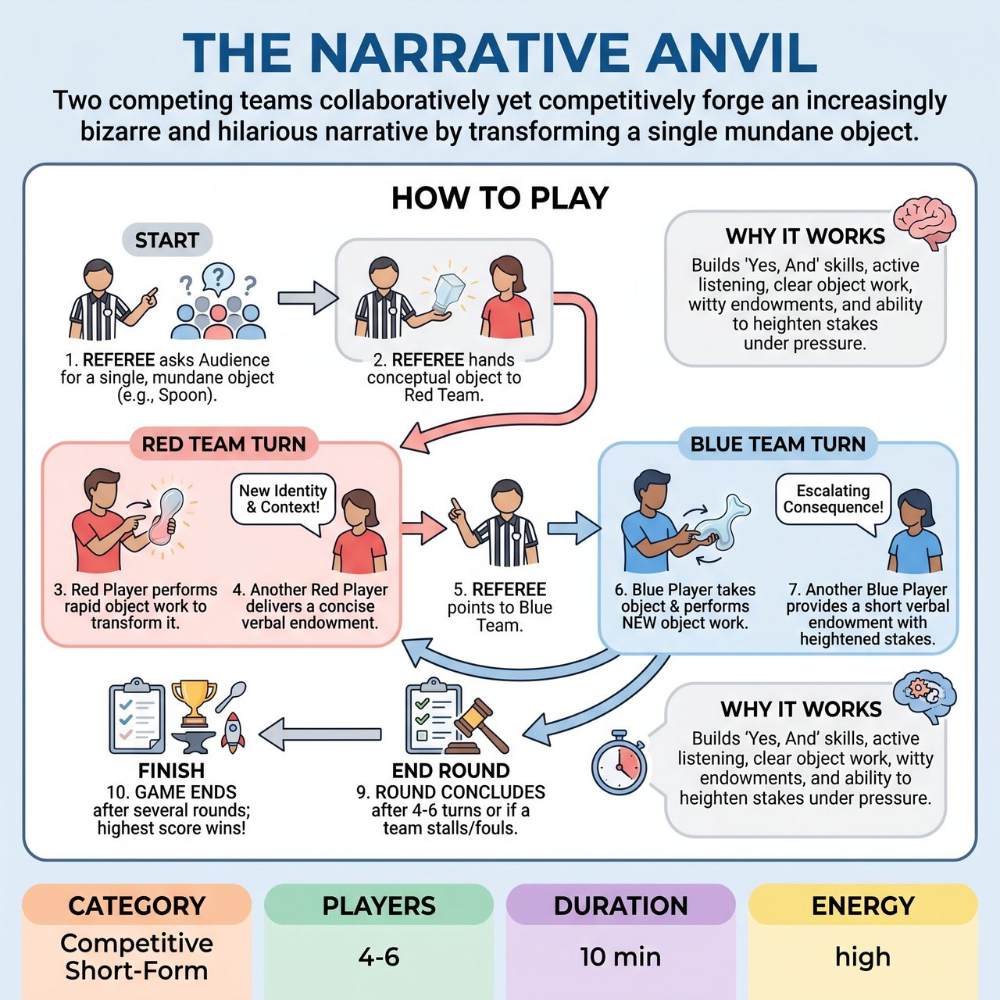

# The Narrative Anvil

{ .game-hero }

> Two competing teams collaboratively yet competitively forge an increasingly bizarre and hilarious narrative by transforming a single mundane object.

## Overview
The Narrative Anvil is an improv game where two competing teams, Red and Blue, collaboratively yet competitively forge an increasingly bizarre and hilarious narrative. Starting with a single, audience-suggested mundane object, teams alternate turns using rapid-fire object work to physically transform it and concise verbal endowments to define its new identity, context, or consequence. The objective is to build upon previous transformations with heightened stakes and fresh perspectives, showcasing swift physical and verbal improvisation, while a Referee ensures internal consistency amidst escalating absurdity.

## Setup
Two teams, Red and Blue, typically with 2-3 players each, are positioned on opposite sides of the stage. A central, open performance space is left clear for players to perform object work. The Referee stands centrally to facilitate, adjudicate, and solicit audience suggestions.

## How to Play
1. The Referee addresses the audience and asks for a single, common, everyday mundane object, selecting one of the most promising suggestions.
2. The Referee gestures to the starting team (e.g., the Red Team) and hands them the conceptual object through clear miming.
3. One player from the starting team quickly steps into the central space and immediately performs detailed object work to visually transform the object into something entirely new and unexpected.
4. Concurrently, a second player (or the same player) from that team delivers a single, concise verbal endowment establishing the object's new identity and a new context, use, or consequence that inherently raises the stakes.
5. Immediately after the endowment, the Referee points to the opposing team (e.g., the Blue Team).
6. A player from the opposing team steps forward, takes hold of the transformed object (miming its current form), and instantly performs new object work to transform it further, energetically building upon its previous state and context.
7. Another player from the opposing team provides a single, short verbal endowment explaining the new identity and an escalating consequence, usage, or problem arising from the latest transformation.
8. Teams alternate turns with a strict time limit (e.g., 10-15 seconds per team turn) to keep the pace frantic and energetic, ensuring each transformation integrates the 'Yes, And' principle.
9. A round concludes after a predetermined number of team turns (e.g., 4-6 per team), when the Referee deems the narrative arc sufficiently heightened, or if a team commits a critical foul.
10. After a predetermined number of Anvil Forging rounds (e.g., 3-5 distinct audience-suggested objects), the team with the highest cumulative score is declared the winner.

## Coaching Notes
- The Referee must clearly initiate each turn and keep the game moving at a fierce pace.
- Award 1 point for clear, creative, and energetic object work, and 1 point for a sharp, concise, and imaginative verbal endowment.
- Award 1-3 bonus points for exceptional displays of 'Yes, And', unexpected comedic twists, flawless teamwork, or engaging with Referee interjections.
- Call the 'Narrative Slip' Foul (-1 point) if a team's transformation fails to acknowledge, integrate, or directly build upon the immediately preceding object's state or the established narrative.
- Call the 'Mundane Mimic' Foul (-1 point) if a team's object work or endowment reverts the object to an uninspired, prosaic, or basic state without significant comedic justification.
- Call a 'Groaner Foul' (-1 point) for excessively forced, low-energy, or overtly bad puns.
- The Referee may use an applausometer at points to gauge audience favor for a specific transformation, potentially influencing bonus point assignment.

## Variations
- Emotional Endowment: The Referee may solicit a specific emotion from the audience, which the next team must subtly or overtly weave into their transformation or endowment, adding an extra layer of challenge and dynamic audience involvement.

## Why It Works
The game tests foundational 'Yes, And' skills, active listening to avoid 'Narrative Slip' fouls, clear and consistent object work, quick witty verbal endowments, and the ability to heighten stakes and comedic impact under fierce, high-energy pacing.

## Safety & Inclusion
The game inherently promotes family-friendly humor through its focus on creative object transformation rather than character-driven gags or suggestive scenarios. The 'clean-content foul' serves as an ultimate safeguard (resulting in -5 points and a game stoppage for the team), signaling a zero-tolerance policy for any blue humor, swearing, or inappropriate innuendo (verbal or physical), reinforcing the competitive short-form match commitment to fun for all ages.

