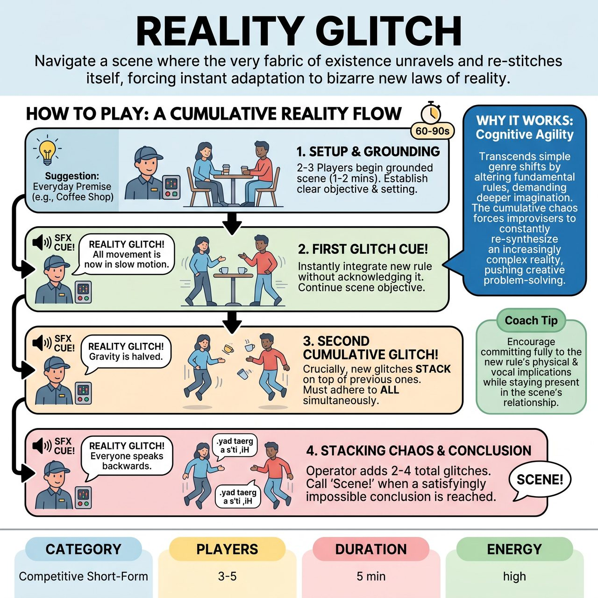

# Reality Glitch

{ .game-hero }

> Navigate a scene where the very fabric of existence unravels and re-stitches itself, forcing instant adaptation to bizarre new laws of reality.

## Overview
"Reality Glitch" is an improv game where players begin a mundane scene, only for an "Operator" to periodically trigger an external cue, instantly announcing a fundamental alteration to the scene's laws of reality. Players must immediately adapt and integrate this new rule without acknowledging it as a game mechanic, continuing their original scene objective. The core challenge arises as these "glitches" accumulate, forcing improvisers to seamlessly integrate multiple, often contradictory, new realities simultaneously.

## Setup
Requires 3-5 improvisers (2-3 core scene players and 1-2 'Operators' acting as Glitch Masters). Use a bare stage with minimal, generic props. The Operator needs a distinct, non-verbal sound effect device (e.g., a chime, whistle, or pre-recorded glitch sound). Get an audience suggestion for a mundane, everyday scene premise like a first date or waiting at the DMV.

## How to Play
1. The Operator solicits a suggestion for a grounded, everyday scene premise.
2. 2-3 core improvisers begin the scene, establishing clear characters, setting, and objective for 1-2 minutes.
3. After 60-90 seconds, the Operator triggers the sound effect cue.
4. The Operator announces 'Reality Glitch!' and states a single, specific new rule altering a basic law of physics, logic, or character capability (e.g., 'All movement must now be backward!').
5. Players must immediately integrate the new rule into their actions and dialogue without acknowledging it as a game mechanic, continuing the original scene objective.
6. After another 60-90 seconds, the Operator triggers the cue again and announces a second glitch.
7. Crucially, new glitches stack on top of previous ones. Players must adhere to all active glitches simultaneously.
8. The Operator continues to add glitches (typically 2-4 total) and calls 'Scene!' when a satisfying or hilariously impossible conclusion is reached.

## Coaching Notes
- Award points for seamless integration, heightening the absurdity, maintaining the narrative, and ensemble support.
- Deduct points for breaking the rules (failing to adhere to active glitches), explaining the glitch (referencing it as a game mechanic), or hesitating/ignoring the glitch.
- Players must 'yes, and' the glitch as if it is a natural development within their reality.
- The Operator should act as an unpredictable force, shaping the scene's existence and adding narrative tension.

## Why It Works
It transcends simple genre shifts by altering fundamental rules, demanding deeper imagination. The cumulative chaos forces improvisers to constantly re-synthesize an increasingly complex reality, pushing cognitive agility and creative problem-solving. It tests immediate, profound adaptability and makes the impossible plausible.

## Safety & Inclusion
Ensure physical safety when glitches involve movement restrictions (e.g., moving backward, involuntary dancing). Players should maintain spatial awareness to avoid tripping or colliding. Operators should avoid calling glitches that force unsafe physical contact or emotional distress.

