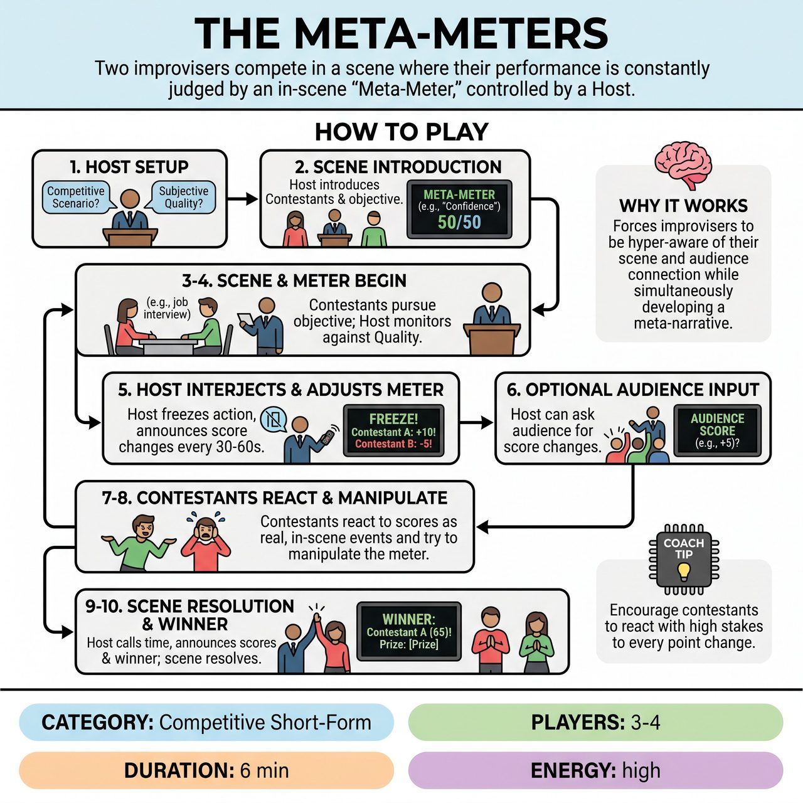

# The Meta-Meters

{ .game-hero }

> Two improvisers compete in a scene where their performance is constantly judged by an in-scene 'Meta-Meter,' controlled by a Host.

## Overview
Two 'Contestant' improvisers perform a scene with a competitive objective, while a 'Host' controls an in-scene 'Meta-Meter' that constantly judges their performance on a chosen subjective quality. The unique twist is that the Contestant characters must explicitly acknowledge, react to, and attempt to manipulate their fluctuating meter scores within the scene's reality. This creates a comedic meta-narrative where improvisers are simultaneously playing their characters and playing to the scoring system to win the scene's ultimate prize.

## Setup
Requires 2 'Contestants', 1 'Host/Judge', and optionally 1 'Assistant/Sidekick'. Uses a standard improv stage. Establish an imaginary (or physical cardboard) 'Meta-Meter' device that the Host will verbally announce readings from. Optional sound effects like a buzzer or ding can enhance the game show atmosphere.

## How to Play
1. The Host steps forward, greets the audience, and asks for two suggestions: a competitive scenario (e.g., 'A job interview') and a subjective quality to be measured (e.g., 'Persuasiveness' or 'Emotional Vulnerability').
2. The Host sets up the scene, introducing the two Contestants and their in-scene objective, making it clear they are competing based on their performance as measured by the Meta-Meter.
3. The two Contestants step into the scene, immediately embracing their characters and pursuing their in-scene objective.
4. As the scene unfolds, the Host acts as the omnipresent judge, constantly monitoring the Contestants' performance against the chosen Meta-Meter quality.
5. Every 30-60 seconds, or after a significant action, the Host interjects, freezes the action briefly, and announces a change in one or both Contestants' Meta-Meter readings, providing a brief, humorous explanation.
6. The Host can occasionally turn to the audience and ask for their input on score changes (e.g., asking for applause or boos).
7. Contestants must immediately react to these score changes as if they are real, in-scene events that directly impact their competitive objective (e.g., gloating if the score goes up, complaining if it goes down).
8. Contestants strategically attempt to manipulate the meter by adjusting their behavior to fit the metric, creating a meta-game.
9. After 5-7 minutes, or when the scene reaches a natural comedic conclusion, the Host calls time, announces the final scores, and declares a winner.
10. The winner receives the established 'prize' and the scene resolves with the consequences of that win.

## Coaching Notes
- The Host's explanations for score adjustments should connect directly to the Contestant's performance in the scene.
- Crucially, the Contestants must react to the score changes as if they are real, in-scene events. They should not break character, but rather incorporate the meta-game into their character's reality.
- Contestants can acknowledge the audience's role in the meter's readings, appealing to them directly within the scene.
- Encourage Contestants to exaggerate their reactions to the scoring, much like a good competitive short-form player reacting to a foul.

## Variations
- Foul System: The Host can call 'fouls' for egregious improv errors (e.g., blocking, waffling, not advancing the scene). These result in a significant score deduction or a brief 'time out' where the player must justify their action to the Host, while characters react with frustration or denial.

## Why It Works
It forces improvisers to be hyper-aware of their scene work and audience connection while simultaneously developing a meta-narrative. The explicit integration of the scoring mechanism within the scene's reality creates a rich, self-aware layer of humor where characters know they are being scored.

## Safety & Inclusion
Ensure the competitive banter remains playful and supportive. If using the optional foul system, keep the critiques lighthearted so players don't feel genuinely criticized on stage.

