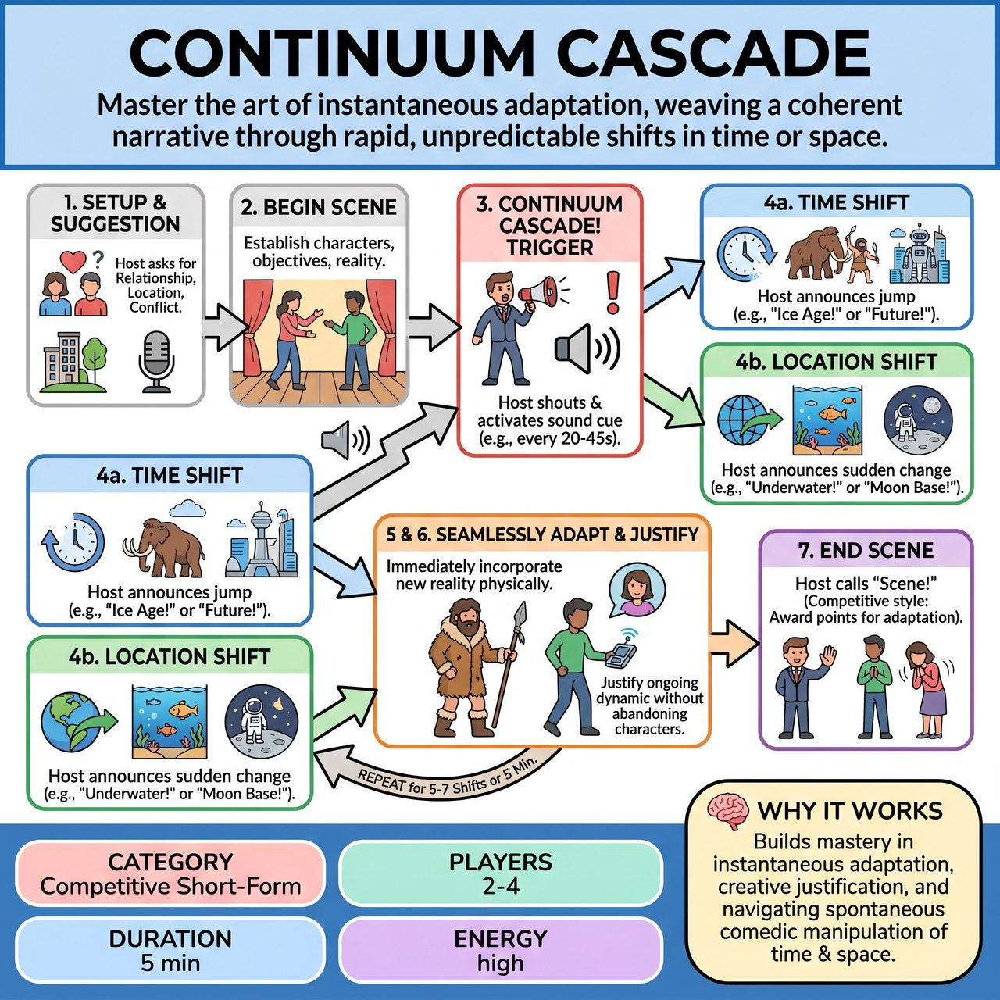

# Continuum Cascade

{ .game-hero }

> Master the art of instantaneous adaptation, weaving a coherent narrative through rapid, unpredictable shifts in time or space.

## Overview
Continuum Cascade is a competitive improv game where 2-4 improvisers begin a scene based on an audience suggestion, establishing characters and a core relationship. Periodically, an external Host triggers an abrupt sound cue and announces a 'Continuum Cascade,' forcing an instantaneous, drastic shift in either the scene's time period or location. The central challenge for players is to adapt seamlessly and immediately to this new reality while never abandoning their established characters, relationship, or ongoing narrative.

## Setup
An open stage with minimal or no props, as players should pantomime all environmental elements. A Host/Referee is essential for explaining the game, calling out shifts, and scoring. A distinct, abrupt sound cue (e.g., a bell, gong, buzzer, or specific sound effect) is required to signal an immediate shift.

## How to Play
1. The Host asks the audience for an initial suggestion to kick off the scene, typically including a Relationship, a Location, and optionally a Starting Conflict or Activity.
2. Players begin the scene, establishing their characters, objectives, and the basic reality based on the audience suggestion, developing a clear 'who, what, where' quickly.
3. At unpredictable intervals (e.g., every 20-45 seconds), the Host shouts 'CONTINUUM CASCADE!' and immediately activates the distinct sound cue.
4. Immediately after the trigger, the Host announces either a Time Shift (e.g., 'Jump to the distant past during the Ice Age!') or a Location Shift (e.g., 'Suddenly, you're at the International Space Station!').
5. Players must immediately and physically incorporate the new time or location into their existing scene, characters, and emerging narrative.
6. Players continue the scene, justifying their ongoing dynamic within the new reality without abandoning their established characters or core objectives.
7. The game runs for a set number of shifts (e.g., 5-7 shifts) or a designated time limit (e.g., 4-6 minutes), concluding when the Host calls 'Scene!'
8. The Host (acting as Referee in a competitive short-form match style) awards points for seamless adaptation, creative justification, character consistency, audience laughter, and narrative bend, while deducting points for ignoring the shift or breaking character/flow.

## Coaching Notes
- The Host's role is critical in pacing the shifts, ensuring they are frequent enough to be challenging but not so rapid as to be impossible.
- The Host should listen for opportunities where a shift would create maximum comedic or dramatic impact.
- Players must not abandon their established characters or the core relationship/objective they were pursuing. They must justify and continue their ongoing dynamic within the new reality.
- Player dialogue, physicality, and emotional responses must reflect the new environment or era while attempting to maintain continuity of their core dramatic situation.
- Encourage players to bend the original scene's objective or conflict to fit the new context, rather than simply starting a new mini-scene each time.

## Variations
- Combined Shift: For maximum challenge, the Host announces a combined Time and Location Shift (e.g., 'Jump to [Time] at [Location]!').

## Why It Works
It pushes improvisers to think beyond static realities, demonstrating that fundamental elements like time and space are ripe for spontaneous comedic manipulation. It builds mastery in instantaneous adaptation, creative justification, and narrative bending.

## Safety & Inclusion
Ensure physical safety during rapid, abrupt transitions and pantomime. Maintain respectful boundaries and consent, especially when adapting relationships to extreme, confined, or physically demanding new locations.

