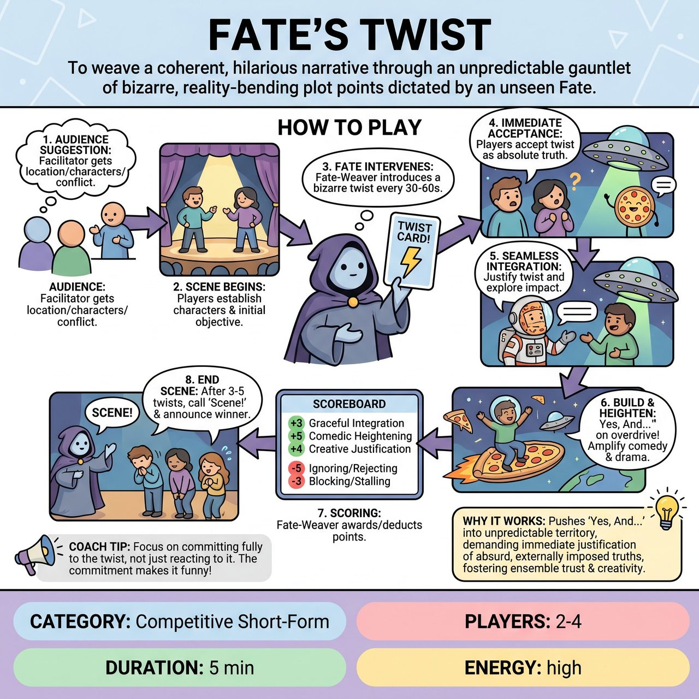

# Fate's Twist

{ .game-hero }

> To weave a coherent, hilarious narrative through an unpredictable gauntlet of bizarre, reality-bending plot points dictated by an unseen Fate.

## Overview
Fate's Twist is a competitive improvisation game where 2-4 players must collaboratively weave a hilarious, coherent narrative despite an unseen Fate-Weaver constantly introducing bizarre, reality-bending plot points. The game challenges improvisers to instantly accept and seamlessly integrate absurd Fate's Twists into their ongoing scene, using rapid Yes, And... principles.

## Setup
Requires 2-4 improvisers (Players), one Fate-Weaver (Referee/Host), and a deck of 20-30 cards or slips of paper. Each card has a concise, open-ended Fate written on it. These Fates are plot-changing directives, not just emotional or genre shifts (e.g., 'One of you is secretly an alien', 'An inanimate object gains sentience', 'The location changes to the surface of the sun').

## How to Play
1. The Fate-Weaver asks the audience for a suggestion to kick off a scene, such as a common location, two incompatible characters, or a simple conflict.
2. The Players step forward and immediately begin an improvised scene based on the audience suggestion, establishing characters, relationships, and an initial objective.
3. At various points throughout the scene (e.g., every 30-60 seconds), the Fate-Weaver draws a card from the Fate's Twist deck and reads it aloud.
4. Immediately upon hearing the Fate, the Players must accept this new reality as absolute truth within their ongoing scene.
5. Players must seamlessly integrate this twist into the narrative, justifying its presence and exploring its immediate impact on their characters and the environment.
6. Players build upon the twist (Yes, And... on Overdrive), heightening the comedic or dramatic implications of the new reality.
7. The Fate-Weaver awards and deducts points: +3 for Graceful Integration, +5 for Comedic Heightening, +4 for Creative Justification, -5 for Ignoring/Rejecting, and +7 for a Callback Fate.
8. The scene continues through 3-5 twists until the Fate-Weaver calls 'Scene!' when a natural conclusion is reached or the time limit is met, followed by announcing the score.

## Coaching Notes
- Players cannot question, ignore, or dismiss the twist as untrue. They must find the truth within extreme absurdity and maintain the integrity of the scene's world even as its rules are rewritten mid-play.
- If a player rejects, ignores, or actively works against a Fate's Twist, the Fate-Weaver blows a whistle, explains the foul, and deduct 5 points.
- Ensure the Fates written on the cards are plot-changing directives rather than simple emotional shifts. Examples include sudden superpowers, fabricated past events, or bizarre reality TV show reveals.
- Award the +7 Bonus points if a Player spontaneously reincorporates a previous Fate's Twist from earlier in the same scene in a new, surprising, and funny way.

## Why It Works
It pushes the Yes, And... principle into highly unpredictable, game-changing narrative territory, demanding immediate justification of absurd, externally imposed truths. The unpredictable nature fosters ensemble trust, communication, and rapid adaptation to drastically changing circumstances.

## Safety & Inclusion
Maintain standard improv safety and consent, especially when twists impose sudden physical changes or bizarre character traits. Ensure players feel comfortable with the imposed realities and avoid twists that force unsafe physical actions.

