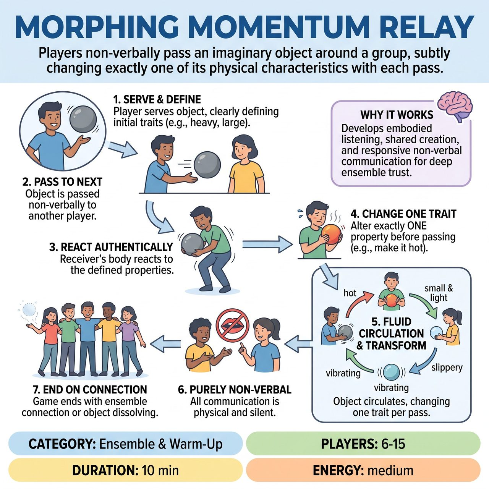

# Morphing Momentum Relay

{ .game-hero }

> Players non-verbally pass an imaginary object around a group, subtly changing exactly one of its physical characteristics with each pass.

## Overview
Adapted from relay races, this game focuses on collective awareness and shared physical agreement. Players non-verbally pass an imaginary object around the group, with each person altering exactly one physical trait before passing it on. The goal is to cultivate a fluid imaginative reality through responsive physical agreement rather than speed or competition.

## Setup
Players form a large circle or a loose, irregular formation, standing equidistant from one another. The facilitator explains that the goal is to pass an invisible object around the group.

## How to Play
1. One player begins by 'serving' the imaginary object, clearly defining its initial physical characteristics (size, weight, texture, temperature, sound) through their physical embodiment and action.
2. The server 'passes' this defined object to another player.
3. The receiving player reacts authentically to the received properties with their body.
4. Before passing it on, the receiving player must change exactly one of its physical characteristics (e.g., making it heavier, hotter, smoother, or introducing a new quality).
5. The object continues to be passed around the group in a fluid, non-linear way, with each pass transforming its properties.
6. All communication regarding the object's state, change, and trajectory must be non-verbal and entirely physical.
7. The game ends when the facilitator observes a strong ensemble connection, or with one player physically dissolving or integrating the object back into the space.

## Coaching Notes
- Point of Concentration (POC): Focus on the constantly transforming physical reality of the invisible object as offered by the previous player, and your subsequent physical act of receiving and imparting its next singular change.
- Actively 'see' and 'feel' the imaginary object based solely on another player's physical offers.
- Make clear, distinct, and committed physical offers that invite precise reception from the next player.
- There is no 'dropping' or 'missing' the object. If a player misinterprets the previous offer, they must respond to what they perceived; the 'error' becomes part of the shared, evolving reality.

## Why It Works
It develops embodied listening, shared creation, and responsive non-verbal communication. Players learn to build an immediate, shared imaginative reality that evolves collectively and relies on deep ensemble trust and agreement.

## Safety & Inclusion
Ensure players have enough space to safely make large physical movements (like heaving a massive object) without colliding with others. Encourage players to respect physical boundaries even when passing imaginary objects.

