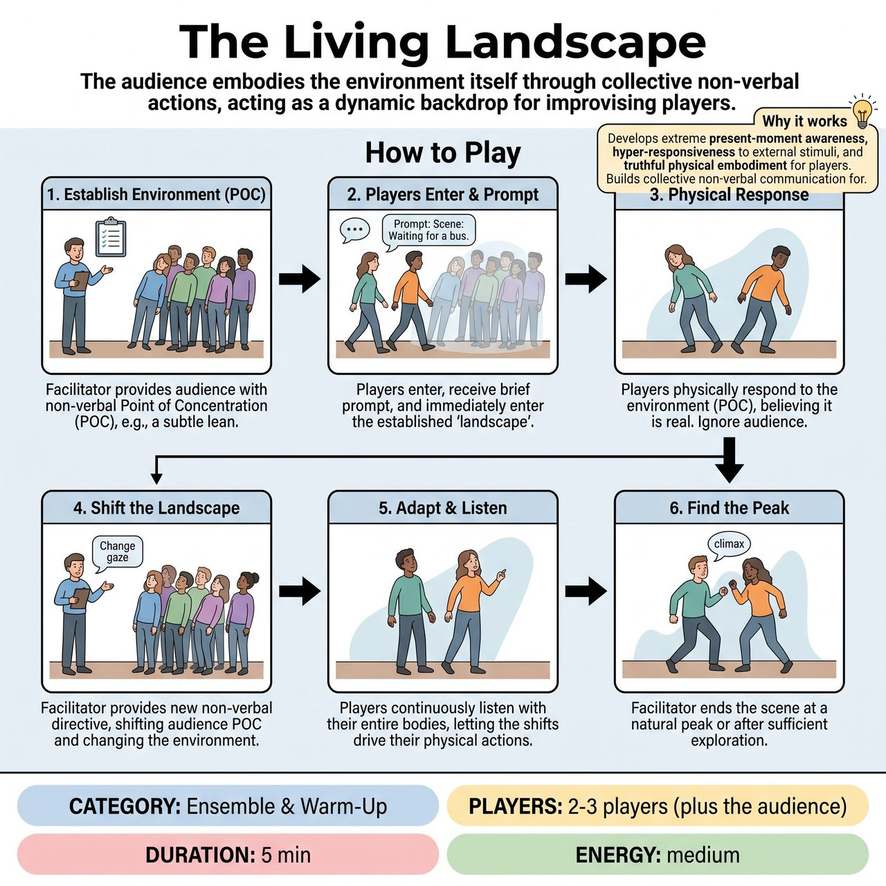

# The Living Landscape

{ .game-hero }

> The audience embodies the environment itself through collective non-verbal actions, acting as a dynamic backdrop for improvising players.

## Overview
The Living Landscape is an interactive game where the audience embodies the environment itself through collective non-verbal actions like sustained physical postures, subtle sounds, or unified gazes. Guided by a facilitator, the audience establishes an initial environmental condition, to which players entering with a basic scene prompt must immediately and physically respond. As the facilitator shifts the audience's collective Point of Concentration, the environment evolves, demanding continuous, present-moment adaptation from the players.

## Setup
The facilitator addresses the audience, explaining their crucial role as the 'Living Landscape.' They emphasize that the audience is actively creating the environmental conditions through collective non-verbal action, focusing on unified intention rather than individual performance.

## How to Play
1. The facilitator provides the audience with an initial, specific non-verbal Point of Concentration (POC) related to an environmental quality (e.g., a subtle lean, a quiet shivering sound, or a specific upward gaze).
2. While the audience establishes and maintains their initial POC, 2-3 players enter the playing space and receive a very brief scene prompt from the facilitator.
3. Players immediately believe and physically respond to the environment created by the audience's POC. They do not acknowledge the audience directly, but rather the implied reality that the audience is embodying.
4. At various points, the facilitator provides a new, evolving directive to the audience, shifting their collective POC to change the environment.
5. Players continuously listen with their entire bodies and imaginations to the shifts in the audience's collective action, allowing these shifts to drive their physical, emotional, and relational choices within the scene.
6. The facilitator ends the scene when a natural peak is reached, or a sufficient exploration of the current landscape has occurred.

## Coaching Notes
- Audience POC: Guide the audience to collectively and physically embody a single, unified, non-verbal environmental force or condition through sustained physical posture, subtle group sound, or unified gaze.
- Player POC: Encourage players to fully inhabit, believe in, and immediately respond to the implied environmental reality and its constant transformations without intellectualization or breaking immersion.
- Ensure the initial audience POC is clear, actionable, and capable of being collectively sustained.
- Remind players not to acknowledge the audience directly, but to treat the audience's actions as the literal environment (e.g., leaning into the wind, shivering from the cold, or ducking from an unseen element above).

## Why It Works
It develops extreme present-moment awareness, hyper-responsiveness to external stimuli, and truthful physical embodiment for the players. For the audience, it builds collective non-verbal communication and unified group focus, creating an 'ensemble mind' across both groups.

## Safety & Inclusion
Ensure any physical stances or movements requested of the audience are accessible and comfortable to sustain. Players should respect their own physical limits and avoid forcing reactions that could cause strain while adapting to the imaginary environment.

