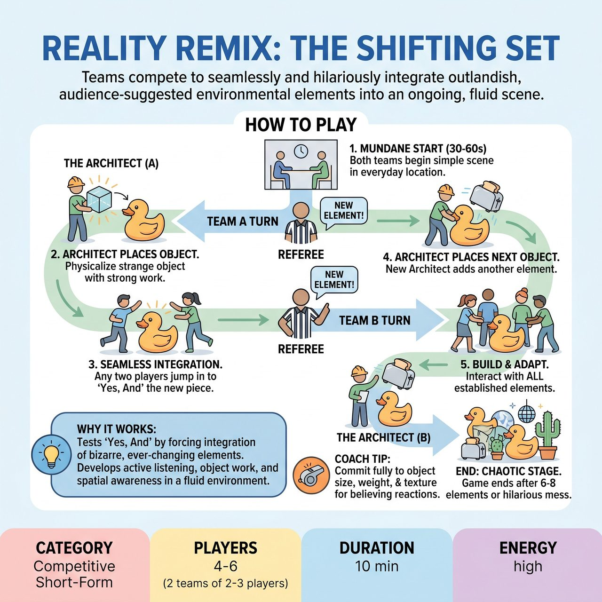

# Reality Remix: The Shifting Set

{ .game-hero }

> Teams compete to seamlessly and hilariously integrate outlandish, audience-suggested environmental elements into an ongoing, fluid scene.

## Overview
Reality Remix: The Shifting Set is an improvisational game where two teams collaboratively and competitively build an increasingly absurd shared world. Teams integrate outlandish, audience-suggested environmental elements into a single, ongoing scene. One player, 'The Architect,' physically establishes each new element, which all players must then seamlessly 'Yes, And' into the evolving reality.

## Setup
Two teams (Red vs. Blue), typically with 2-3 players each, start on stage in a neutral position. The referee stands centrally, ready to facilitate. No physical props are used; everything is mimed.

## How to Play
1. The referee asks the audience for a mundane, every-day location. Players from both teams initiate a simple, short scene in this location lasting 30-60 seconds.
2. The referee interjects with a firm 'New Element!' and asks the audience for a single, unusual, inanimate object or environmental feature.
3. A designated team goes first. One player from that team steps forward as 'The Architect' and receives the suggestion.
4. The Architect clearly physicalizes the object with strong object work, demonstrating its primary characteristic, and physically places it within the established scene environment.
5. Immediately after placement, at least two other players from either team jump into the scene to naturally and inventively incorporate the new set piece.
6. Players must be mindful of and interact with all previously established environmental elements as the scene continues for 60-90 seconds.
7. The referee calls 'New Element!' again to signal the other team's turn. A player from the other team becomes The Architect, gets a new suggestion, and integrates it into the same ongoing scene.
8. The game concludes after 6-8 new elements are introduced, or when the stage becomes a hilariously overstuffed, fantastical mess.
9. The referee awards points based on Inventive Object Work (2 points), Seamless Integration & 'Yes, And' (3 points), Energetic Play & Pacing (1 point), and Cohesion & Continuity (1 point).

## Coaching Notes
- Call an 'Invisible Ink Foul' (loss of point) if an Architect fails to establish a clear physical presence for the object, or if subsequent players fail to acknowledge or interact with key established objects.
- Call a 'Spatial Sabotage Foul' (loss of point) if a player places a new object or interacts with an existing one in a way that illogically destroys a previously established significant element without justification.
- Call standard competitive-improv fouls like a 'clean-content foul' for inappropriate content or a 'groaner foul' for excessively bad puns.
- Ensure players use strong object work, vividly miming and maintaining the properties of numerous objects.
- Encourage rapid endowment, giving properties, functions, and personalities to newly introduced objects.
- Keep the scene fluid, transitions swift, and energy high despite accumulating elements.

## Why It Works
It tests 'Yes, And' by forcing players to integrate new, bizarre elements and build upon an ever-changing environment. It develops active listening, strong object work, rapid endowment, and spatial awareness as players manage the physical stage space as more elements are introduced.

## Safety & Inclusion
The game inherently promotes family-friendly humor by focusing on inanimate objects or environmental features, avoiding mature themes. The referee maintains strict control over appropriate suggestions and enforces a 'clean-content foul' to penalize any blue humor, swearing, or inappropriate innuendo.

