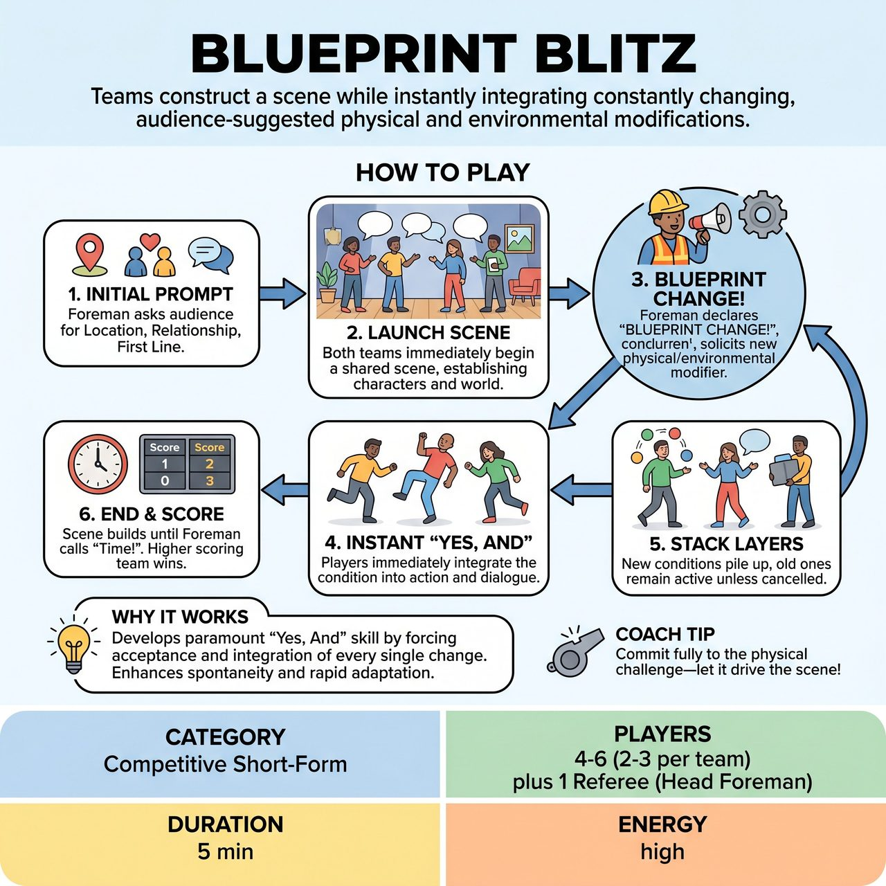

# Blueprint Blitz

{ .game-hero }

> Teams construct a scene while instantly integrating constantly changing, audience-suggested physical and environmental modifications.

## Overview
Blueprint Blitz is an improv game where two teams construct a scene based on audience-provided prompts, then continuously adapt to and integrate constantly changing, audience-suggested 'blueprints'—physical and environmental modifications—called out by a 'Head Foreman' referee. Players must instantly 'Yes, And' these new conditions, layering absurd challenges into the evolving narrative. The game tests rapid adaptability, physical comedy, and teamwork, leading to increasingly chaotic and hilarious scenes.

## Setup
Two teams (Red vs. Blue), typically 2-3 players per team on stage. A Referee (the 'Head Foreman'). The stage should be open and flexible. Players act as scene-builders and adaptability specialists.

## How to Play
1. The Head Foreman opens by asking the audience for a foundational scene idea: a fascinating Location, a unique Relationship, and a First Line.
2. All players from both teams immediately launch into a shared scene based on the chosen prompt, establishing characters, interactions, and the general atmosphere.
3. At unpredictable intervals, the Head Foreman loudly declares, 'BLUEPRINT CHANGE!' and solicits a specific, physical or environmental modifier from the audience (e.g., sticky ground, crawling only, underwater).
4. Upon hearing the 'Blueprint Change,' players must immediately 'Yes, And' the new condition, physically and verbally integrating its effects into their actions, dialogue, and character reactions.
5. Old 'Blueprints' remain active unless explicitly cancelled by the Head Foreman, allowing multiple changes to pile up in quick succession.
6. The Head Foreman awards points (e.g., 1-5 points) throughout the scene to the team demonstrating superior integration and comedic execution, and deducts points for fouls.
7. The scene continues building layers of challenges until the Head Foreman calls 'Time!', and the team with the higher score wins.

## Coaching Notes
- The Head Foreman must expertly draw out clear, family-friendly scene prompts and gently guide audience suggestions to be physical or environmental in nature.
- Call 'Ignoring the Blueprint!' Foul for any player who fails to integrate a 'Blueprint Change' quickly, physically, or convincingly.
- Call 'Structural Weakness!' Foul for a player who actively negates a previously established 'Blueprint Change' that wasn't cancelled, or contradicts established scene logic without a clear comedic purpose.
- Standard fouls apply: Clean-content foul for blue humor/swearing, and Groaner Foul for excessively bad puns.
- Award points for swift, creative, and physically compelling integration, exceptional character commitment, teamwork, and generating big laughs.
- Players must actively listen to the Head Foreman's announcements, the audience's suggestions, and their teammates' ongoing reactions and character choices.
- Focus on Object Work: Bring invisible physical conditions to life with convincing physicality.
- Maintain believable character reactions and relationships despite the absurd and compounding physical limitations.

## Why It Works
It develops the absolute paramount skill of 'Yes, And' by forcing players to accept and build upon every single Blueprint Change. It enhances spontaneity and adaptation, training the ability to instantly pivot and integrate new, often contradictory, information into an existing scene without losing focus or narrative flow.

## Safety & Inclusion
The game's inherent structure promotes family-friendly humor. The 'Blueprint Changes' are filtered by the Head Foreman to steer clear of any suggestive or inappropriate themes. The challenges are playful obstacles, not opportunities for edgy content. Ensure physical safety on stage as players navigate compounding physical limitations and chaotic object work.

