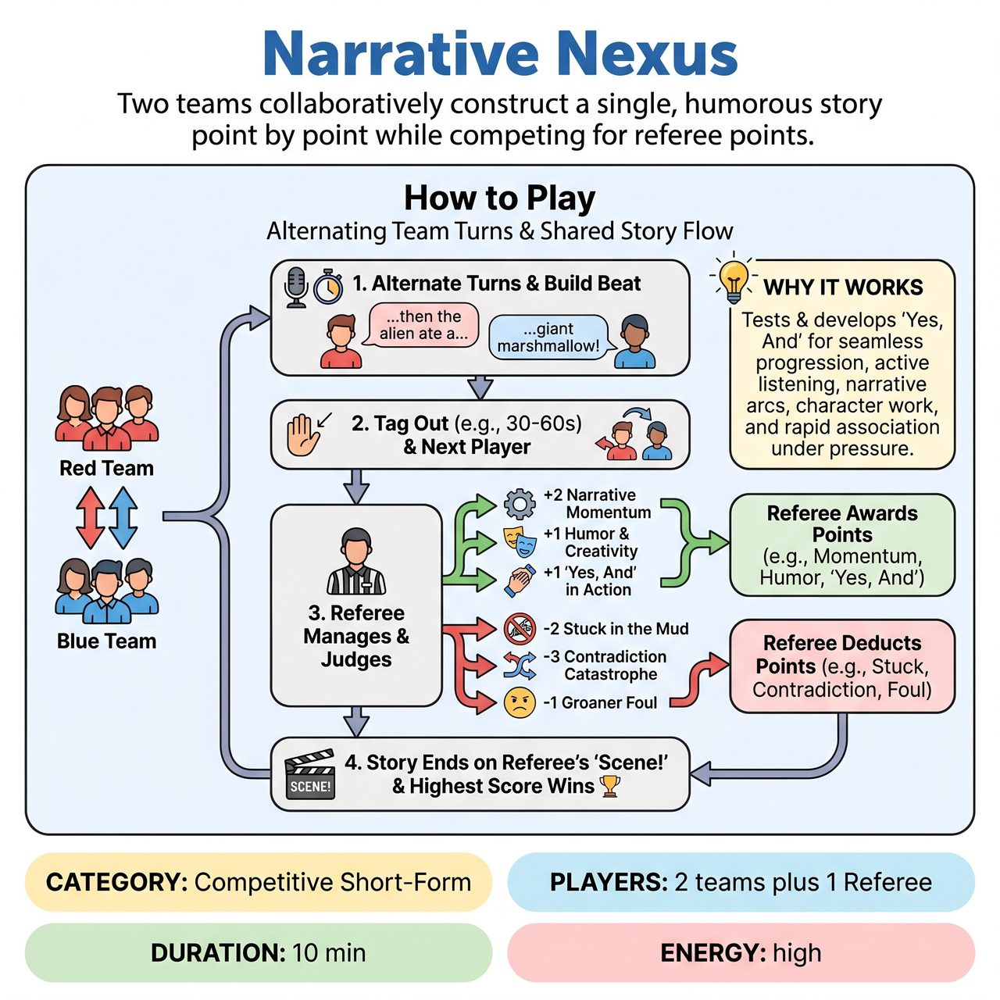

# Narrative Nexus

{ .game-hero }

> Two teams collaboratively construct a single, humorous story point by point while competing for referee points.

## Overview
Narrative Nexus is a competitive improvisational game where two teams (Red vs. Blue) collaboratively construct a single, humorous story, point by point. Guided by an audience-suggested genre and central conflict, players alternate turns, each contributing a narrative beat that builds seamlessly on the previous one. A Referee awards points for narrative momentum, humor, and cohesion, while penalizing contradictions or stagnation, ultimately determining the winning team based on the highest score once the story's central conflict is resolved.

## Setup
Two teams (Red and Blue) stand ready on stage with a Referee. The Referee gets audience suggestions for a Genre (e.g., Sci-Fi Epic), a Central Conflict/Quest (e.g., 'Find the legendary Giggle-Stone'), and an optional Key Character Trait or Object. The Referee then sets the very first beat of the story, establishing the protagonist and initial setting.

## How to Play
1. Teams alternate turns, sending one player forward at a time to contribute to the shared story.
2. Each player has a limited amount of time (e.g., 30-60 seconds) to deliver a narrative beat or short scene.
3. The beat must build directly upon the previous player's contribution, advance the central conflict logically within the genre, and introduce new characters, obstacles, plot twists, or resolutions.
4. Once a player completes their beat, they tag out, and a player from the opposing team immediately steps in to continue the narrative from that exact point.
5. The Referee manages the pace, calling 'Next Player!' or 'Next Team!' and clearly indicating which team is up.
6. The Referee awards points for Narrative Momentum (+2), Humor & Creativity (+1), 'Yes, And' in Action (+1), Audience Suggestion Integration (+1), and Strong Object Work/Character Physicality (+1).
7. The Referee deducts points for Stuck in the Mud (-2), Contradiction Catastrophe (-3), Groaner Foul (-1), and Clean-Content Foul (-5 & Player Substitution).
8. The story continues alternating between teams until the Referee deems the central conflict resolved or the quest completed, calling 'Scene!'.
9. The team with the highest cumulative score at the end of the narrative wins.

## Coaching Notes
- Maintain a rapid pace; the Referee should clearly indicate which team is up and call 'Next Player!' or 'Next Team!' to keep things moving.
- Encourage active listening; players must internalize every detail of the developing story to build upon it effectively.
- Watch for the 'Stuck in the Mud' foul: penalize players who get lost, repeat plot points, or fail to significantly advance the story.
- Watch for the 'Contradiction Catastrophe' foul: penalize players who directly negate, ignore, or overtly block a significant plot point, character trait, or object established by a previous player.
- Audience laughter and engagement serve as informal feedback, often influencing the Referee's 'Humor & Creativity' points.

## Why It Works
It tests and develops core improv skills like 'Yes, And' (critical for seamless progression and avoiding contradictions), active listening, understanding narrative arcs, character and object work, rapid association under pressure, and maintaining pacing and focus on a central conflict.

## Safety & Inclusion
Strict family-friendly ethos enforced via the 'Clean-Content Foul' (-5 Points & Player Substitution) for any blue humor, swearing, sexual innuendo, or inappropriate content. The offending player is immediately removed from the stage and another player from their team must take their place.

