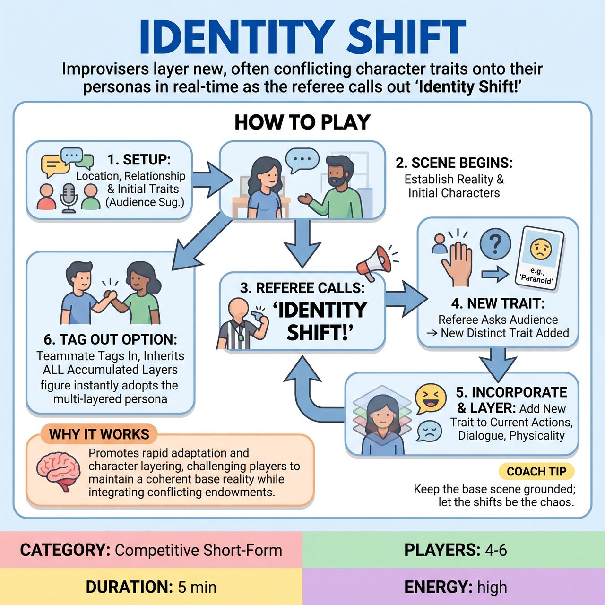

# Identity Shift

{ .game-hero }

> Improvisers layer new, often conflicting character traits onto their personas in real-time as the referee calls out 'Identity Shift!'

## Overview
Identity Shift is a fast-paced, high-energy game where improvisers start a scene with a simple character endowment, only to have new, distinct, and often conflicting traits 'shifted' onto them mid-scene by the referee or audience. The challenge and comedy come from how the players dynamically integrate these accumulating endowments into their character's behavior, motivations, and physicality, creating complex and evolving personas on the fly.

## Setup
4-6 players (typically 2-3 per team) with two active on stage at any given time. A clear, open stage with no props (all mimed). The referee gets a location, a relationship, and initial character endowments from the audience to begin.

## How to Play
1. The referee asks the audience for a location and a relationship between the two initial players.
2. Each of the two active players receives a simple, audience-suggested initial character endowment or role.
3. The scene begins with the two active players establishing the setting and their initial traits.
4. At unpredictable intervals, the referee loudly calls out, 'IDENTITY SHIFT!'
5. Immediately after the call, the referee points to one active player and asks the audience for a new, distinct character trait, emotion, or quirk for that player, quickly picking one suggestion.
6. The designated player must immediately incorporate this new endowment into their character's current actions, dialogue, and physicality, adding it to all previously assigned endowments without dropping them.
7. The scene continues, with the referee randomly directing new shifts to either player to create increasingly layered characters.
8. Players can tag out to a teammate by making physical contact. The incoming player must seamlessly pick up the scene and immediately embody the character with all accumulated endowments.

## Coaching Notes
- Pacing: The referee controls the pace of the 'shifts.' Early shifts might be slower to allow players to establish their initial character. Later shifts can come rapidly to heighten the challenge and comedic chaos.
- Ensure fairness between players in receiving shifts so one player isn't doing all the heavy lifting.
- Scoring: Award points for seamless integration (5 pts), heightening the comedy (3 pts), physical embodiment (2 pts), listening/'Yes, And...' (3 pts), and successful tag-outs (5 pts).
- Fouls to watch for: Call an 'Identity Crisis' Foul (-5 points) if a player ignores a new endowment, drops a previous one, or fails to integrate it quickly.
- Fouls to watch for: Call a 'Muddled Miming' Foul (-3 points) for unclear or uncommitted physical choices when embodying a new trait.
- Fouls to watch for: Call a 'Groaner Foul' (-5 points) for uninspired puns, or a 'No, But...' Foul (-5 points) for negating a new endowment.

## Why It Works
It promotes key improv skills like 'Yes, And...', active listening, object work, and strong physical choices. By providing a clear, dynamic structure that forces continuous character evolution, it demands lightning-fast adaptation and challenges improvisers to integrate complex and often contradictory traits visually and verbally.

## Safety & Inclusion
Content Foul (-10 points): Any inappropriate or offensive suggestion or dialogue results in the referee immediately stopping play, addressing the foul, and selecting a clean audience suggestion. The game embodies the family-friendly spirit of competitive short-form matches, ensuring all suggestions are vetted for appropriateness by the referee.

