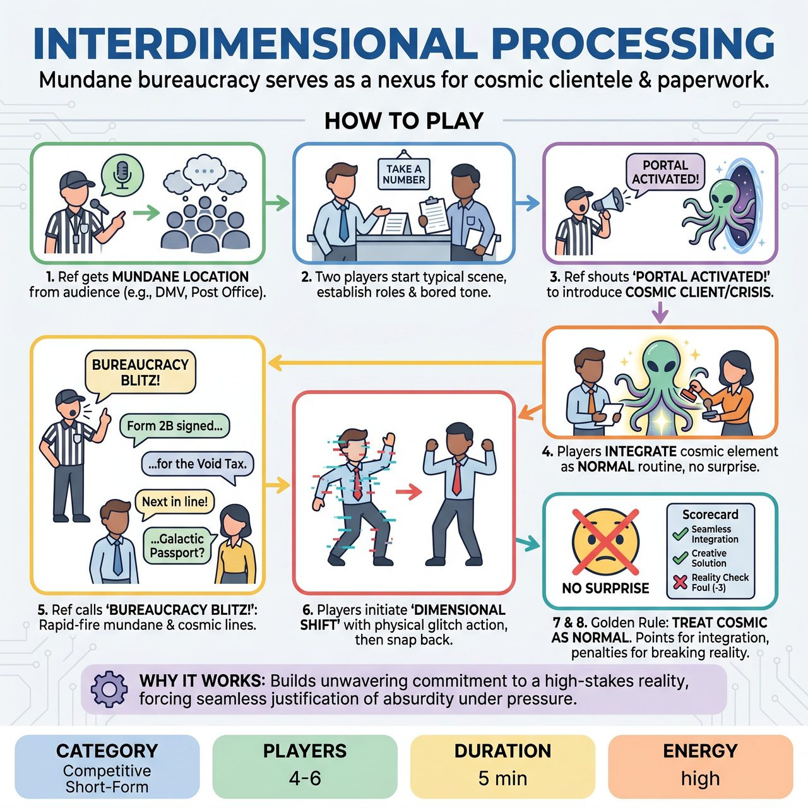

# Interdimensional Processing

{ .game-hero }

> Players navigate a seemingly mundane bureaucratic setting that is secretly a nexus for interdimensional paperwork and cosmic clientele.

## Overview
Interdimensional Processing plunges players into a seemingly ordinary, frustratingly bureaucratic setting – like a DMV, Post Office, or Doctor's Waiting Room. The twist? This mundane location is secretly a nexus point for interdimensional paperwork and cosmic clientele. Players must seamlessly integrate the absurdity of universe-altering forms and alien requests into their everyday, beleaguered bureaucratic tasks, all while maintaining their character's deadpan acceptance of the dual reality.

## Setup
Requires 4-6 improvisers divided into two teams (Red and Blue) and one Referee. Played on a standard competitive short-form stage with minimal, entirely mimed props (chairs or a counter can be suggested with stage blocking). The Referee might carry a special 'Portal Activator' (e.g., a whimsical gadget or an oversized clipboard). The audience suggests the initial mundane setting and may occasionally be prompted to suggest the nature of a cosmic client or interdimensional crisis.

## How to Play
1. The Referee asks the audience for a mundane, bureaucratic location (e.g., 'DMV', 'Public Library's Overdue Returns').
2. Two players (one from each team, or two from the starting team) begin a typical scene in the chosen location, establishing their character roles (e.g., a bored clerk, a frustrated customer).
3. At any point, the Referee can shout 'PORTAL ACTIVATED!' to introduce a new cosmic client or interdimensional crisis, suggested by the audience, generated by the Referee, or entering through another player.
4. Players must immediately integrate this cosmic element into the scene, treating it as completely normal for their characters and the setting. The mundane bureaucracy still applies.
5. The Referee can call 'BUREAUCRACY BLITZ!' All active players must then rapidly alternate delivering lines that are both mundane bureaucracy and cosmic in nature for a rapid-fire 15-20 seconds.
6. Players can subtly initiate a 'Dimensional Shift' by performing a distinct physical action that suggests a momentary 'glitch' in reality, then immediately snapping back to their character's composed demeanor.
7. Characters must always treat the interdimensional elements as completely normal and routine. Reacting with surprise, shock, or questioning the reality of the cosmic elements constitutes a 'Reality Check Foul'.
8. The Referee awards points for Seamless Integration (3 points), Creative Cosmic Solution (2 points), Strong Object Work / Physicality (1 point), Bureaucracy Blitz Success (2 points per team), and Audience Laugh (1 point).
9. The Referee deducts points or stops play for a 'Reality Check Foul' (-3 points), a content foul (inappropriate content), a Groaner Foul (weak/unoriginal joke), or a 'Paperwork Pile-up' Foul (-1 point if a player gets stuck or slows down the scene's momentum).

## Coaching Notes
- Absolutely crucial 'Yes, And': Players must accept both the mundane aspects of the setting and the fantastical cosmic intrusions, building upon each element as perfectly normal.
- Active listening is required to constantly integrate suggestions from the Referee, the audience, and teammates to correctly identify and blend the dual realities.
- Encourage strong object work. Miming both ordinary office supplies (forms, pens) and outrageous cosmic items (black holes, sentient nebulas) adds visual humor and strengthens realism within the absurd premise.
- Maintain dynamic pacing. The game naturally shifts between scene work, sudden 'Portal Activations', and the high-energy 'Bureaucracy Blitz', keeping the audience consistently entertained.
- Endow characters with unique traits perfectly adapted to this bizarre dual existence, such as an overly jaded cosmic clerk or a new employee struggling to grasp galactic red tape.
- Utilize strong physical choices. 'Dimensional Shifts' and physical reactions to mimed cosmic objects encourage broad and engaging physical comedy.

## Why It Works
The game is driven by quick changes and rapid-fire exchanges, forcing players to think on their feet and integrate new information instantly. The competitive scoring and high penalty for a 'Reality Check Foul' demand unwavering commitment and sharp 'Yes, And' skills, pushing teams to be imaginative and seamless in their comedic fusion of realities.

## Safety & Inclusion
The scenarios are inherently silly, imaginative, and devoid of any content that would violate the clean-content foul rule. The cosmic stakes must always remain whimsical, never genuinely threatening or inappropriate.

