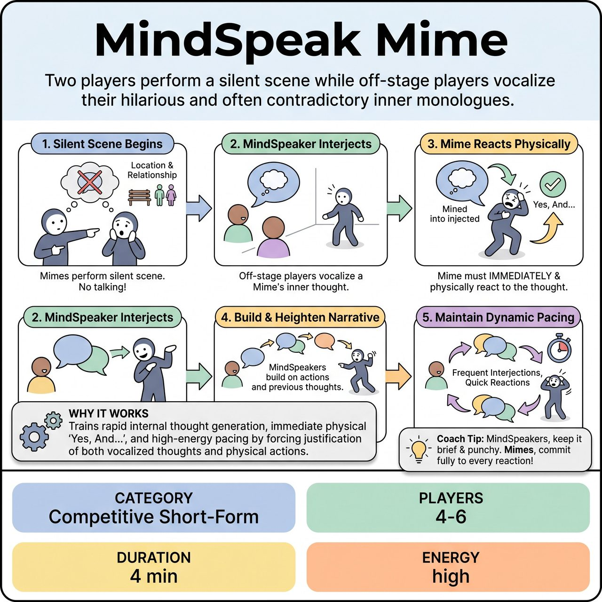

# MindSpeak Mime

{ .game-hero }

> Two players perform a silent scene while off-stage players vocalize their hilarious and often contradictory inner monologues.

## Overview
MindSpeak Mime is an improv game where two players perform a scene entirely through silent mime, based on an audience-suggested location and relationship. Simultaneously, 2-4 'MindSpeakers' vocalize the Mimes' internal thoughts, intentions, and reactions. The core dynamic lies in the Mimes' immediate physical reactions to these spoken inner monologues, creating a hilarious and often contradictory blend of visible action and internal commentary that drives the scene forward.

## Setup
You need 4-6 players total. Two 'Mimes' occupy the main performance area to perform the scene entirely through physical actions and mime, without speaking. Two to four 'MindSpeakers' stand slightly off-stage or just off-center, facing the Mimes, to serve as their inner voices. All props are mimed. Get an audience suggestion for one location and one relationship between the two Mimes.

## How to Play
1. The Mimes begin a silent, mimed scene based on the audience's suggested location and relationship. No spoken dialogue from the Mimes is allowed at any point.
2. At any point after the scene begins, a MindSpeaker can verbally interject with an internal thought, feeling, or observation belonging to one of the Mimes. They should lean forward slightly or gesture subtly to indicate which Mime's thoughts they are voicing.
3. The designated Mime must immediately and physically react to the spoken thought as if they just had it. This reaction should be strong, clear, and 'Yes, And...' the internal monologue.
4. MindSpeakers listen actively to the Mimes' actions and previous inner thoughts, building on the narrative, creating conflict, revealing hidden desires, or offering unexpected comedic twists that fit and elevate the Mime's action.
5. Continue with dynamic pacing. MindSpeakers should interject frequently but not overlap, and Mimes should react quickly and clearly.

## Coaching Notes
- The Referee can call 'New Thought!' if MindSpeakers hesitate, or 'Clear the Mind!' to encourage a shift in the internal dialogue's focus.
- The Referee can gesture to a specific Mime if their thoughts need voicing.
- MindSpeakers must justify the Mime's existing physical actions or inspire new ones. Deduct points if a thought is entirely disconnected from the ongoing action, contradicts established reality, or breaks the 'Yes, And...' rule.
- Mimes must rely on strong object work and physical storytelling. Deduct points if a Mime accidentally speaks an actual line of dialogue.
- Call a 'Waffling Foul' if MindSpeakers hesitate too long or Mimes fail to react clearly and promptly.
- Call a 'Groaner Foul' if a MindSpeaker delivers an obvious, cheap, or forced pun.

## Why It Works
The game demands rapid-fire internal thoughts and immediate, clear reactions, maintaining a high-energy pace. It promotes 'Yes, And...' as Mimes must physically accept vocalized thoughts and MindSpeakers must justify physical actions. It heavily relies on active listening, strong object work, and character endowments, naturally alternating between moments of silent action and sudden verbal insights.

## Safety & Inclusion
Enforce a standard clean-content call or buzzer for any inappropriate or suggestive internal thoughts. Keep the humor focused on the disconnect between physical action and internal thought to maintain a clean, family-friendly environment.

